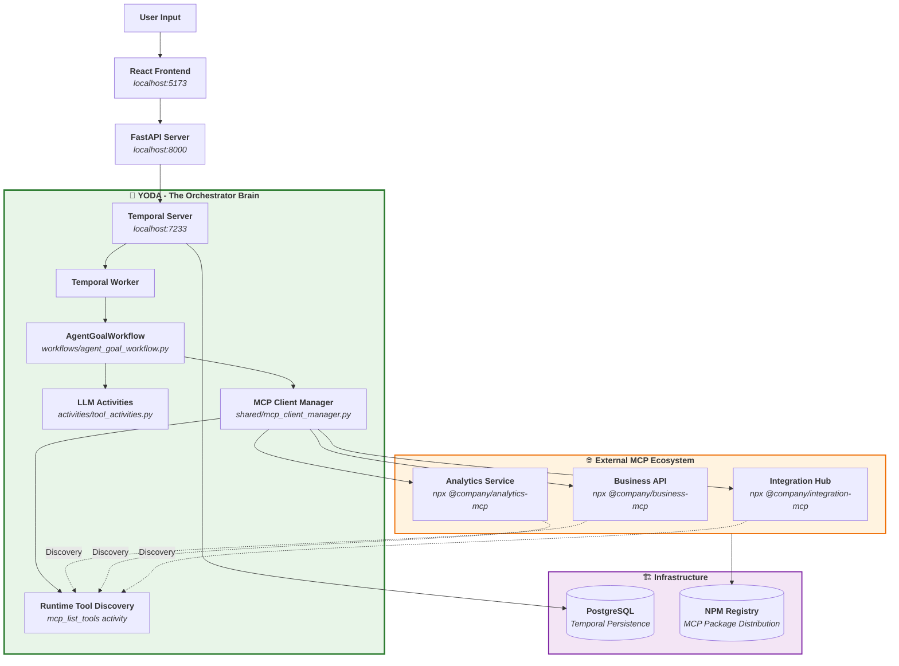
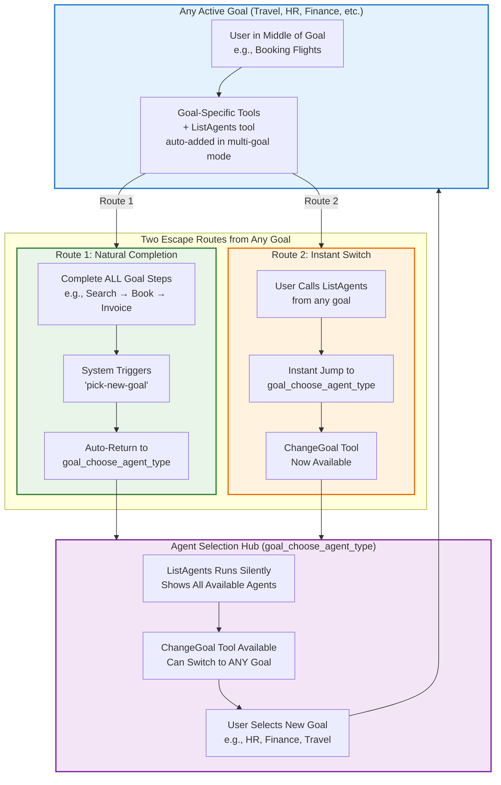

# Enhanced Temporal AI Agent - Architecture Documentation

## 🎯 **Executive Summary**

Document the current MCP server integration system and explore potential enhancements for streamlined tool development workflows while maintaining full Temporal orchestration capabilities.

**🔑 Key Insight:** The system already supports excellent MCP integration with NPM-based distribution and runtime tool discovery.

---

## 📊 **Architecture Overview**

### **MCP Server Integration Architecture**

**Quick Setup:**
1. Add server definition to `shared/mcp_config.py`
2. Reference in goal files 
3. Publish via NPM
4. Tools auto-discovered at runtime



## 👥 **Team Separation Pattern**

### **🛠️ Tool Development Team**
```bash
# 1. Build MCP Server following MCP protocol standard
# Node.js, Python, Go, etc. - any language that can create NPM executable

# 2. Develop tools with correct schema (automatically validated)
{
  "name": "GetCustomerOrders",
  "description": "Retrieve customer order history",
  "inputSchema": {
    "type": "object",
    "properties": {
      "customer_id": {"type": "string", "description": "Customer identifier"},
      "date_range": {"type": "string", "description": "Date range filter"}
    },
    "required": ["customer_id"]
  }
}

# 3. Publish to NPM
npm publish @company/business-mcp

# 4. Notify goal team
"Hey, we added @company/business-mcp with order management and customer tools"
```

---

### **🎨 Goal Team** (Agent Design & User Experience Focus)

**Responsibility**: Agent personas, conversation flows, user experience

**Process**: Discover MCP tools and design agents
```python
# Step 1: Add MCP server definition to shared/mcp_config.py
def get_business_mcp_server_definition(included_tools: list[str]) -> MCPServerDefinition:
    return MCPServerDefinition(
        name="business-mcp",
        command="npx",
        args=["-y", "@company/business-mcp"],
        included_tools=included_tools,
    )

# Step 2: Tools are automatically discovered at runtime via mcp_list_tools
# Returns schema like:
{
  "GetCustomerOrders": {
    "name": "GetCustomerOrders",
    "description": "Retrieve customer order history", 
    "inputSchema": {
      "properties": {
        "customer_id": {"type": "string", "description": "Customer identifier"},
        "date_range": {"type": "string", "description": "Date range filter"}
      },
      "required": ["customer_id"]
    }
  }
}

# Step 3: Design goals using MCP server reference
# goals/business.py - Focus on agent behavior and UX  
goal_business_assistant = AgentGoal(
    agent_name="Business Assistant",
    agent_friendly_description="Help with customer orders and business operations",
    starter_prompt="Hi! I can help with your business operations...",
    
    # Reference MCP server (tools auto-discovered at runtime)
    mcp_server_definition=get_business_mcp_server_definition(
        included_tools=["GetCustomerOrders", "UpdateOrderStatus"]
    ),
)
```

---

## **Low-Friction Team Workflow**

The MCP integration enables minimal coordination between teams through a simple 5-step process:

1. **Tool Development Team**: Build + publish MCP server to NPM (any tech stack + MCP protocol)
2. **Goal Team**: Add ~10 lines to `shared/mcp_config.py` (centralized registry)
3. **System Integration**: Goals reference MCP servers - tools automatically discovered at runtime
4. **Distribution**: NPM handles all distribution - no manual coordination needed!
5. **Immediate Availability**: Tools become available instantly when goal activates

**Key Benefits**: Teams work independently, MCP protocol ensures compatibility, runtime discovery eliminates manual registration.

---

## **Goal Switching Architecture**

The system implements a dual-path goal switching mechanism that gives users maximum flexibility:



Users never get "stuck" in a goal - they always have two escape routes. The agent selection hub serves as the universal switching point, providing instant gratification without needing to complete the current goal.

The system supports both single-mode (locked to one agent) and multi-mode (flexible goal switching). YODA defaults to multi-mode to enable the agent orchestration layer and provide the best user experience.