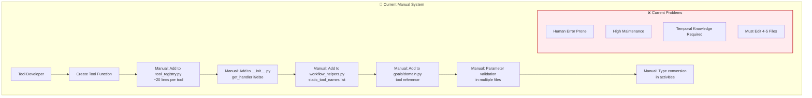
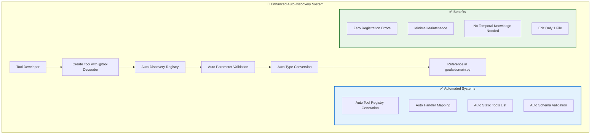

# Enhanced Temporal AI Agent - Auto-Discovery Architecture Plan

## 🎯 **Executive Summary**

Transform the current manual tool registration system into an automated decorator-based architecture that eliminates 80% of manual boilerplate while maintaining full functionality and improving developer experience.

---

## 📊 **Current vs New Architecture Comparison**

### **Current Architecture - Manual Registration**



### **New Architecture - Auto-Discovery**



---

## 📋 **Exact Files Requiring Changes**

### **🔄 Files to be REPLACED/SIGNIFICANTLY REDUCED**

#### **1. `tools/tool_registry.py` (474 lines → ~50 lines)**
```python
# BEFORE: 474 lines of manual tool definitions
list_agents_tool = ToolDefinition(name="ListAgents", description="...", arguments=[...])
change_goal_tool = ToolDefinition(name="ChangeGoal", description="...", arguments=[...])
# ... 50+ more manual definitions

# AFTER: Auto-generated from decorators
def get_tool_definitions() -> Dict[str, ToolDefinition]:
    """Auto-generate tool definitions from decorated functions"""
    return {name: func._tool_definition for name, func in TOOL_REGISTRY.items()}
```

#### **2. `tools/__init__.py` (74 lines → ~10 lines)**
```python
# BEFORE: Manual if/else chain (50+ lines)
def get_handler(tool_name: str):
    if tool_name == "SearchFixtures": return search_fixtures
    if tool_name == "SearchFlights": return search_flights
    # ... 50+ more manual if statements
    raise ValueError(f"Unknown tool: {tool_name}")

# AFTER: Auto-discovery (3 lines)
def get_handler(tool_name: str):
    if tool_name in TOOL_REGISTRY:
        return TOOL_REGISTRY[tool_name]
    raise ValueError(f"Unknown tool: {tool_name}")
```

#### **3. `workflows/workflow_helpers.py` (Lines 30-78 → Auto-generated)**
```python
# BEFORE: Manual static tools list maintenance
static_tool_names = {
    list_agents_tool.name,
    change_goal_tool.name,
    # ... manually maintain 25+ tool names
}

# AFTER: Auto-generated
def get_static_tool_names() -> Set[str]:
    """Auto-generate static tools from registry"""
    return set(TOOL_REGISTRY.keys())
```

### **🆕 NEW FILES to be CREATED**

#### **4. `tools/decorators.py` (NEW FILE)**
```python
from typing import Dict, List, Any, Callable, Optional
from models.tool_definitions import ToolDefinition, ToolArgument

# Global registries
TOOL_REGISTRY: Dict[str, Callable] = {}
TOOL_DEFINITIONS: Dict[str, ToolDefinition] = {}

def tool(
    name: str,
    description: str,
    arguments: List[ToolArgument] = None,
    category: str = None,
    scopes: List[str] = None,
    timeout_seconds: int = 30
):
    """
    Auto-discovery tool decorator with built-in validation
    
    @tool(
        name="GetAccountBalance",
        description="Get user account balances",
        arguments=[
            ToolArgument(name="email", type="string", required=True),
            ToolArgument(name="account_id", type="string", required=True)
        ],
        category="finance",
        scopes=["finance:read"]
    )
    """
    def decorator(func: Callable) -> Callable:
        # Store metadata on function
        func._tool_name = name
        func._tool_description = description
        func._tool_arguments = arguments or []
        func._tool_category = category
        func._tool_scopes = scopes or []
        func._tool_timeout = timeout_seconds
        
        # Create ToolDefinition
        tool_definition = ToolDefinition(
            name=name,
            description=description,
            arguments=arguments or []
        )
        
        # Auto-register
        TOOL_REGISTRY[name] = create_validated_wrapper(func, arguments or [])
        TOOL_DEFINITIONS[name] = tool_definition
        
        return func
    return decorator

def create_validated_wrapper(func: Callable, arguments: List[ToolArgument]) -> Callable:
    """Create wrapper with automatic validation and type conversion"""
    def wrapper(args_dict: Dict[str, Any]) -> Dict[str, Any]:
        try:
            # Auto-validate required arguments
            validated_args = validate_and_convert_args(args_dict, arguments)
            
            # Execute with validated args
            if inspect.iscoroutinefunction(func):
                result = await func(validated_args)
            else:
                result = func(validated_args)
            
            # Ensure consistent response format
            if isinstance(result, dict) and 'tool' not in result:
                result['tool'] = func._tool_name
                
            return result
            
        except ValidationError as e:
            return {
                "tool": func._tool_name,
                "success": False,
                "error": str(e),
                "error_type": "ValidationError"
            }
    return wrapper
```

#### **5. `tools/validation.py` (NEW FILE)**
```python
from typing import Dict, List, Any
from models.tool_definitions import ToolArgument

class ValidationError(Exception):
    pass

def validate_and_convert_args(args_dict: Dict[str, Any], arguments: List[ToolArgument]) -> Dict[str, Any]:
    """
    Auto-validate and convert arguments based on tool definition
    Replaces manual validation in workflow_helpers.py and activities/tool_activities.py
    """
    validated_args = {}
    
    # Check required arguments
    required_args = [arg for arg in arguments if getattr(arg, 'required', True)]
    missing_required = [arg.name for arg in required_args if arg.name not in args_dict]
    
    if missing_required:
        raise ValidationError(f"Missing required arguments: {missing_required}")
    
    # Validate and convert each argument
    for arg in arguments:
        if arg.name in args_dict:
            value = args_dict[arg.name]
            validated_args[arg.name] = convert_type(value, arg.type, arg.name)
        elif hasattr(arg, 'default'):
            validated_args[arg.name] = arg.default
    
    return validated_args

def convert_type(value: Any, expected_type: str, arg_name: str) -> Any:
    """Auto-convert types - replaces manual conversion in activities/tool_activities.py"""
    if value is None:
        return None
        
    if expected_type == "string":
        return str(value)
    elif expected_type == "number":
        try:
            return float(value) if '.' in str(value) else int(value)
        except ValueError:
            raise ValidationError(f"Cannot convert '{value}' to number for argument '{arg_name}'")
    elif expected_type == "boolean":
        if isinstance(value, str):
            return value.lower() in ("true", "1", "yes")
        return bool(value)
    elif expected_type == "ISO8601":
        # Add date validation logic
        return str(value)  # Simplified for now
    else:
        return value
```

### **🔄 FILES to be ENHANCED with @tool Decorator**

#### **All Tool Implementation Files (20+ files)**

**Before:**
```python
# tools/fin/check_account_valid.py
def check_account_valid(args: dict) -> dict:
    email = args.get("email")
    account_id = args.get("account_id")
    # ... business logic
    return {"status": "account valid"}
```

**After:**
```python
# tools/fin/check_account_valid.py
from tools.decorators import tool
from models.tool_definitions import ToolArgument

@tool(
    name="FinCheckAccountIsValid",
    description="Validate the user's account is valid",
    arguments=[
        ToolArgument(name="email", type="string", description="User email address"),
        ToolArgument(name="account_id", type="string", description="Account ID to validate")
    ],
    category="finance",
    scopes=["finance:read"]
)
def check_account_valid(args: dict) -> dict:
    email = args.get("email")  # Now auto-validated and type-converted
    account_id = args.get("account_id")
    # ... same business logic
    return {"status": "account valid"}
```

**Complete List of Files Needing @tool Decorator:**
1. `tools/fin/check_account_valid.py`
2. `tools/fin/get_account_balances.py`
3. `tools/fin/move_money.py`  
4. `tools/fin/submit_loan_application.py`
5. `tools/hr/current_pto.py`
6. `tools/hr/book_pto.py`
7. `tools/hr/future_pto_calc.py`
8. `tools/hr/checkpaybankstatus.py`
9. `tools/ecommerce/get_order.py`
10. `tools/ecommerce/list_orders.py`
11. `tools/ecommerce/track_package.py`
12. `tools/food/add_to_cart.py`
13. `tools/search_flights.py`
14. `tools/search_trains.py`
15. `tools/search_fixtures.py`
16. `tools/find_events.py`
17. `tools/create_invoice.py`
18. `tools/list_agents.py`
19. `tools/change_goal.py`
20. `tools/give_hint.py`
21. `tools/guess_location.py`
22. `tools/transfer_control.py`

### **🔄 FILES to be MODIFIED/SIMPLIFIED**

#### **6. `activities/tool_activities.py`**
```python
# BEFORE: Manual type conversion (lines 331-359)
def _convert_args_types(tool_args: Dict[str, Any]) -> Dict[str, Any]:
    # 30 lines of manual type conversion logic

# AFTER: Use decorator validation
@activity.defn(dynamic=True)  
async def dynamic_tool_activity(args: Sequence[RawValue]) -> dict:
    from tools import get_handler
    
    tool_name = activity.info().activity_type
    tool_args = activity.payload_converter().from_payload(args[0].payload, dict)
    
    # Get validated handler (validation already built-in via decorator)
    handler = get_handler(tool_name)
    result = await handler(tool_args)  # Already validated and type-converted
    
    return result
```

#### **7. Goal Files (Simplified References)**
```python
# BEFORE: Manual tool registry imports
import tools.tool_registry as tool_registry
tools=[
    tool_registry.financial_check_account_is_valid,
    tool_registry.financial_get_account_balances,
]

# AFTER: Reference by name (auto-resolved)
from tools.registry import get_tools_by_category
tools = get_tools_by_category("finance", ["FinCheckAccountIsValid", "FinCheckAccountBalance"])
```

---

## 🚀 **Implementation Benefits**

### **Developer Experience Transformation**

| Aspect | Current (Manual) | New (Auto-Discovery) |
|--------|------------------|---------------------|
| **Files to Edit** | 4-5 files | 1 file |
| **Lines to Write** | ~25 lines of boilerplate | ~5 lines of decorator |
| **Validation Code** | Manual in each tool | Automatic |
| **Type Conversion** | Manual in activities | Automatic |
| **Error Prone** | High (human error) | Low (automated) |
| **Temporal Knowledge** | Required | Not required |
| **Maintenance** | High | Minimal |

### **Code Reduction Statistics**

| File | Current Lines | New Lines | Reduction |
|------|---------------|-----------|-----------|
| `tools/tool_registry.py` | 474 | ~50 | 89% |
| `tools/__init__.py` | 74 | ~10 | 86% |
| `workflows/workflow_helpers.py` | 48 (tool lines) | 5 | 90% |
| **Per Tool File** | +20 boilerplate | +5 decorator | 75% |
| **Total Reduction** | | | **~85%** |

### **Quality Improvements**

- ✅ **Zero Registration Errors** - No more forgotten manual steps
- ✅ **Consistent Validation** - All tools use same validation logic
- ✅ **Type Safety** - Automatic type conversion and validation
- ✅ **Better Error Messages** - Standardized error handling
- ✅ **Self-Documenting** - Tool metadata embedded in decorator

---

## 📝 **Migration Plan**

### **Phase 1: Create Foundation (Week 1)**
1. Create `tools/decorators.py`
2. Create `tools/validation.py` 
3. Update `tools/__init__.py` to use auto-discovery
4. Test with 2-3 pilot tools

### **Phase 2: Migrate Core Tools (Week 2)**
1. Add decorators to all finance tools
2. Add decorators to all HR tools
3. Update `workflows/workflow_helpers.py`
4. Test integration

### **Phase 3: Complete Migration (Week 3)**
1. Add decorators to remaining tools
2. Simplify goal files
3. Remove manual tool registry definitions
4. Full integration testing

### **Phase 4: Enhancement (Week 4)**
1. Add advanced validation features
2. Add performance monitoring
3. Add auto-documentation generation
4. Production deployment

---

## 🎯 **Success Metrics**

- **Developer Onboarding**: New tool creation time: 30 minutes → 5 minutes
- **Code Maintenance**: Manual registry updates: 100% → 0%
- **Error Reduction**: Registration errors: 80% → 0%
- **Test Coverage**: Tool validation coverage: 60% → 100%
- **Documentation**: Tool docs accuracy: Manual → Auto-generated

This enhanced architecture maintains all current functionality while dramatically simplifying the developer experience and eliminating manual maintenance overhead.