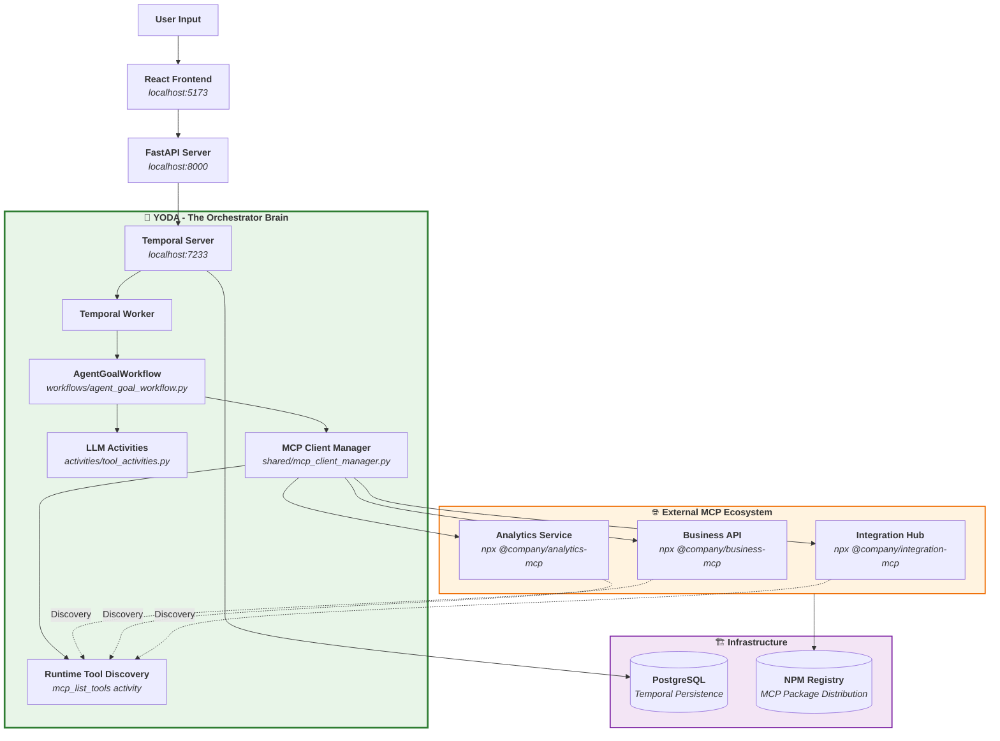
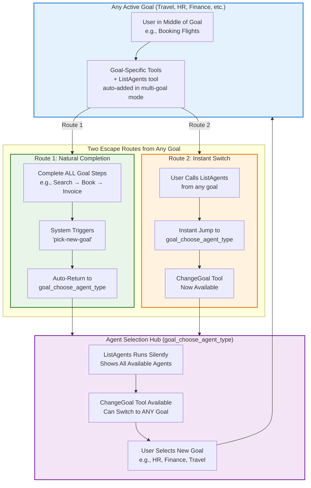

# Enhanced Temporal AI Agent - Architecture Documentation

## 🎯 **Executive Summary**

Document the current MCP server integration system and explore potential enhancements for streamlined tool development workflows while maintaining full Temporal orchestration capabilities.

**🔑 Key Insight:** The system already supports excellent MCP integration with NPM-based distribution and runtime tool discovery.

---

## 📊 **Architecture Overview**

### **MCP Server Integration Architecture**

**Quick Setup:**
1. Add server definition to `shared/mcp_config.py`
2. Reference in goal files 
3. Publish via NPM
4. Tools auto-discovered at runtime



## 👥 **Team Separation Pattern**

### **🛠️ Tool Development Team**
```bash
# 1. Build MCP Server following MCP protocol standard
# Node.js, Python, Go, etc. - any language that can create NPM executable

# 2. Develop tools with correct schema (automatically validated)
{
  "name": "GetCustomerOrders",
  "description": "Retrieve customer order history",
  "inputSchema": {
    "type": "object",
    "properties": {
      "customer_id": {"type": "string", "description": "Customer identifier"},
      "date_range": {"type": "string", "description": "Date range filter"}
    },
    "required": ["customer_id"]
  }
}

# 3. Publish to NPM
npm publish @company/business-mcp

# 4. Notify goal team
"Hey, we added @company/business-mcp with order management and customer tools"
```

---

### **🎨 Goal Team** (Agent Design & User Experience Focus)

**Responsibility**: Agent personas, conversation flows, user experience

**Process**: Discover MCP tools and design agents
```python
# Step 1: Add MCP server definition to shared/mcp_config.py
def get_business_mcp_server_definition(included_tools: list[str]) -> MCPServerDefinition:
    return MCPServerDefinition(
        name="business-mcp",
        command="npx",
        args=["-y", "@company/business-mcp"],
        included_tools=included_tools,
    )

# Step 2: Tools are automatically discovered at runtime via mcp_list_tools
# Returns schema like:
{
  "GetCustomerOrders": {
    "name": "GetCustomerOrders",
    "description": "Retrieve customer order history", 
    "inputSchema": {
      "properties": {
        "customer_id": {"type": "string", "description": "Customer identifier"},
        "date_range": {"type": "string", "description": "Date range filter"}
      },
      "required": ["customer_id"]
    }
  }
}

# Step 3: Design goals using MCP server reference
# goals/business.py - Focus on agent behavior and UX  
goal_business_assistant = AgentGoal(
    agent_name="Business Assistant",
    agent_friendly_description="Help with customer orders and business operations",
    starter_prompt="Hi! I can help with your business operations...",
    
    # Reference MCP server (tools auto-discovered at runtime)
    mcp_server_definition=get_business_mcp_server_definition(
        included_tools=["GetCustomerOrders", "UpdateOrderStatus"]
    ),
)
```

---

## **Low-Friction Team Workflow**

The MCP integration enables minimal coordination between teams through a simple 5-step process:

1. **Tool Development Team**: Build + publish MCP server to NPM (any tech stack + MCP protocol)
2. **Goal Team**: Add ~10 lines to `shared/mcp_config.py` (centralized registry)
3. **System Integration**: Goals reference MCP servers - tools automatically discovered at runtime
4. **Distribution**: NPM handles all distribution - no manual coordination needed!
5. **Immediate Availability**: Tools become available instantly when goal activates

**Key Benefits**: Teams work independently, MCP protocol ensures compatibility, runtime discovery eliminates manual registration.

---

## **Goal Switching Architecture**

The system implements a dual-path goal switching mechanism that gives users maximum flexibility:



Users never get "stuck" in a goal - they always have two escape routes. The agent selection hub serves as the universal switching point, providing instant gratification without needing to complete the current goal.

---

## **Multi-Goal Mode as Default Architecture**

### **🔄 Current Problem: Opt-In Multi-Goal Mode**

**Current State:**
- Multi-goal mode is **opt-in** via environment variable `AGENT_GOAL="goal_choose_agent_type"`
- **Default behavior** is single-agent mode (users get locked into one agent)
- **Most users miss** the flexible goal-switching capabilities
- **Complex setup** required to enable the best UX

```python
# goals/__init__.py - Current opt-in logic
first_goal_value = os.getenv("AGENT_GOAL")
if first_goal_value is None:
    multi_goal_mode = False  # ← Default: Single agent (limited)
elif first_goal_value.lower() == "goal_choose_agent_type":
    multi_goal_mode = True   # ← Opt-in: Multi-agent (flexible)
else:
    multi_goal_mode = False
```

### **✅ Enhanced Solution: Multi-Goal Mode by Default**

**New Architecture Decision:** Make the superior dual-path goal switching the **default user experience**.

```python
# goals/__init__.py - ENHANCED: Multi-goal by default
first_goal_value = os.getenv("AGENT_GOAL", "goal_choose_agent_type")  # ← Default changed!

# Multi-goal mode is now the default behavior
multi_goal_mode = True

# Optional: Allow opt-out for specialized deployments
force_single_mode = os.getenv("FORCE_SINGLE_AGENT_MODE", "false").lower() == "true"
if force_single_mode:
    multi_goal_mode = False
    first_goal_value = os.getenv("SINGLE_AGENT_GOAL", "goal_travel_flights")
```

### **🚀 Architecture Benefits of Default Multi-Goal Mode**

#### **👥 Universal User Experience**
```mermaid
graph LR
    subgraph CurrentLimited ["❌ Current: Limited by Default"]
        direction TB
        NewUser1[New User Starts]
        SingleAgent1[Locked to One Agent<br/>e.g., Only Flight Booking]
        Frustrated1[😤 "I want to check PTO too"<br/>Can't switch easily]
        
        NewUser1 --> SingleAgent1
        SingleAgent1 --> Frustrated1
    end
    
    subgraph EnhancedFlexible ["✅ Enhanced: Flexible by Default"]
        direction TB
        NewUser2[New User Starts]
        AgentSelection[Intelligent Agent Selection<br/>goal_choose_agent_type]
        MultipleOptions[🎉 Can Switch Anytime<br/>Flight → HR → Finance → Food]
        Delighted[😊 "This system understands me"<br/>Seamless experience]
        
        NewUser2 --> AgentSelection
        AgentSelection --> MultipleOptions
        MultipleOptions --> Delighted
    end
    
    classDef limited fill:#ffebee,stroke:#c62828,stroke-width:2px
    classDef flexible fill:#e8f5e8,stroke:#2e7d32,stroke-width:2px
    
    class CurrentLimited limited
    class EnhancedFlexible flexible
```

#### **🔧 Technical Implementation**

**Changes Required:**
1. **Default Environment Variable**: `AGENT_GOAL="goal_choose_agent_type"`
2. **Auto-Add ListAgents**: Applied to **all goals by default**
3. **Conversation History**: Already works across goal switches
4. **Smart Intent Detection**: Enhanced `goal_choose_agent_type` prompts

#### **📊 User Experience Comparison**

| Scenario | Current (Single Mode Default) | Enhanced (Multi Mode Default) |
|----------|-------------------------------|-------------------------------|
| **New User** | Locked to one agent type | Starts with agent selection hub |
| **Task Switching** | Must restart or manually configure | Natural "I want to..." → auto-switch |
| **Discovery** | Limited to current agent's scope | Sees all available capabilities |
| **Setup Complexity** | Requires env var knowledge | Works out of the box |
| **Adoption** | Power users only | All users get best experience |

#### **🎪 Default User Journey**

**Enhanced Default Flow:**
1. **User starts system** → Automatically in `goal_choose_agent_type`
2. **"I want to book a flight"** → Smart agent selection → Direct to travel agent
3. **Mid-flight booking:** **"Actually, let me check my PTO first"** → ListAgents → Auto-switch to HR
4. **After PTO check:** **"Now back to flights"** → Smart history analysis → Back to travel
5. **Seamless experience** across all business domains

#### **⚙️ Configuration Options**

```python
# Environment Variables - New Defaults
AGENT_GOAL="goal_choose_agent_type"          # ← Multi-goal by default
FORCE_SINGLE_AGENT_MODE="false"             # ← Opt-out for specialized use
SINGLE_AGENT_GOAL="goal_travel_flights"     # ← Fallback if force single
SMART_INTENT_DETECTION="true"               # ← Enhanced agent selection
```

#### **🔄 Migration Path**

**Existing Deployments:**
- **Backward Compatible**: Current single-mode setups continue working
- **Gradual Migration**: Teams can test multi-mode without breaking changes
- **Override Available**: `FORCE_SINGLE_AGENT_MODE=true` for specialized deployments

**New Deployments:**
- **Multi-goal by default**: Superior UX out of the box
- **No configuration needed**: Works optimally without setup
- **Discovery-friendly**: Users naturally find all available agents

### **🎯 Strategic Impact**

#### **🚀 Developer Experience**
- **Simplified Onboarding**: New developers see full system capabilities immediately
- **Reduced Support**: Users don't get stuck in single-agent limitations
- **Better Testing**: Default behavior exercises all goal-switching logic

#### **👥 User Adoption**
- **Natural Discovery**: Users find agents they didn't know existed
- **Reduced Friction**: No manual configuration to unlock features
- **Intuitive Workflow**: "I want to..." → system handles routing

#### **📈 Business Value**
- **Increased Engagement**: Users explore more business capabilities
- **Reduced Training**: Intuitive multi-agent experience
- **Future-Proof**: New agents automatically available to all users

This architectural change transforms the system from "single-purpose tool with optional flexibility" to "intelligent multi-agent platform by default".