# Enhanced Temporal AI Agent - Architecture Documentation

## 🎯 **Executive Summary**

Document the current MCP server integration system and explore potential enhancements for streamlined tool development workflows while maintaining full Temporal orchestration capabilities.

**🔑 Key Insight:** The system already supports excellent MCP integration with NPM-based distribution and runtime tool discovery.

---

## 📊 **Architecture Overview**

### **MCP Server Integration Architecture**

**Quick Setup:**
1. Add server definition to `shared/mcp_config.py`
2. Reference in goal files 
3. Publish via NPM
4. Tools auto-discovered at runtime


## 👥 **Team Separation Pattern**

### **🛠️ Tool Development Team**
```bash
# 1. Build MCP Server following MCP protocol standard
# Node.js, Python, Go, etc. - any language that can create NPM executable

# 2. Develop tools with correct schema (automatically validated)
{
  "name": "GetCustomerOrders",
  "description": "Retrieve customer order history",
  "inputSchema": {
    "type": "object",
    "properties": {
      "customer_id": {"type": "string", "description": "Customer identifier"},
      "date_range": {"type": "string", "description": "Date range filter"}
    },
    "required": ["customer_id"]
  }
}

# 3. Publish to NPM
npm publish @company/business-mcp

# 4. Notify goal team
"Hey, we added @company/business-mcp with order management and customer tools"
```

---

### **🎨 Goal Team** (Agent Design & User Experience Focus)

**Responsibility**: Agent personas, conversation flows, user experience

**Process**: Discover MCP tools and design agents
```python
# Step 1: Add MCP server definition to shared/mcp_config.py
def get_business_mcp_server_definition(included_tools: list[str]) -> MCPServerDefinition:
    return MCPServerDefinition(
        name="business-mcp",
        command="npx",
        args=["-y", "@company/business-mcp"],
        included_tools=included_tools,
    )

# Step 2: Tools are automatically discovered at runtime via mcp_list_tools
# Returns schema like:
{
  "GetCustomerOrders": {
    "name": "GetCustomerOrders",
    "description": "Retrieve customer order history", 
    "inputSchema": {
      "properties": {
        "customer_id": {"type": "string", "description": "Customer identifier"},
        "date_range": {"type": "string", "description": "Date range filter"}
      },
      "required": ["customer_id"]
    }
  }
}

# Step 3: Design goals using MCP server reference
# goals/business.py - Focus on agent behavior and UX  
goal_business_assistant = AgentGoal(
    agent_name="Business Assistant",
    agent_friendly_description="Help with customer orders and business operations",
    starter_prompt="Hi! I can help with your business operations...",
    
    # Reference MCP server (tools auto-discovered at runtime)
    mcp_server_definition=get_business_mcp_server_definition(
        included_tools=["GetCustomerOrders", "UpdateOrderStatus"]
    ),
)
```

---

## **Low-Friction Team Workflow**

The MCP integration enables minimal coordination between teams through a simple 5-step process:

1. **Tool Development Team**: Build + publish MCP server to NPM (any tech stack + MCP protocol)
2. **Goal Team**: Add ~10 lines to `shared/mcp_config.py` (centralized registry)
3. **System Integration**: Goals reference MCP servers - tools automatically discovered at runtime
4. **Distribution**: NPM handles all distribution - no manual coordination needed!
5. **Immediate Availability**: Tools become available instantly when goal activates

**Key Benefits**: Teams work independently, MCP protocol ensures compatibility, runtime discovery eliminates manual registration.

---

## **Goal Switching Architecture**

The system implements a dual-path goal switching mechanism that gives users maximum flexibility:


Users never get "stuck" in a goal - they always have two escape routes. The agent selection hub serves as the universal switching point, providing instant gratification without needing to complete the current goal.

The system supports both single-mode (locked to one agent) and multi-mode (flexible goal switching). **YODA defaults to multi-mode to enable the agent orchestration layer and provide the best user experience.**

---

## **Response Schema & Examples Integration to MCP Schema**

**Current State**: 
- MCP servers only provide `inputSchema` for tool parameters
- Goal teams manually write example responses in `example_conversation_history`
- No formal output schema validation

**Enhanced MCP Schema Integration:**

```python
# MCP Server: @company/auth-mcp
{
  "name": "ValidateJWT",
  "description": "Validate user JWT token and extract permissions",
  "inputSchema": {
    "type": "object",
    "properties": {
      "jwt_token": {"type": "string", "description": "User JWT token"}
    },
    "required": ["jwt_token"]
  },
  "responseSchema": {
    "type": "object", 
    "properties": {
      "valid": {"type": "boolean"},
      "user_id": {"type": "string"},
      "scopes": {"type": "array", "items": {"type": "string"}},
      "expires_at": {"type": "string", "format": "date-time"}
    }
  },
  "examples": {
    "success": {
      "valid": true,
      "user_id": "user_123", 
      "scopes": ["finance:read", "hr:write"],
      "expires_at": "2024-01-15T10:30:00Z"
    },
    "error": {
      "valid": false,
      "error": "Token expired"
    }
  }
}
```

**Implementation Purpose for Goal Teams:**

This enhancement is specifically designed so **goal teams know exactly what responses are expected to be fed to the LLM**:

1. **Schema + Examples**: Goal teams see precise response structure and concrete examples, eliminating guesswork
2. **MCP-Informed Manual Writing**: Goal teams copy from MCP examples to design accurate agent conversations

**Current example_conversation_history approach:**
```python
example_conversation_history="\n ".join([
    "user_confirmed_tool_run: <user clicks confirm on ValidateJWT tool>",
    "tool_result: { 'valid': true, 'user_id': 'user_123' }",  # Manual writing
    "agent: Your token is valid!"
])
```

---

## **JWT Token Authentication Architecture**

**Use Case**: YODA embedded in existing authenticated platforms, where business MCPs need user-specific authorization.

### **Complete JWT Flow Architecture**

```mermaid
graph TD
    subgraph Frontend ["🌐 Frontend (Embedded in Portal)"]
        PortalSession["Portal Session<br/>sessionId: abc123"]
        YodaUI["YODA Chat UI<br/>React Component"]
        PortalSession --> YodaUI
    end
    
    subgraph YODA ["🧠 YODA System"]
        API["FastAPI<br/>/send-prompt"]
        Workflow["AgentGoalWorkflow<br/>session_context: abc123"]
        JWTActivity["MCP Activity<br/>GetJWTFromSession"]
        
        API --> Workflow
        Workflow --> JWTActivity
    end
    
    subgraph AuthMCP ["🔐 Auth MCP Server"]
        GetJWTTool["GetJWTFromSession<br/>MCP Tool"]
        PortalAPI["Portal API Call<br/>GET /api/session/abc123"]
        
        JWTActivity --> GetJWTTool
        GetJWTTool --> PortalAPI
    end
    
    subgraph BusinessMCP ["🏢 Business MCP Server"]
        CustomerTool["GetCustomerOrders<br/>Requires JWT"]
        BusinessAPI["Business API<br/>Authorization: Bearer jwt_token"]
        
        CustomerTool --> BusinessAPI
    end
    
    %% JWT Flow
    YodaUI -->|"{ prompt, sessionId }"| API
    PortalAPI -->|"{ jwt_token, user_id, scopes }"| GetJWTTool
    GetJWTTool -->|"JWT Response"| JWTActivity
    JWTActivity -->|"Store JWT"| Workflow
    Workflow -->|"Pass JWT to tools"| CustomerTool
    
    classDef frontend fill:#e3f2fd,stroke:#1976d2,stroke-width:2px
    classDef yoda fill:#e8f5e8,stroke:#2e7d32,stroke-width:2px
    classDef auth fill:#fff3e0,stroke:#ef6c00,stroke-width:2px
    classDef business fill:#f3e5f5,stroke:#7b1fa2,stroke-width:2px
    
    class Frontend frontend
    class YODA yoda
    class AuthMCP auth
    class BusinessMCP business
```



JWT tokens will be obtained from the Auth MCP server using the session ID passed from the frontend. These tokens are then used to provide authorization restrictions, controlling which tools and data each user can access within the platform.

**Example JWT Flow:**

**1. Auth MCP Response:**
```json
{
  "jwt_token": "eyJhbGciOiJIUzI1NiIsInR5cCI6IkpXVCJ9...",
  "user_id": "user_123",
  "scopes": ["csr", "ops", "sales"],
  "expires_at": "2024-01-15T10:30:00Z"
}
```

**2. Business MCP Tool Request (with JWT):**
```json
{
  "date_range": "2024-01-01,2024-01-31",
  "jwt_token": "eyJhbGciOiJIUzI1NiIsInR5cCI6IkpXVCJ9..."
  // jwt_token includes customer_id
}
```

The business MCP server validates the JWT token and scopes before executing the requested tool, ensuring users only access authorized data.

---

## **Alert & Schedule System Architecture**

**Use Case**: Users can set alerts ("notify when BTC drops 5%") and schedules ("sell when BTC rises 5%") through natural language interaction with YODA, creating a global orchestration system accessible from anywhere.

### **Implementation Overview**

**Database Extension**: Add alerts and schedules tables to existing PostgreSQL (Temporal persistence database):

```sql
-- User alerts/schedules identified by JWT token
alerts_table: user_id, condition, status (active/triggered/dismissed), created_at
schedules_table: user_id, action, condition, status (pending/executed/failed), created_at
```

**Frontend Enhancement**: Add notification area above the chat interface:

```javascript
// New UI component above search box
<AlertsScheduleBox>
  <Alerts>
    • BTC Alert: -5% trigger (active)
    • Unpaid Fee: $50 overdue (triggered)
  </Alerts>
  <Schedules>
    • BTC Sell: +5% trigger (pending)
    • Monthly Report: Completed ✓
  </Schedules>
</AlertsScheduleBox>
```

**User Flow Examples**:
- **Alert**: "Let me know when my BTC value goes down more than 5%" → Creates alert entry with user's JWT token
- **Schedule**: "Sell my BTC once it goes up 5%" → Creates schedule entry with execution logic
- **Global Access**: Users can interact with YODA from any location, all alerts/schedules tracked by JWT identity

**Status Types**: `active`, `triggered`, `executed`, `failed`, `dismissed`, `completed`

This extends YODA from a conversational agent to a persistent orchestration platform where users can set long-term automation and monitoring across all their integrated business tools.
