# Enhanced Temporal AI Agent - Auto-Discovery Architecture Plan

## 🎯 **Executive Summary**

Transform the current manual tool registration system into an automated decorator-based architecture that eliminates 80% of manual boilerplate while maintaining full functionality and improving developer experience.

---

## 📊 **Current vs New Architecture Comparison**

### **Current Architecture - Monolithic Manual System**


**❌ Current Tool Development Reality:**

Tool developers work directly in the monolithic codebase and must:

1. **Create tool function** (`tools/fin/check_account_valid.py`)
2. **Add manual definition** (`tools/tool_registry.py` - 20+ lines of ToolDefinition)
3. **Add manual handler** (`tools/__init__.py` - if/else statement in get_handler())
4. **Add to static list** (`workflows/workflow_helpers.py` - manual static_tool_names maintenance)
5. **Reference in goal** (`goals/finance.py` - import and reference tool_registry)

**Current Pain Points:**
- ❌ **Manual registration** across 4-5 files per tool
- ❌ **Human error prone** - easy to forget steps or make mistakes
- ❌ **Temporal knowledge required** - must understand workflow internals
- ❌ **No validation automation** - manual parameter checking everywhere
- ❌ **High maintenance overhead** - 50+ manual if/else statements in get_handler()

### **New Architecture - Enhanced Auto-Discovery System**

```mermaid
graph TB
    User[User Input] --> Frontend[React Frontend<br/>localhost:5173]
    Frontend --> API[FastAPI Server<br/>localhost:8000]
    API --> Temporal[Temporal Server<br/>localhost:7233]
    Temporal --> Worker[Temporal Worker]
    
    subgraph EnhancedSystem ["🚀 Enhanced Monolithic Codebase with Auto-Discovery"]
        direction TB
        Worker --> AgentWorkflow[AgentGoalWorkflow<br/>workflows/agent_goal_workflow.py]
        AgentWorkflow --> LLMActivity[LLM Activities<br/>activities/tool_activities.py]
        AgentWorkflow --> ToolExecution[Tool Execution<br/>workflows/workflow_helpers.py]
        
        ToolExecution --> AutoHandler[Auto get_handler Function<br/>tools/__init__.py]
        AutoHandler --> DecoratedTools["Auto-Registered Tool Functions<br/>tools/*/ with tool decorator"]
        
        ToolExecution --> MCPClient[MCP Client Manager<br/>shared/mcp_client_manager.py]
        MCPClient --> ExternalMCP[External MCP Servers<br/>Stripe, etc.]
        
        subgraph AutoDiscovery ["✅ Auto-Discovery Tool System"]
            AutoRegistry["tools/decorators.py<br/>Tool Decorator Auto-Registration"]
            AutoValidation["tools/validation.py<br/>Auto Parameter Validation"]
            AutoDefinitions["Auto-Generated ToolDefinitions<br/>Runtime Discovery"]
            AutoStaticList["Auto-Generated static_tool_names<br/>Dynamic Loading"]
        end
        
        subgraph DataLayer ["📊 Data Layer"]
            Postgres[(PostgreSQL<br/>- Temporal Event History<br/>- Workflow State<br/>- Conversation Data)]
            Temporal --> Postgres
            LocalStorage[Browser LocalStorage<br/>- Chat History Cache]
        end
        
        subgraph Infrastructure ["🏗️ Infrastructure"]
            Docker[Docker Compose<br/>7 Containers:<br/>- temporal<br/>- postgresql<br/>- api<br/>- worker<br/>- train-api<br/>- frontend<br/>- temporal-ui]
        end
    end
    
    classDef enhanced fill:#e8f5e8,stroke:#2e7d32,stroke-width:3px
    classDef auto fill:#e3f2fd,stroke:#1976d2,stroke-width:2px
    classDef dataBox fill:#fff3e0,stroke:#ef6c00,stroke-width:2px
    classDef infraBox fill:#e8f5e8,stroke:#2e7d32,stroke-width:2px
    
    class EnhancedSystem enhanced
    class AutoDiscovery auto
    class DataLayer dataBox
    class Infrastructure infraBox
```



## 👥 **Perfect Team Separation**

### **🛠️ Tool Development Team** (Technical Focus)

**Responsibility**: Business logic implementation only

**Process**: Create ONE file per tool
```python
# tools/finance/credit_score.py (ONLY file to create)
from tools.decorators import tool
from models.tool_definitions import ToolArgument

@tool(
    name="CheckCreditScore",
    description="Check user's credit score", 
    category="finance",
    arguments=[
        ToolArgument(name="ssn", type="string", description="Social Security Number"),
        ToolArgument(name="email", type="string", description="User email address")
    ]
)
def check_credit_score(args: dict) -> dict:
    # ONLY business logic - validation handled by decorator
    ssn = args.get("ssn")
    email = args.get("email")
    
    credit_score = calculate_credit_score(ssn, email)
    
    return {
        "success": True,
        "credit_score": credit_score,
        "rating": "Excellent" if credit_score > 750 else "Good"
    }
```

**Tool Developer Benefits:**
- ✅ **Explicit control** - specify exactly what you need
- ✅ **Clear naming** - no auto-conversion confusion
- ✅ **Custom categories** - organize tools as needed
- ✅ **Auto-registration** - no more manual registry editing
- ✅ **Zero goal knowledge** - never touch goal files
- ✅ **No Temporal concepts** - decorators handle workflow integration
- ✅ **Auto-integration** - tools automatically available to appropriate agents

---

### **🎨 Goal Manager Team** (Agent Design & UX Focus)

**Responsibility**: Agent personas, conversation flows, user experience

**Process**: Design agents with flexible tool composition
```python
# goals/finance.py - Focus on agent behavior and UX
from tools.auto_discovery import get_tools_by_category, auto_discover_tools

goal_fin_basic_assistant = AgentGoal(
    agent_name="Finance Assistant",
    agent_friendly_description="Help with basic banking and account management",
    starter_prompt="Hi! I can help you with your banking needs...",
    
    # OPTION 1: Auto-discover ALL finance tools (zero maintenance)
    tools=get_tools_by_category("finance")
)

goal_fin_account_specialist = AgentGoal(
    agent_name="Account Specialist", 
    agent_friendly_description="Specialized help for account balances and validation",
    
    # OPTION 2: Hand-pick specific tools
    tools=auto_discover_tools([
        "FinCheckAccountIsValid",
        "FinGetAccountBalances"
    ])
)

goal_fin_advanced_advisor = AgentGoal(
    agent_name="Financial Advisor",
    agent_friendly_description="Advanced financial planning and services",
    
    # OPTION 3: Category with exclusions
    tools=get_tools_by_category("finance", exclude=["FinHighRiskTrading"])
)

goal_fin_travel_concierge = AgentGoal(
    agent_name="Travel Finance Concierge",
    agent_friendly_description="Handle travel expenses and financial planning",
    
    # OPTION 4: Mixed composition (multiple categories + specific tools)
    tools=(
        get_tools_by_category("finance", exclude=["FinAdvancedTrading"]) +
        get_tools_by_category("travel") +
        auto_discover_tools(["SendEmail", "ScheduleAppointment"])
    )
)
```

**Goal Manager Benefits:**
- ✅ **Design freedom** - choose the best tool composition for each agent
- ✅ **Zero tool maintenance** - new tools automatically available via categories
- ✅ **Fine control** - include/exclude exactly what you want
- ✅ **Focus on UX** - agent personalities, conversation flows, user experience
- ✅ **Always up-to-date** - rest assured all tools are automatically exposed

---

### **🔄 Automatic Bridge Between Teams**

```mermaid
graph LR
    subgraph ToolTeam [🛠️ Tool Development Team]
        CreateTool[Create tools/finance/new_tool.py<br/>with @tool decorator]
    end
    
    subgraph System [🔧 Auto-Discovery System]
        AutoRegistry[Auto-Registry by category<br/>tools/decorators.py]
        CategoryAPI[get_tools_by_category API<br/>tools/auto_discovery.py]
    end
    
    subgraph GoalTeam [🎨 Goal Manager Team]
        DesignAgent[Design agent behavior<br/>goals/finance.py]
        UseTools[tools = get_tools_by_category finance]
    end
    
    CreateTool --> AutoRegistry
    AutoRegistry --> CategoryAPI
    CategoryAPI --> UseTools
    UseTools --> DesignAgent
    
    classDef toolTeam fill:#e3f2fd,stroke:#1976d2,stroke-width:2px
    classDef goalTeam fill:#f3e5f5,stroke:#7b1fa2,stroke-width:2px
    classDef system fill:#e8f5e8,stroke:#2e7d32,stroke-width:2px
    
    class ToolTeam toolTeam
    class GoalTeam goalTeam
    class System system
```



**Perfect Workflow:**
1. **Tool developers** create `tools/{domain}/{tool}.py` with `category="finance"`
2. **System** automatically registers tools by category
3. **Goal managers** use flexible tool selection in `goals/{domain}.py`
4. **Zero coordination needed** between teams!

---

## 📋 **Exact Files Requiring Changes**

### **🔄 Files to be REPLACED/SIGNIFICANTLY REDUCED**

#### **1. `tools/tool_registry.py` (474 lines → ~50 lines)**
```python
# BEFORE: 474 lines of manual tool definitions
list_agents_tool = ToolDefinition(name="ListAgents", description="...", arguments=[...])
change_goal_tool = ToolDefinition(name="ChangeGoal", description="...", arguments=[...])
# ... 50+ more manual definitions

# AFTER: Auto-generated from decorators
def get_tool_definitions() -> Dict[str, ToolDefinition]:
    """Auto-generate tool definitions from decorated functions"""
    return {name: func._tool_definition for name, func in TOOL_REGISTRY.items()}
```

#### **2. `tools/__init__.py` (74 lines → ~10 lines)**
```python
# BEFORE: Manual if/else chain (50+ lines)
def get_handler(tool_name: str):
    if tool_name == "SearchFixtures": return search_fixtures
    if tool_name == "SearchFlights": return search_flights
    # ... 50+ more manual if statements
    raise ValueError(f"Unknown tool: {tool_name}")

# AFTER: Auto-discovery (3 lines)
def get_handler(tool_name: str):
    if tool_name in TOOL_REGISTRY:
        return TOOL_REGISTRY[tool_name]
    raise ValueError(f"Unknown tool: {tool_name}")
```

#### **3. `workflows/workflow_helpers.py` (Lines 30-78 → Auto-generated)**
```python
# BEFORE: Manual static tools list maintenance
static_tool_names = {
    list_agents_tool.name,
    change_goal_tool.name,
    # ... manually maintain 25+ tool names
}

# AFTER: Auto-generated
def get_static_tool_names() -> Set[str]:
    """Auto-generate static tools from registry"""
    return set(TOOL_REGISTRY.keys())
```

### **🆕 NEW FILES to be CREATED**

#### **4. `tools/decorators.py` (NEW FILE)**
```python
from typing import Dict, List, Any, Callable, Optional
from models.tool_definitions import ToolDefinition, ToolArgument

# Global registries
TOOL_REGISTRY: Dict[str, Callable] = {}
TOOL_DEFINITIONS: Dict[str, ToolDefinition] = {}

def tool(
    name: str,
    description: str,
    arguments: List[ToolArgument] = None,
    category: str = None
):
    """
    Auto-discovery tool decorator with built-in validation
    
    @tool(
        name="GetAccountBalance",
        description="Get user account balances",
        arguments=[
            ToolArgument(name="email", type="string", description="User email"),
            ToolArgument(name="account_id", type="string", description="Account ID")
        ],
        category="finance"
    )
    """
    def decorator(func: Callable) -> Callable:
        # Store metadata on function
        func._tool_name = name
        func._tool_description = description
        func._tool_arguments = arguments or []
        func._tool_category = category


        
        # Create ToolDefinition
        tool_definition = ToolDefinition(
            name=name,
            description=description,
            arguments=arguments or []
        )
        
        # Auto-register
        TOOL_REGISTRY[name] = create_validated_wrapper(func, arguments or [])
        TOOL_DEFINITIONS[name] = tool_definition
        
        return func
    return decorator

def create_validated_wrapper(func: Callable, arguments: List[ToolArgument]) -> Callable:
    """Create wrapper with automatic validation and type conversion"""
    def wrapper(args_dict: Dict[str, Any]) -> Dict[str, Any]:
        try:
            # Auto-validate required arguments
            validated_args = validate_and_convert_args(args_dict, arguments)
            
            # Execute with validated args
            if inspect.iscoroutinefunction(func):
                result = await func(validated_args)
            else:
                result = func(validated_args)
            
            # Ensure consistent response format
            if isinstance(result, dict) and 'tool' not in result:
                result['tool'] = func._tool_name
                
            return result
            
        except ValidationError as e:
            return {
                "tool": func._tool_name,
                "success": False,
                "error": str(e),
                "error_type": "ValidationError"
            }
    return wrapper
```

#### **5. `tools/validation.py` (NEW FILE)**
```python
from typing import Dict, List, Any
from models.tool_definitions import ToolArgument

class ValidationError(Exception):
    pass

def validate_and_convert_args(args_dict: Dict[str, Any], arguments: List[ToolArgument]) -> Dict[str, Any]:
    """
    Auto-validate and convert arguments based on tool definition
    Replaces manual validation in workflow_helpers.py and activities/tool_activities.py
    """
    validated_args = {}
    
    # Check required arguments
    required_args = [arg for arg in arguments if getattr(arg, 'required', True)]
    missing_required = [arg.name for arg in required_args if arg.name not in args_dict]
    
    if missing_required:
        raise ValidationError(f"Missing required arguments: {missing_required}")
    
    # Validate and convert each argument
    for arg in arguments:
        if arg.name in args_dict:
            value = args_dict[arg.name]
            validated_args[arg.name] = convert_type(value, arg.type, arg.name)
        elif hasattr(arg, 'default'):
            validated_args[arg.name] = arg.default
    
    return validated_args

def convert_type(value: Any, expected_type: str, arg_name: str) -> Any:
    """Auto-convert types - replaces manual conversion in activities/tool_activities.py"""
    if value is None:
        return None
        
    if expected_type == "string":
        return str(value)
    elif expected_type == "number":
        try:
            return float(value) if '.' in str(value) else int(value)
        except ValueError:
            raise ValidationError(f"Cannot convert '{value}' to number for argument '{arg_name}'")
    elif expected_type == "boolean":
        if isinstance(value, str):
            return value.lower() in ("true", "1", "yes")
        return bool(value)
    elif expected_type == "ISO8601":
        # Add date validation logic
        return str(value)  # Simplified for now
    else:
        return value
```

#### **6. `tools/auto_discovery.py` (NEW FILE) - Goal File Automation**
```python
from typing import List, Dict, Any
from models.tool_definitions import ToolDefinition
from tools.decorators import TOOL_REGISTRY, TOOL_DEFINITIONS

def auto_discover_tools(tool_names: List[str]) -> List[ToolDefinition]:
    """
    Auto-discover tools by name for goal files
    Eliminates manual tool_registry imports and references
    
    Usage in goals/finance.py:
    tools = auto_discover_tools(["FinCheckAccountIsValid", "FinGetAccountBalances"])
    """
    discovered_tools = []
    for tool_name in tool_names:
        if tool_name in TOOL_DEFINITIONS:
            discovered_tools.append(TOOL_DEFINITIONS[tool_name])
        else:
            available_tools = list(TOOL_DEFINITIONS.keys())
            raise ValueError(
                f"Tool '{tool_name}' not found in auto-registry. "
                f"Available tools: {available_tools}"
            )
    return discovered_tools

def get_tools_by_category(category: str) -> List[ToolDefinition]:
    """Get all tools for a specific category (finance, travel, etc.)"""
    category_tools = []
    for tool_name, func in TOOL_REGISTRY.items():
        if hasattr(func, '_tool_category') and func._tool_category == category:
            category_tools.append(TOOL_DEFINITIONS[tool_name])
    return category_tools

def get_all_available_tools() -> Dict[str, ToolDefinition]:
    """Get all registered tools - useful for debugging"""
    return TOOL_DEFINITIONS.copy()
```

### **🔄 FILES to be ENHANCED with @tool Decorator**

#### **All Tool Implementation Files (20+ files)**

**Before:**
```python
# tools/fin/check_account_valid.py
def check_account_valid(args: dict) -> dict:
    email = args.get("email")
    account_id = args.get("account_id")
    # ... business logic
    return {"status": "account valid"}
```

**After:**
```python
# tools/fin/check_account_valid.py
from tools.decorators import tool
from models.tool_definitions import ToolArgument

@tool(
    name="FinCheckAccountIsValid",
    description="Validate the user's account is valid",
    arguments=[
        ToolArgument(name="email", type="string", description="User email address"),
        ToolArgument(name="account_id", type="string", description="Account ID to validate")
    ],
    category="finance",

)
def check_account_valid(args: dict) -> dict:
    email = args.get("email")  # Now auto-validated and type-converted
    account_id = args.get("account_id")
    # ... same business logic
    return {"status": "account valid"}
```

**Complete List of Files Needing @tool Decorator:**
1. `tools/fin/check_account_valid.py`
2. `tools/fin/get_account_balances.py`
3. `tools/fin/move_money.py`  
4. `tools/fin/submit_loan_application.py`
5. `tools/hr/current_pto.py`
6. `tools/hr/book_pto.py`
7. `tools/hr/future_pto_calc.py`
8. `tools/hr/checkpaybankstatus.py`
9. `tools/ecommerce/get_order.py`
10. `tools/ecommerce/list_orders.py`
11. `tools/ecommerce/track_package.py`
12. `tools/food/add_to_cart.py`
13. `tools/search_flights.py`
14. `tools/search_trains.py`
15. `tools/search_fixtures.py`
16. `tools/find_events.py`
17. `tools/create_invoice.py`
18. `tools/list_agents.py`
19. `tools/change_goal.py`
20. `tools/give_hint.py`
21. `tools/guess_location.py`
22. `tools/transfer_control.py`

### **📝 ENHANCED DATA MODELS**


### **🔄 FILES to be MODIFIED/SIMPLIFIED**

#### **6. `activities/tool_activities.py`**
```python
# BEFORE: Manual type conversion (lines 331-359)
def _convert_args_types(tool_args: Dict[str, Any]) -> Dict[str, Any]:
    # 30 lines of manual type conversion logic

# AFTER: Use decorator validation
@activity.defn(dynamic=True)  
async def dynamic_tool_activity(args: Sequence[RawValue]) -> dict:
    from tools import get_handler
    
    tool_name = activity.info().activity_type
    tool_args = activity.payload_converter().from_payload(args[0].payload, dict)
    
    # Get validated handler (validation already built-in via decorator)
    handler = get_handler(tool_name)
    result = await handler(tool_args)  # Already validated and type-converted
    
    return result
```

#### **7. Goal Files - ALL 7 files (Fully Automated Tool References)**
```python
# BEFORE: Manual tool registry imports and references (goals/finance.py)
import tools.tool_registry as tool_registry
from models.tool_definitions import AgentGoal

goal_fin_check_account_balances = AgentGoal(
    tools=[
        tool_registry.financial_check_account_is_valid,  # Manual reference
        tool_registry.financial_get_account_balances,    # Manual reference  
        tool_registry.financial_move_money,              # Manual reference
    ],
)

# AFTER: Auto-discovery by name (no imports needed)
from tools.auto_discovery import auto_discover_tools
from models.tool_definitions import AgentGoal

goal_fin_check_account_balances = AgentGoal(
    tools=auto_discover_tools([
        "FinCheckAccountIsValid", 
        "FinGetAccountBalances", 
        "FinMoveMoney"
    ]),
)
```

**Files to be Updated:**
- ✅ `goals/finance.py` - 3 goals with finance tools
- ✅ `goals/travel.py` - 2 goals with travel tools  
- ✅ `goals/hr.py` - 2 goals with HR tools
- ✅ `goals/ecommerce.py` - 2 goals with ecommerce tools
- ✅ `goals/food.py` - 1 goal with food tools
- ✅ `goals/agent_selection.py` - 1 goal with agent tools
- ✅ `goals/stripe_mcp.py` - 1 goal with MCP tools

**Result**: No more manual `tool_registry` imports - everything auto-discovered!

---

## 🚀 **Implementation Benefits**

### **Developer Experience Transformation**

| Aspect | Current (Manual) | New (Auto-Discovery) |
|--------|------------------|---------------------|
| **Files to Edit** | 4-5 files | 1 file |
| **Lines to Write** | ~25 lines of boilerplate | ~5 lines of decorator |
| **Validation Code** | Manual in each tool | Automatic |
| **Type Conversion** | Manual in activities | Automatic |
| **Error Prone** | High (human error) | Low (automated) |
| **Temporal Knowledge** | Required | Not required |
| **Maintenance** | High | Minimal |

### **Code Reduction Statistics**

| File | Current Lines | New Lines | Reduction |
|------|---------------|-----------|-----------|
| `tools/tool_registry.py` | 474 | ~50 | 89% |
| `tools/__init__.py` | 74 | ~10 | 86% |
| `workflows/workflow_helpers.py` | 48 (tool lines) | 5 | 90% |
| **Per Tool File** | +20 boilerplate | +5 decorator | 75% |
| **Total Reduction** | | | **~85%** |

### **Quality Improvements**

- ✅ **Zero Registration Errors** - No more forgotten manual steps
- ✅ **Consistent Validation** - All tools use same validation logic
- ✅ **Type Safety** - Automatic type conversion and validation
- ✅ **Better Error Messages** - Standardized error handling
- ✅ **Self-Documenting** - Tool metadata embedded in decorator

---

## 📝 **Migration Plan**

### **Phase 1: Create Foundation (Week 1)**
1. Create `tools/decorators.py`
2. Create `tools/validation.py` 
3. Update `tools/__init__.py` to use auto-discovery
4. Test with 2-3 pilot tools

### **Phase 2: Migrate Core Tools (Week 2)**
1. Add decorators to all finance tools
2. Add decorators to all HR tools
3. Update `workflows/workflow_helpers.py`
4. Test integration

### **Phase 3: Complete Migration (Week 3)**
1. Add decorators to remaining tools
2. Simplify goal files
3. Remove manual tool registry definitions
4. Full integration testing

### **Phase 4: Enhancement (Week 4)**
1. Add advanced validation features
2. Add performance monitoring
3. Add auto-documentation generation
4. Production deployment

---

## 🎯 **Success Metrics**

- **Developer Onboarding**: New tool creation time: 30 minutes → 5 minutes
- **Code Maintenance**: Manual registry updates: 100% → 0%
- **Error Reduction**: Registration errors: 80% → 0%
- **Test Coverage**: Tool validation coverage: 60% → 100%
- **Documentation**: Tool docs accuracy: Manual → Auto-generated

This enhanced architecture maintains all current functionality while dramatically simplifying the developer experience and eliminating manual maintenance overhead.