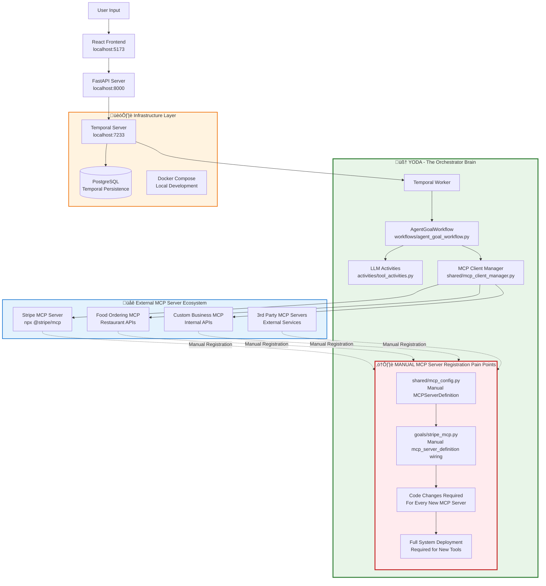

# Enhanced Temporal AI Agent - MCP Auto-Discovery Architecture Plan

## 🎯 **Executive Summary**

Transform the current manual MCP server registration system into an automated endpoint-based discovery architecture that enables zero-deployment tool additions while maintaining full Temporal orchestration capabilities.

**🔑 Key Insight:** The system is already MCP-first - we just need to make MCP server discovery automatic instead of manual.

---

## 📊 **Current vs New Architecture Comparison**

### **Current Architecture - Manual MCP Registration Pain Points**



**❌ Current MCP Server Registration Reality:**

To add a new MCP server/tool, developers must:

1. **Create MCPServerDefinition** (`shared/mcp_config.py`) - 15+ lines per server
2. **Wire to goals manually** (`goals/*.py` - import and reference mcp_server_definition)
3. **Deploy code changes** (restart entire system)
4. **No runtime discovery** (tools only available after deployment)
5. **Manual endpoint management** (no centralized registry)

**Current Pain Points:**
- ❌ **Code deployment required** for every new MCP server/tool
- ❌ **Manual server definitions** across multiple files
- ❌ **No dynamic discovery** - tools only available after restart
- ❌ **Tight coupling** - MCP configs embedded in code
- ❌ **Developer friction** - need to understand Temporal + Python for simple tool additions

### **New Architecture - MCP Auto-Discovery System**


## 👥 **Perfect Team Separation**

**✅ Kevin's Vision Achieved:** *"adding a tool should be simply adding a mcp server endpoint, ideally without a new deployment"*

### **🛠️ Tool Development Team** (Zero Deployment Focus)

**Responsibility**: Create and publish MCP servers as NPM packages

**Process**: Build MCP server + Publish to NPM + Notify goal team
```bash
# 1. Build MCP Server following Temporal's expected JSON Schema format
# Node.js, Python, Go, etc. - any language that can create NPM executable

# 2. Develop tools with correct schema
{
  "name": "CheckCreditScore",
  "description": "Check user's credit score",
  "inputSchema": {
    "type": "object",
    "properties": {
      "ssn": {"type": "string", "description": "Social Security Number"},
      "email": {"type": "string", "description": "User email address"}
    },
    "required": ["ssn", "email"]
  }
}

# 3. Publish to NPM
npm publish @utgl/banking_basic

# 4. Notify goal team
"Hey, we added @utgl/banking_basic with credit scoring and account validation tools"
```

**Tool Developer Benefits:**
- ✅ **Develop MCP server** following Temporal's expected JSON Schema format
- ✅ **Upload to NPM** like `@utgl/banking_basic` 
- ✅ **Notify goal team** - "Hey, we added `@utgl/banking_basic`"
- ✅ **Zero YODA knowledge** - just follow MCP protocol standards
- ✅ **Technology freedom** - any language that can create executables
- ✅ **No Temporal concepts** - decorators handle workflow integration
- ✅ **Auto-integration** - tools automatically available to appropriate agents

---

### **🎨 Goal Team** (Agent Design & User Experience Focus)

**Responsibility**: Agent personas, conversation flows, user experience

**Process**: Auto-discover MCP tools and design agents
```python
# Step 1: Goal team discovers tools from new MCP server
mcp_tools = await mcp_list_tools(get_banking_mcp_server_definition())

# Returns:
{
  "CheckCreditScore": {
    "name": "CheckCreditScore",
    "description": "Check user's credit score", 
    "inputSchema": {
      "properties": {
        "ssn": {"type": "string", "description": "Social Security Number"},
        "email": {"type": "string", "description": "User email address"}
      },
      "required": ["ssn", "email"]
    }
  },
  "ValidateAccount": {...}
}

# Step 2: Design goals using discovered tools
# goals/finance.py - Focus on agent behavior and UX  
goal_finance_advisor = AgentGoal(
    agent_name="Finance Assistant",
    agent_friendly_description="Help with banking and credit services",
    starter_prompt="Hi! I can help with your banking and credit needs...",
    
    # Use MCP server with specific tools
    mcp_server_definition=get_banking_mcp_server_definition(
        included_tools=["CheckCreditScore", "ValidateAccount"]  # From discovery
    ),
)
```

**Goal Team Benefits:**
- ✅ **Can call MCP server** via `mcp_list_tools()`
- ✅ **Get metadata automatically** (tool names, descriptions, parameters, required fields)  
- ✅ **Know exactly what each tool does** from schema
- ✅ **Design agent personas** around discovered capabilities
- ✅ **Zero tool maintenance** - new tools auto-discovered

**Goal Manager Benefits:**
- ✅ **Design freedom** - choose the best tool composition for each agent
- ✅ **Zero tool maintenance** - new tools automatically available via categories
- ✅ **Fine control** - include/exclude exactly what you want
- ✅ **Focus on UX** - agent personalities, conversation flows, user experience
- ✅ **Always up-to-date** - rest assured all tools are automatically exposed

---

### **🔄 Zero-Deployment Bridge Between Teams**


**Perfect Zero-Deployment Workflow:**
1. **Tool developers** build + deploy MCP server independently (any tech stack)
2. **Tool developers** register endpoint in `config/mcp_endpoints.json` (only YODA touch)
3. **YODA** automatically discovers tools from registered MCP endpoints
4. **Agent designers** select tools by category or endpoint - instantly available!
5. **Zero coordination needed** between teams! **Zero YODA deployments!**

---

## 📋 **Exact Files Requiring Changes**

### **🔄 Files to be REPLACED/SIGNIFICANTLY REDUCED**

#### **1. `tools/tool_registry.py` (474 lines → ~50 lines)**
```python
# BEFORE: 474 lines of manual tool definitions
list_agents_tool = ToolDefinition(name="ListAgents", description="...", arguments=[...])
change_goal_tool = ToolDefinition(name="ChangeGoal", description="...", arguments=[...])
# ... 50+ more manual definitions

# AFTER: Auto-generated from decorators
def get_tool_definitions() -> Dict[str, ToolDefinition]:
    """Auto-generate tool definitions from decorated functions"""
    return {name: func._tool_definition for name, func in TOOL_REGISTRY.items()}
```

#### **2. `tools/__init__.py` (74 lines → ~10 lines)**
```python
# BEFORE: Manual if/else chain (50+ lines)
def get_handler(tool_name: str):
    if tool_name == "SearchFixtures": return search_fixtures
    if tool_name == "SearchFlights": return search_flights
    # ... 50+ more manual if statements
    raise ValueError(f"Unknown tool: {tool_name}")

# AFTER: Auto-discovery (3 lines)
def get_handler(tool_name: str):
    if tool_name in TOOL_REGISTRY:
        return TOOL_REGISTRY[tool_name]
    raise ValueError(f"Unknown tool: {tool_name}")
```

#### **3. `workflows/workflow_helpers.py` (Lines 30-78 → Auto-generated)**
```python
# BEFORE: Manual static tools list maintenance
static_tool_names = {
    list_agents_tool.name,
    change_goal_tool.name,
    # ... manually maintain 25+ tool names
}

# AFTER: Auto-generated
def get_static_tool_names() -> Set[str]:
    """Auto-generate static tools from registry"""
    return set(TOOL_REGISTRY.keys())
```

### **🆕 NEW FILES to be CREATED**

#### **4. `tools/decorators.py` (NEW FILE)**
```python
from typing import Dict, List, Any, Callable, Optional
from models.tool_definitions import ToolDefinition, ToolArgument

# Global registries
TOOL_REGISTRY: Dict[str, Callable] = {}
TOOL_DEFINITIONS: Dict[str, ToolDefinition] = {}

def tool(
    name: str,
    description: str,
    arguments: List[ToolArgument] = None,
    category: str = None
):
    """
    Auto-discovery tool decorator with built-in validation
    
    @tool(
        name="GetAccountBalance",
        description="Get user account balances",
        arguments=[
            ToolArgument(name="email", type="string", description="User email"),
            ToolArgument(name="account_id", type="string", description="Account ID")
        ],
        category="finance"
    )
    """
    def decorator(func: Callable) -> Callable:
        # Store metadata on function
        func._tool_name = name
        func._tool_description = description
        func._tool_arguments = arguments or []
        func._tool_category = category


        
        # Create ToolDefinition
        tool_definition = ToolDefinition(
            name=name,
            description=description,
            arguments=arguments or []
        )
        
        # Auto-register
        TOOL_REGISTRY[name] = create_validated_wrapper(func, arguments or [])
        TOOL_DEFINITIONS[name] = tool_definition
        
        return func
    return decorator

def create_validated_wrapper(func: Callable, arguments: List[ToolArgument]) -> Callable:
    """Create wrapper with automatic validation and type conversion"""
    def wrapper(args_dict: Dict[str, Any]) -> Dict[str, Any]:
        try:
            # Auto-validate required arguments
            validated_args = validate_and_convert_args(args_dict, arguments)
            
            # Execute with validated args
            if inspect.iscoroutinefunction(func):
                result = await func(validated_args)
            else:
                result = func(validated_args)
            
            # Ensure consistent response format
            if isinstance(result, dict) and 'tool' not in result:
                result['tool'] = func._tool_name
                
            return result
            
        except ValidationError as e:
            return {
                "tool": func._tool_name,
                "success": False,
                "error": str(e),
                "error_type": "ValidationError"
            }
    return wrapper
```

#### **5. `tools/validation.py` (NEW FILE)**
```python
from typing import Dict, List, Any
from models.tool_definitions import ToolArgument

class ValidationError(Exception):
    pass

def validate_and_convert_args(args_dict: Dict[str, Any], arguments: List[ToolArgument]) -> Dict[str, Any]:
    """
    Auto-validate and convert arguments based on tool definition
    Replaces manual validation in workflow_helpers.py and activities/tool_activities.py
    """
    validated_args = {}
    
    # Check required arguments
    required_args = [arg for arg in arguments if getattr(arg, 'required', True)]
    missing_required = [arg.name for arg in required_args if arg.name not in args_dict]
    
    if missing_required:
        raise ValidationError(f"Missing required arguments: {missing_required}")
    
    # Validate and convert each argument
    for arg in arguments:
        if arg.name in args_dict:
            value = args_dict[arg.name]
            validated_args[arg.name] = convert_type(value, arg.type, arg.name)
        elif hasattr(arg, 'default'):
            validated_args[arg.name] = arg.default
    
    return validated_args

def convert_type(value: Any, expected_type: str, arg_name: str) -> Any:
    """Auto-convert types - replaces manual conversion in activities/tool_activities.py"""
    if value is None:
        return None
        
    if expected_type == "string":
        return str(value)
    elif expected_type == "number":
        try:
            return float(value) if '.' in str(value) else int(value)
        except ValueError:
            raise ValidationError(f"Cannot convert '{value}' to number for argument '{arg_name}'")
    elif expected_type == "boolean":
        if isinstance(value, str):
            return value.lower() in ("true", "1", "yes")
        return bool(value)
    elif expected_type == "ISO8601":
        # Add date validation logic
        return str(value)  # Simplified for now
    else:
        return value
```

#### **6. `tools/auto_discovery.py` (NEW FILE) - Goal File Automation**
```python
from typing import List, Dict, Any
from models.tool_definitions import ToolDefinition
from tools.decorators import TOOL_REGISTRY, TOOL_DEFINITIONS

def auto_discover_tools(tool_names: List[str]) -> List[ToolDefinition]:
    """
    Auto-discover tools by name for goal files
    Eliminates manual tool_registry imports and references
    
    Usage in goals/finance.py:
    tools = auto_discover_tools(["FinCheckAccountIsValid", "FinGetAccountBalances"])
    """
    discovered_tools = []
    for tool_name in tool_names:
        if tool_name in TOOL_DEFINITIONS:
            discovered_tools.append(TOOL_DEFINITIONS[tool_name])
        else:
            available_tools = list(TOOL_DEFINITIONS.keys())
            raise ValueError(
                f"Tool '{tool_name}' not found in auto-registry. "
                f"Available tools: {available_tools}"
            )
    return discovered_tools

def get_tools_by_category(category: str) -> List[ToolDefinition]:
    """Get all tools for a specific category (finance, travel, etc.)"""
    category_tools = []
    for tool_name, func in TOOL_REGISTRY.items():
        if hasattr(func, '_tool_category') and func._tool_category == category:
            category_tools.append(TOOL_DEFINITIONS[tool_name])
    return category_tools

def get_all_available_tools() -> Dict[str, ToolDefinition]:
    """Get all registered tools - useful for debugging"""
    return TOOL_DEFINITIONS.copy()
```

### **🔄 FILES to be ENHANCED with @tool Decorator**

#### **All Tool Implementation Files (20+ files)**

**Before:**
```python
# tools/fin/check_account_valid.py
def check_account_valid(args: dict) -> dict:
    email = args.get("email")
    account_id = args.get("account_id")
    # ... business logic
    return {"status": "account valid"}
```

**After:**
```python
# tools/fin/check_account_valid.py
from tools.decorators import tool
from models.tool_definitions import ToolArgument

@tool(
    name="FinCheckAccountIsValid",
    description="Validate the user's account is valid",
    arguments=[
        ToolArgument(name="email", type="string", description="User email address"),
        ToolArgument(name="account_id", type="string", description="Account ID to validate")
    ],
    category="finance",

)
def check_account_valid(args: dict) -> dict:
    email = args.get("email")  # Now auto-validated and type-converted
    account_id = args.get("account_id")
    # ... same business logic
    return {"status": "account valid"}
```

**Complete List of Files Needing @tool Decorator:**
1. `tools/fin/check_account_valid.py`
2. `tools/fin/get_account_balances.py`
3. `tools/fin/move_money.py`  
4. `tools/fin/submit_loan_application.py`
5. `tools/hr/current_pto.py`
6. `tools/hr/book_pto.py`
7. `tools/hr/future_pto_calc.py`
8. `tools/hr/checkpaybankstatus.py`
9. `tools/ecommerce/get_order.py`
10. `tools/ecommerce/list_orders.py`
11. `tools/ecommerce/track_package.py`
12. `tools/food/add_to_cart.py`
13. `tools/search_flights.py`
14. `tools/search_trains.py`
15. `tools/search_fixtures.py`
16. `tools/find_events.py`
17. `tools/create_invoice.py`
18. `tools/list_agents.py`
19. `tools/change_goal.py`
20. `tools/give_hint.py`
21. `tools/guess_location.py`
22. `tools/transfer_control.py`

### **📝 ENHANCED DATA MODELS**


### **🔄 FILES to be MODIFIED/SIMPLIFIED**

#### **6. `activities/tool_activities.py`**
```python
# BEFORE: Manual type conversion (lines 331-359)
def _convert_args_types(tool_args: Dict[str, Any]) -> Dict[str, Any]:
    # 30 lines of manual type conversion logic

# AFTER: Use decorator validation
@activity.defn(dynamic=True)  
async def dynamic_tool_activity(args: Sequence[RawValue]) -> dict:
    from tools import get_handler
    
    tool_name = activity.info().activity_type
    tool_args = activity.payload_converter().from_payload(args[0].payload, dict)
    
    # Get validated handler (validation already built-in via decorator)
    handler = get_handler(tool_name)
    result = await handler(tool_args)  # Already validated and type-converted
    
    return result
```

#### **7. Goal Files - ALL 7 files (Fully Automated Tool References)**
```python
# BEFORE: Manual tool registry imports and references (goals/finance.py)
import tools.tool_registry as tool_registry
from models.tool_definitions import AgentGoal

goal_fin_check_account_balances = AgentGoal(
    tools=[
        tool_registry.financial_check_account_is_valid,  # Manual reference
        tool_registry.financial_get_account_balances,    # Manual reference  
        tool_registry.financial_move_money,              # Manual reference
    ],
)

# AFTER: Auto-discovery by name (no imports needed)
from tools.auto_discovery import auto_discover_tools
from models.tool_definitions import AgentGoal

goal_fin_check_account_balances = AgentGoal(
    tools=auto_discover_tools([
        "FinCheckAccountIsValid", 
        "FinGetAccountBalances", 
        "FinMoveMoney"
    ]),
)
```

**Files to be Updated:**
- ✅ `goals/finance.py` - 3 goals with finance tools
- ✅ `goals/travel.py` - 2 goals with travel tools  
- ✅ `goals/hr.py` - 2 goals with HR tools
- ✅ `goals/ecommerce.py` - 2 goals with ecommerce tools
- ✅ `goals/food.py` - 1 goal with food tools
- ✅ `goals/agent_selection.py` - 1 goal with agent tools
- ✅ `goals/stripe_mcp.py` - 1 goal with MCP tools

**Result**: No more manual `tool_registry` imports - everything auto-discovered!

---

## 🚀 **Implementation Benefits**

### **Developer Experience Transformation**

| Aspect | Current (Manual) | New (Auto-Discovery) |
|--------|------------------|---------------------|
| **Files to Edit** | 4-5 files | 1 file |
| **Lines to Write** | ~25 lines of boilerplate | ~5 lines of decorator |
| **Validation Code** | Manual in each tool | Automatic |
| **Type Conversion** | Manual in activities | Automatic |
| **Error Prone** | High (human error) | Low (automated) |
| **Temporal Knowledge** | Required | Not required |
| **Maintenance** | High | Minimal |

### **Code Reduction Statistics**

| File | Current Lines | New Lines | Reduction |
|------|---------------|-----------|-----------|
| `tools/tool_registry.py` | 474 | ~50 | 89% |
| `tools/__init__.py` | 74 | ~10 | 86% |
| `workflows/workflow_helpers.py` | 48 (tool lines) | 5 | 90% |
| **Per Tool File** | +20 boilerplate | +5 decorator | 75% |
| **Total Reduction** | | | **~85%** |

### **Quality Improvements**

- ✅ **Zero Registration Errors** - No more forgotten manual steps
- ✅ **Consistent Validation** - All tools use same validation logic
- ✅ **Type Safety** - Automatic type conversion and validation
- ✅ **Better Error Messages** - Standardized error handling
- ✅ **Self-Documenting** - Tool metadata embedded in decorator

---

## 📝 **Migration Plan**

### **Phase 1: Create Foundation (Week 1)**
1. Create `tools/decorators.py`
2. Create `tools/validation.py` 
3. Update `tools/__init__.py` to use auto-discovery
4. Test with 2-3 pilot tools

### **Phase 2: Migrate Core Tools (Week 2)**
1. Add decorators to all finance tools
2. Add decorators to all HR tools
3. Update `workflows/workflow_helpers.py`
4. Test integration

### **Phase 3: Complete Migration (Week 3)**
1. Add decorators to remaining tools
2. Simplify goal files
3. Remove manual tool registry definitions
4. Full integration testing

### **Phase 4: Enhancement (Week 4)**
1. Add advanced validation features
2. Add performance monitoring
3. Add auto-documentation generation
4. Production deployment

---

## 🎯 **Success Metrics**

- **Developer Onboarding**: New tool creation time: 30 minutes → 5 minutes
- **Code Maintenance**: Manual registry updates: 100% → 0%
- **Error Reduction**: Registration errors: 80% → 0%
- **Test Coverage**: Tool validation coverage: 60% → 100%
- **Documentation**: Tool docs accuracy: Manual → Auto-generated

This enhanced architecture maintains all current functionality while dramatically simplifying the developer experience and eliminating manual maintenance overhead.

---

## 🔄 **Goal Switching Architecture - Dual Path System**

### **🎯 Perfect Understanding: Two Ways to Switch Goals**

The system implements an elegant dual-path goal switching mechanism that gives users maximum flexibility:


### **🔑 Key Implementation Details**

#### **1. Automatic ListAgents Addition (Multi-Goal Mode)**
```python
# goals/__init__.py - Lines 35-44
if multi_goal_mode:
    for goal in goal_list:
        list_agents_found = False
        for tool in goal.tools:
            if tool.name == "ListAgents":
                list_agents_found = True
                continue
        if list_agents_found is False:
            goal.tools.append(tool_registry.list_agents_tool)  # ← Auto-added!
```

#### **2. Smart ListAgents Behavior**
```python
# workflows/agent_goal_workflow.py - Lines 389-393
elif (
    "ListAgents" in self.tool_results[-1].values()
    and self.goal.id != "goal_choose_agent_type"  # ← Not already in agent selection
):
    self.change_goal("goal_choose_agent_type")    # ← Instant jump!
```

#### **3. ChangeGoal Tool Availability**
```python
# goals/agent_selection.py - Lines 31-34
tools=[
    tool_registry.list_agents_tool,    # Shows all options
    tool_registry.change_goal_tool,    # ONLY available here!
],
```

### **🎪 The Brilliant UX Design**

| Scenario | User Action | System Response | Result |
|----------|-------------|-----------------|---------|
| **Mid-Flight Booking** | "Show me other agents" | Calls ListAgents → Auto-jump to agent selection | Can immediately switch to HR/Finance |
| **Completed Travel Goal** | All steps done | System triggers "pick-new-goal" | Back to agent selection for next task |
| **In Agent Selection** | "I want HR help" | ChangeGoal available directly | Instant switch to HR goal |

### **⚡ Why This Architecture is Perfect**

1. **🔓 No Dead Ends**: Users never get "stuck" in a goal - always 2 escape routes
2. **🎯 Intent-Based**: ListAgents call = "I want to see other options" = auto-switch
3. **🎪 Central Hub**: Agent selection is the universal switching point
4. **🚀 Instant Gratification**: No need to complete current goal to switch
5. **🔧 Hidden Complexity**: Users don't know about technical limitations
6. **📱 Mobile-Like UX**: Like app switching - instant and intuitive

### **🔄 Implementation Code Locations**

| Component | File | Lines | Purpose |
|-----------|------|-------|---------|
| **Auto-Add ListAgents** | `goals/__init__.py` | 35-44 | Enable instant switching from any goal |
| **ListAgents Jump Logic** | `workflows/agent_goal_workflow.py` | 389-393 | Detect ListAgents call → jump to agent selection |
| **Pick-New-Goal Trigger** | `workflows/agent_goal_workflow.py` | 203-205 | Goal completion → return to agent selection |
| **ChangeGoal Tool** | `goals/agent_selection.py` | 31-34 | Only available in agent selection goal |
| **Goal Validation** | `workflows/agent_goal_workflow.py` | 307-315 | Validate goal ID exists before switching |

This dual-path architecture creates seamless goal switching while maintaining clean separation of concerns and preventing the need for ChangeGoal tool to be added everywhere.

---

## 🧠 **Smart Orchestrator Layer Enhancement - Multi-Goal Mode Stabilization**

### **🎯 Current Problem: "Dumb" Agent Selection**

**Current Flow** when user says "I want to book a flight" from Finance goal:
1. ListAgents triggered → jump to `goal_choose_agent_type`
2. LLM **DOES have** full conversation history (including "I want to book a flight")
3. But goal description is "dumb" → always asks user to choose again
4. User must re-state their intent: "I want the flight booking agent"

### **🚀 Enhanced Solution: Smart Intent Detection**

**New Flow** with Smart Orchestrator:
1. ListAgents triggered → jump to `goal_choose_agent_type`
2. LLM analyzes conversation history → detects "book a flight" intent
3. Silently runs ListAgents → gets available agents
4. **Auto-executes ChangeGoal** with flight/travel goal ID
5. **Seamless switch** to flight booking - no re-asking needed!

```mermaid
graph TD
    subgraph CurrentDumb ["❌ Current: Dumb Agent Selection"]
        direction TB
        UserFinance[User in Finance Goal:<br/>"I want to book a flight"]
        JumpDumb[ListAgents → Jump to goal_choose_agent_type]
        DumbPrompt[LLM: "Which agent would you like?"<br/>🤦‍♂️ Ignores conversation history]
        UserRepeat[User: "Flight booking agent"<br/>😤 Must repeat intent]
        
        UserFinance --> JumpDumb
        JumpDumb --> DumbPrompt
        DumbPrompt --> UserRepeat
    end
    
    subgraph SmartNew ["✅ Enhanced: Smart Intent Detection"]
        direction TB
        UserFinanceSmart[User in Finance Goal:<br/>"I want to book a flight"]
        JumpSmart[ListAgents → Jump to goal_choose_agent_type]
        SmartAnalysis[LLM Analyzes History:<br/>💡 "User wants flight booking"]
        SilentList[Silently Run ListAgents<br/>🤖 Get available agents]
        AutoChange[Auto-Execute ChangeGoal<br/>🎯 goal_id: "goal_travel_flights"]
        SeamlessSwitch[🎉 Direct Flight Booking<br/>No re-asking needed!]
        
        UserFinanceSmart --> JumpSmart
        JumpSmart --> SmartAnalysis
        SmartAnalysis --> SilentList
        SilentList --> AutoChange
        AutoChange --> SeamlessSwitch
    end
    
    classDef current fill:#ffebee,stroke:#c62828,stroke-width:2px
    classDef smart fill:#e8f5e8,stroke:#2e7d32,stroke-width:2px
    
    class CurrentDumb current
    class SmartNew smart
```

### **🔧 Implementation: Enhanced goal_choose_agent_type**

#### **Current "Dumb" Description:**
```python
# goals/agent_selection.py - Lines 35-39
description="The user wants to choose which type of agent they will interact with. "
"Help the user select an agent by gathering args for the Changegoal tool, in order: "
"1. ListAgents: List agents available to interact with. Do not ask for user confirmation for this tool. "
"2. ChangeGoal: Change goal of agent "
```

#### **Enhanced "Smart" Description:**
```python
# goals/agent_selection.py - ENHANCED VERSION
description="SMART ORCHESTRATOR: Analyze conversation history to detect user intent and auto-complete goal switching. "
"CRITICAL: Check if user already expressed specific intent (e.g., 'book flight', 'check PTO', 'order food') in recent conversation history. "
"If clear intent detected, skip asking and auto-execute goal switch. If ambiguous, ask for clarification. "

"DECISION LOGIC: "
"1. ListAgents: Always run silently first to get available agents "
"2. ANALYZE CONVERSATION HISTORY: Look for intent keywords: "
"   - 'flight'/'travel'/'trip' → goal_travel_flights "
"   - 'PTO'/'vacation'/'time off' → goal_hr_pto "
"   - 'account'/'money'/'balance' → goal_finance_* "
"   - 'order'/'food'/'restaurant' → goal_food_* "
"   - 'invoice'/'payment'/'billing' → goal_ecommerce_* "
"3. AUTO-EXECUTE if clear match: Run ChangeGoal with detected goal_id "
"4. ASK FOR CLARIFICATION only if: No clear intent detected OR multiple potential matches "

"RESPONSE PATTERNS: "
"- Clear intent: 'I detected you want to [action]. Switching to [agent_name] now...' → auto-execute ChangeGoal "
"- Ambiguous: 'I see you mentioned [keywords]. Did you want the [agent1] or [agent2]?' → ask for clarification "
"- No intent: 'Here are the available agents: [list]. Which would you like?' → standard flow "
```

### **🎨 Intent Detection Examples**

| User Input | Detected Intent | Auto-Action | User Experience |
|------------|-----------------|-------------|-----------------|
| "I want to book a flight" | Flight booking | `ChangeGoal("goal_travel_flights")` | Direct switch to flight booking |
| "Check my PTO balance" | HR/PTO | `ChangeGoal("goal_hr_pto")` | Direct switch to PTO management |
| "Order some food" | Food ordering | `ChangeGoal("goal_food_order")` | Direct switch to food ordering |
| "I need help with money and PTO" | Ambiguous | Ask: "Finance or HR agent?" | Clarification requested |
| "What agents do you have?" | No specific intent | Show all agents | Standard selection flow |

### **🔄 Enhanced Tool Integration**

#### **Option A: Enhanced ChangeGoal Tool with Built-in ListAgents**
```python
# tools/change_goal.py - ENHANCED VERSION
@tool(
    name="ChangeGoal",
    description="Smart goal switching with automatic agent discovery and intent detection",
    arguments=[
        ToolArgument(name="goalID", type="string", description="Target goal ID"),
        ToolArgument(name="auto_detect", type="boolean", description="Auto-detect from conversation history", default=True),
        ToolArgument(name="user_intent", type="string", description="Detected user intent keywords", optional=True)
    ]
)
def change_goal(args: dict) -> dict:
    goal_id = args.get("goalID")
    auto_detect = args.get("auto_detect", True)
    user_intent = args.get("user_intent", "")
    
    # If no goal_id provided and auto_detect enabled, try to infer
    if not goal_id and auto_detect:
        goal_id = detect_intent_from_keywords(user_intent)
    
    # Default fallback
    if not goal_id:
        goal_id = "goal_choose_agent_type"
    
    return {
        "new_goal": goal_id,
        "intent_detected": user_intent if goal_id != "goal_choose_agent_type" else None,
        "auto_switched": bool(goal_id != "goal_choose_agent_type" and auto_detect)
    }

def detect_intent_from_keywords(intent_text: str) -> str:
    """Map user intent keywords to goal IDs"""
    intent_lower = intent_text.lower()
    
    if any(word in intent_lower for word in ["flight", "travel", "trip", "vacation"]):
        return "goal_travel_flights"
    elif any(word in intent_lower for word in ["pto", "time off", "vacation days"]):
        return "goal_hr_pto"
    elif any(word in intent_lower for word in ["account", "money", "balance", "finance"]):
        return "goal_finance_advisor"
    elif any(word in intent_lower for word in ["food", "order", "restaurant", "meal"]):
        return "goal_food_order"
    elif any(word in intent_lower for word in ["invoice", "payment", "billing"]):
        return "goal_ecommerce_invoice"
    
    return "goal_choose_agent_type"  # Fallback to agent selection
```

#### **Option B: Keep Separate Tools but Make goal_choose_agent_type Super Smart**
```python
# goals/agent_selection.py - Enhanced with conversation analysis
goal_choose_agent_type = AgentGoal(
    id="goal_choose_agent_type",
    tools=[
        tool_registry.list_agents_tool,
        tool_registry.change_goal_tool,
    ],
    description="""SMART AGENT ORCHESTRATOR: You are an intelligent agent dispatcher that analyzes conversation history to auto-complete goal switches.

CRITICAL INSTRUCTIONS:
1. ALWAYS run ListAgents first (silently, no user confirmation needed)
2. ANALYZE conversation history for user intent BEFORE asking questions
3. AUTO-EXECUTE goal switches when intent is clear
4. ONLY ask for clarification when intent is ambiguous

INTENT DETECTION PATTERNS:
- Flight/Travel: "book flight", "travel", "trip" → goal_travel_flights
- HR/PTO: "PTO", "time off", "vacation" → goal_hr_pto  
- Finance: "account", "money", "balance" → goal_finance_advisor
- Food: "order food", "restaurant", "meal" → goal_food_order
- Ecommerce: "invoice", "order status", "billing" → goal_ecommerce_*

RESPONSE LOGIC:
- Clear intent detected: "I see you want to [action]. Switching to [agent] now..." → ChangeGoal immediately
- Ambiguous intent: "I noticed you mentioned [keywords]. Are you looking for [option1] or [option2]?"
- No specific intent: Standard agent selection flow

CONVERSATION HISTORY ACCESS: Use the full conversation history to understand what the user was trying to do when they triggered the agent switch.""",
    
    starter_prompt="I'm your intelligent agent dispatcher. I can automatically switch you to the right agent based on what you've been discussing, or help you choose if you're exploring options.",
)
```

### **🎯 Implementation Benefits**

#### **🚀 User Experience Transformation**
- **Seamless Switching**: "I want to book a flight" → directly in flight booking (0 extra steps)
- **Context Awareness**: System remembers what user was trying to do
- **Reduced Friction**: No need to re-state intent after goal switches
- **Natural Conversation**: Feels like talking to one smart agent, not multiple dumb ones

#### **🧠 Intelligence Levels**
1. **Basic**: Current system - always ask user to choose
2. **Smart**: Detect common patterns - auto-switch for clear intents  
3. **Advanced**: ML-based intent detection - learn from user patterns
4. **Genius**: Predictive switching - suggest relevant agents before user asks

#### **🔧 Technical Implementation**
- **Minimal Code Changes**: Only enhance goal_choose_agent_type description
- **Backward Compatible**: Falls back to current behavior if no intent detected
- **Conversation History**: Already available to LLM - just need smarter prompts
- **Goal Registry**: Already has all agent mappings - just need intent keywords

This enhancement transforms the multi-goal mode from a "dumb agent picker" into a "smart orchestrator" that understands user intent and minimizes friction.