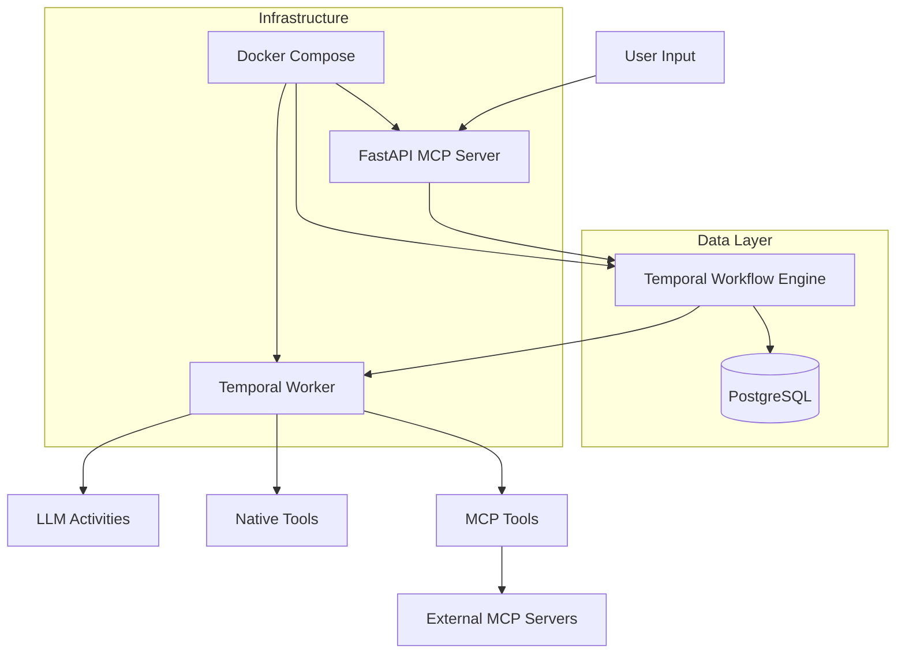

# Temporal AI Agent - Comprehensive Technical Documentation

## Overview

The **Temporal AI Agent** is a sophisticated workflow orchestration system that leverages Temporal's workflow engine to manage AI agent interactions and tool execution. The system acts as an MCP (Model Context Protocol) client, orchestrating both native tools and external MCP tools in deterministic, resilient workflows.

---

# 📄 **Doc 1: MCP Server – Temporal Workflow & AI Agent Flow**

## 1. Temporal's Server-side Advantages

### State Management Across Long-Running Workflows

Temporal provides several critical advantages for AI agent orchestration:

- **Deterministic Replay**: Workflow state is automatically persisted and can be replayed exactly, ensuring consistent behavior across restarts and failures
- **Durable Execution**: Conversations and tool execution state survive system failures and restarts
- **Event Sourcing**: Complete audit trail of all agent interactions and decisions
- **State Isolation**: Each workflow instance maintains its own conversation history and tool state

### Task Queue Management

```python
# workflows/agent_goal_workflow.py:96-100
while True:
    await workflow.wait_condition(
        lambda: bool(self.prompt_queue) or self.chat_ended or self.confirmed
    )
```

**Benefits**:
- **Signal-based Communication**: User prompts, confirmations, and end-chat signals are queued and processed deterministically
- **Backpressure Handling**: Natural flow control through Temporal's task queue system
- **Worker Scaling**: Multiple workers can process different workflow instances concurrently

### Retry Semantics

```python
# workflows/agent_goal_workflow.py:134-137
retry_policy=RetryPolicy(
    initial_interval=timedelta(seconds=5), 
    backoff_coefficient=1
)
```

**Automatic Retry Handling**:
- LLM API failures are automatically retried with exponential backoff
- Tool execution failures follow configurable retry policies
- Activity timeouts are handled gracefully with circuit breaker patterns

## 2. Full Execution Flow

### System Architecture



### Complete Execution Flow

1. **Input Validation** (`api/main.py:142-169`)
   ```python
   @app.post("/send-prompt")
   async def send_prompt(prompt: str):
       combined_input = CombinedInput(
           tool_params=AgentGoalWorkflowParams(None, None),
           agent_goal=get_initial_agent_goal(),
       )
   ```

2. **Workflow Launch** (`workflows/agent_goal_workflow.py:66-86`)
   - Environment settings lookup
   - MCP tools discovery (if configured)
   - Conversation history initialization

3. **Tool Resolution** (`workflows/agent_goal_workflow.py:149-182`)
   ```python
   context_instructions = generate_genai_prompt(
       agent_goal=self.goal,
       conversation_history=self.conversation_history,
       mcp_tools_info=self.mcp_tools_info,
   )
   
   tool_data = await workflow.execute_activity_method(
       ToolActivities.agent_toolPlanner,
       prompt_input,
       schedule_to_close_timeout=LLM_ACTIVITY_SCHEDULE_TO_CLOSE_TIMEOUT,
   )
   ```

4. **Tool Execution** (`workflows/workflow_helpers.py:83-140`)
   - **Native Tools**: Direct function execution via dynamic activities
   - **MCP Tools**: Client manager with connection pooling

5. **Response Aggregation** (`workflows/agent_goal_workflow.py:107-109`)
   ```python
   if self.ready_for_tool_execution(waiting_for_confirm, current_tool):
       waiting_for_confirm = await self.execute_tool(current_tool)
   ```

### Workflow Diagrams

**Main Agent Loop**:
```
Start → Load Goal → Wait for Signal → Validate Input → 
Generate LLM Response → Execute Tool → Aggregate Results → 
Check Completion → [Loop or End]
```

**Tool Execution Flow**:
```
Tool Selected → Check Type (Native/MCP) → 
Execute Activity → Handle Retry → 
Return Result → Update Conversation
```

## 3. Integration Design

### MCP Server Integration

The system acts as an **MCP client** rather than server, integrating with external MCP servers:

```python
# shared/mcp_client_manager.py:32-47
async def get_client(self, server_def: MCPServerDefinition) -> Any:
    async with self._lock:
        key = self._get_server_key(server_def)
        if key not in self._clients:
            await self._create_client(server_def, key)
        return self._clients[key]
```

**Key Integration Points**:

1. **Server Definition** (`models/tool_definitions.py:6-15`)
   ```python
   @dataclass
   class MCPServerDefinition:
       name: str
       command: str
       args: List[str]
       env: Optional[Dict[str, str]] = None
       connection_type: str = "stdio"
       included_tools: Optional[List[str]] = None
   ```

2. **Dynamic Tool Loading** (`workflows/agent_goal_workflow.py:75-77`)
   ```python
   if self.goal.mcp_server_definition:
       await self.load_mcp_tools()
   ```

3. **Connection Pooling** (`shared/mcp_client_manager.py:24-31`)
   - Reuses connections across tool calls
   - Thread-safe client management
   - Automatic connection lifecycle management

### Tool Execution Handling

**Signals vs Activities vs Child Workflows**:

- **Signals**: Used for user interaction (prompts, confirmations, end-chat)
- **Activities**: Used for all tool execution (both native and MCP)
- **Child Workflows**: Not currently used; single workflow handles entire conversation

**Tool Call Routing** (`workflows/workflow_helpers.py:96-112`):
```python
if goal and is_mcp_tool(current_tool, goal):
    mcp_args = tool_data["args"].copy()
    mcp_args["server_definition"] = goal.mcp_server_definition
    
    dynamic_result = await workflow.execute_activity(
        current_tool,
        mcp_args,
        schedule_to_close_timeout=TOOL_ACTIVITY_SCHEDULE_TO_CLOSE_TIMEOUT,
        summary=f"{goal.mcp_server_definition.name} (MCP Tool)",
    )
```

### Error Handling and Observability

**Retry Policies**:
- LLM activities: 5-second initial interval with linear backoff
- Tool activities: Configurable per tool type
- MCP connection failures: Automatic reconnection with exponential backoff

**Observability**:
- Temporal UI integration for workflow monitoring
- Structured logging with activity context
- Conversation history as workflow state for debugging

**Timeout Configuration**:
```python
# workflows/workflow_helpers.py:18-21
LLM_ACTIVITY_SCHEDULE_TO_CLOSE_TIMEOUT = timedelta(minutes=10)
LLM_ACTIVITY_START_TO_CLOSE_TIMEOUT = timedelta(minutes=5)
TOOL_ACTIVITY_SCHEDULE_TO_CLOSE_TIMEOUT = timedelta(minutes=10)
TOOL_ACTIVITY_START_TO_CLOSE_TIMEOUT = timedelta(minutes=5)
```

---

# 📄 **Doc 2: MCP Server ↔ Tooling & Entities (UTX, JWT, Registry, Parameters)**

## 1. Tool Registry and Exposure Design

### Tool Registration Architecture

**Static Tool Definition** (`tools/tool_registry.py:6-22`):
```python
list_agents_tool = ToolDefinition(
    name="ListAgents",
    description="List available agents to interact with, pulled from goal_registry.",
    arguments=[],
)

change_goal_tool = ToolDefinition(
    name="ChangeGoal",
    description="Change the goal of the active agent.",
    arguments=[
        ToolArgument(
            name="goalID",
            type="string",
            description="Which goal to change to",
        ),
    ],
)
```

**Dynamic MCP Tool Registration** (`tools/tool_registry.py:440-474`):
```python
def create_mcp_tool_definitions(mcp_tools_info: Dict[str, Dict]) -> List[ToolDefinition]:
    tool_definitions = []
    
    for tool_name, tool_info in mcp_tools_info.items():
        input_schema = tool_info.get("inputSchema", {})
        properties = input_schema.get("properties", {})
        
        arguments = []
        for param_name, param_info in properties.items():
            arguments.append(
                ToolArgument(
                    name=param_name,
                    type=param_info.get("type", "string"),
                    description=param_info.get("description", ""),
                )
            )
        
        tool_def = ToolDefinition(
            name=tool_info["name"],
            description=tool_info.get("description", ""),
            arguments=arguments,
        )
        tool_definitions.append(tool_def)
    
    return tool_definitions
```

### Tool Metadata Structure

**Core Tool Models** (`models/tool_definitions.py:18-29`):
```python
@dataclass
class ToolArgument:
    name: str
    type: str
    description: str

@dataclass
class ToolDefinition:
    name: str
    description: str
    arguments: List[ToolArgument]
```

**Tool Discovery Process**:
1. **Static Tools**: Defined in `tools/tool_registry.py`
2. **MCP Tools**: Discovered dynamically via `mcp_list_tools` activity
3. **Goal Association**: Tools linked to specific goals in `goals/` directory

### Design Guidelines for Tool Developers

**Naming Conventions**:
- PascalCase for tool names (e.g., `SearchFlights`, `CheckAccountBalance`)
- Descriptive parameter names with clear types
- Consistent description format across domains

**Interface Requirements**:
```python
# Example native tool structure
@activity.defn
async def search_flights(args: Dict[str, Any]) -> Dict[str, Any]:
    # Input validation
    origin = args.get("origin")
    destination = args.get("destination")
    
    # Business logic
    result = perform_search(origin, destination)
    
    # Structured response
    return {
        "tool": "SearchFlights",
        "success": True,
        "content": result
    }
```

**Scope Definition**:
- Single responsibility per tool
- Clear input/output contracts
- Domain-specific organization (`finance/`, `hr/`, `ecommerce/`)

## 2. Security and Scope Enforcement via JWT

### Current Security State

**⚠️ Critical Gap**: The current implementation **does not include JWT authentication or access control**. This is a significant architectural gap for production deployment.

### Recommended JWT Implementation

**JWT Token Design** (Not Implemented):
```json
{
  "sub": "user_id",
  "iat": 1640995200,
  "exp": 1641081600,
  "scope": ["finance:read", "finance:write", "hr:read"],
  "goals": ["goal_fin_check_balances", "goal_hr_employee_lookup"],
  "tools": ["CheckAccountBalance", "GetEmployeeInfo"],
  "rate_limit": {
    "requests_per_hour": 100,
    "concurrent_workflows": 5
  }
}
```

**Proposed Access Control Points**:
1. **API Gateway**: JWT validation before workflow start
2. **Workflow Level**: Scope verification in workflow initialization
3. **Activity Level**: Tool-specific permission checks
4. **MCP Integration**: Server-specific access tokens

**Implementation Strategy**:
```python
# Proposed: shared/auth.py (Not Implemented)
@dataclass
class UserContext:
    user_id: str
    scopes: List[str]
    allowed_goals: List[str]
    allowed_tools: List[str]
    rate_limits: Dict[str, int]

async def validate_jwt_and_extract_context(token: str) -> UserContext:
    # JWT validation and context extraction
    pass

async def check_tool_permission(user_context: UserContext, tool_name: str) -> bool:
    # Tool-level permission check
    pass
```

## 3. Efficient Parameter & Response Handling

### Parameter Validation

**Current Validation** (`activities/tool_activities.py:51-87`):
```python
@activity.defn
async def agent_validatePrompt(self, validation_input: ValidationInput) -> ValidationResult:
    # Create context string describing tools and goals
    tools_description = []
    for tool in validation_input.agent_goal.tools:
        tool_str = f"Tool: {tool.name}\n"
        tool_str += f"Description: {tool.description}\n"
        tool_str += "Arguments: " + ", ".join(
            [f"{arg.name} ({arg.type})" for arg in tool.arguments]
        )
        tools_description.append(tool_str)
```

**Type Conversion for MCP Tools** (`activities/tool_activities.py:237`):
```python
# Convert argument types for MCP tools
converted_args = _convert_args_types(tool_args)
```

### Response Handling

**Structured Response Format**:
```python
# activities/tool_activities.py:247-251
return {
    "tool": tool_name,
    "success": True,
    "content": normalized_result,
}
```

**Error Response Format**:
```python
# activities/tool_activities.py:254-259
return {
    "tool": tool_name,
    "success": False,
    "error": str(e),
    "error_type": type(e).__name__,
}
```

### Data Retrieval Optimization

**Connection Pooling** (`shared/mcp_client_manager.py:24-47`):
- Reuses MCP client connections across tool calls
- Reduces connection overhead for repeated operations
- Thread-safe client management

**Response Filtering** (Recommended Enhancement):
```python
# Proposed: Parameter-based response filtering
@dataclass
class ResponseFilter:
    include_fields: Optional[List[str]] = None
    exclude_fields: Optional[List[str]] = None
    max_records: Optional[int] = None
    pagination: Optional[Dict[str, Any]] = None
```

## 4. System Design for Alerts, Schedules, and Efficient Retrieval

### Current Scheduling Limitations

**⚠️ Gap**: The current system **does not implement alert/schedule triggering**. All workflows are manually initiated via API calls.

### Recommended Scheduling Architecture

**Temporal Cron Workflows** (Not Implemented):
```python
# Proposed: workflows/scheduled_workflow.py
@workflow.defn
class ScheduledAlertWorkflow:
    @workflow.run
    async def run(self, schedule_config: ScheduleConfig) -> str:
        # Schedule-based tool execution
        pass

# Proposed: Schedule configuration
@dataclass
class ScheduleConfig:
    cron_expression: str
    goal_id: str
    parameters: Dict[str, Any]
    notification_channels: List[str]
```

### JSON Feed Structure

**Current Response Format**:
```python
# Conversation history format
ConversationHistory = Dict[str, List[Message]]
Message = Dict[str, Union[str, Dict[str, Any]]]
```

**Proposed Enhanced Feed Structure**:
```json
{
  "workflow_id": "agent-workflow-001",
  "timestamp": "2024-01-15T10:30:00Z",
  "goal": {
    "id": "goal_fin_transactions",
    "category": "finance"
  },
  "results": [
    {
      "tool": "GetTransactions",
      "timestamp": "2024-01-15T10:30:05Z",
      "success": true,
      "data": {
        "client_count": 5,
        "transaction_count": 50,
        "total_amount": 125000.00
      },
      "metadata": {
        "execution_time_ms": 1250,
        "cache_hit": false
      }
    }
  ],
  "next_execution": "2024-01-15T11:30:00Z"
}
```

### Batching and Streaming Strategies

**Current Limitations**:
- Single tool execution per user interaction
- No built-in batching or streaming capabilities
- Sequential tool execution only

**Proposed Enhancements**:

1. **Batch Processing**:
```python
# Proposed: Batch tool execution
@workflow.defn
class BatchToolWorkflow:
    async def execute_batch(self, tools: List[ToolRequest]) -> List[ToolResult]:
        # Parallel tool execution with aggregation
        tasks = []
        for tool_request in tools:
            tasks.append(workflow.execute_activity(
                tool_request.name,
                tool_request.args,
                schedule_to_close_timeout=timedelta(minutes=5)
            ))
        
        results = await asyncio.gather(*tasks, return_exceptions=True)
        return self.aggregate_results(results)
```

2. **Streaming Responses**:
```python
# Proposed: Streaming workflow updates
@workflow.signal
async def stream_update(self, update: StreamUpdate) -> None:
    # Real-time updates for long-running operations
    await self.emit_stream_event(update)
```

---

# 🔄 **General Engineering Objective**

## Class and File Responsibilities

### Core Workflow Components

1. **`workflows/agent_goal_workflow.py`**
   - **Responsibility**: Main conversation orchestration
   - **Key Methods**: `run()`, signals for user interaction
   - **State Management**: Conversation history, tool results, confirmation state

2. **`activities/tool_activities.py`**
   - **Responsibility**: Tool execution and LLM integration
   - **Key Methods**: `agent_toolPlanner()`, `mcp_tool_activity()`, `dynamic_tool_activity()`
   - **External Interactions**: LLM APIs, MCP servers

3. **`shared/mcp_client_manager.py`**
   - **Responsibility**: MCP server connection pooling
   - **Key Methods**: `get_client()`, connection lifecycle management
   - **Performance**: Connection reuse, thread safety

### Tool and Goal Management

4. **`tools/tool_registry.py`**
   - **Responsibility**: Static tool definitions and MCP tool integration
   - **Key Functions**: `create_mcp_tool_definitions()`
   - **Tool Types**: Native Python functions, MCP external tools

5. **`goals/`** (by domain)
   - **Responsibility**: Domain-specific goal configurations
   - **Structure**: Goal ID, tools list, conversation examples
   - **Domains**: Finance, HR, Food ordering, Travel, Ecommerce

6. **`api/main.py`**
   - **Responsibility**: REST API and workflow lifecycle
   - **Key Endpoints**: `/send-prompt`, `/confirm`, `/start-workflow`
   - **Integration**: Temporal client management

## Sequence Diagrams

### Tool Execution Sequence

```
User → API: POST /send-prompt
API → Temporal: start_workflow()
Temporal → Worker: signal(user_prompt)
Worker → LLM: agent_toolPlanner()
LLM → Worker: tool_selection
Worker → MCP/Native: execute_tool()
MCP/Native → Worker: tool_result
Worker → Temporal: update_state
Temporal → API: workflow_query
API → User: tool_data
User → API: POST /confirm
API → Temporal: signal(confirm)
Worker → User: final_response
```

## Architectural Improvements

### 1. Security Enhancements

**Immediate Actions**:
- Implement JWT-based authentication
- Add API rate limiting
- Introduce role-based access control (RBAC)

**Implementation**:
```python
# Proposed middleware
@app.middleware("http")
async def jwt_middleware(request: Request, call_next):
    if not validate_jwt(request.headers.get("Authorization")):
        raise HTTPException(401, "Invalid token")
    return await call_next(request)
```

### 2. Modularity Improvements

**Goal-Tool Decoupling**:
- Abstract tool registry from goal definitions
- Implement plugin architecture for new domains
- Separate MCP server configurations from code

**Proposed Structure**:
```
configs/
  ├── goals/           # YAML-based goal definitions
  ├── mcp_servers/     # External MCP server configs
  └── permissions/     # Role-based access definitions
```

### 3. Performance Optimizations

**Connection Management**:
- Implement MCP connection health checks
- Add connection pool size configuration
- Implement graceful connection failover

**Caching Strategy**:
```python
# Proposed: Response caching
@dataclass
class CacheConfig:
    ttl_seconds: int
    cache_key_template: str
    cache_store: str  # "redis" | "memory" | "database"
```

### 4. Observability Enhancements

**Metrics Collection**:
- Tool execution latency tracking
- LLM token usage monitoring
- Workflow success/failure rates

**Proposed Monitoring**:
```python
# Metrics integration
from temporalio import activity
import prometheus_client as prom

tool_execution_duration = prom.Histogram(
    'tool_execution_duration_seconds',
    'Time spent executing tools',
    ['tool_name', 'success']
)

@activity.defn
async def monitored_tool_execution(tool_name: str, args: Dict) -> Dict:
    with tool_execution_duration.labels(tool_name=tool_name).time():
        # Tool execution logic
        pass
```

## Unused/Deprecated Code Cleanup

### Files to Review for Removal

1. **`thirdparty/train_api.py`** - Legacy train booking service
   - Only used by deprecated `SearchTrains`/`BookTrains` tools
   - Consider consolidation with main API server

2. **Multiple Task Queues** - `TEMPORAL_LEGACY_TASK_QUEUE`
   - Legacy pattern for train tools only
   - Should migrate to unified task queue

3. **Environment Variable Duplication**
   - Multiple places checking `SHOW_CONFIRM` environment variable
   - Consolidate into single configuration source

### Code Consolidation Opportunities

1. **MCP Client Creation** - Duplicate logic in multiple files
2. **Tool Result Formatting** - Inconsistent response structures
3. **Error Handling** - Various error handling patterns across activities

## Development Workflow Recommendations

### 1. Tool Development Process

```python
# Standardized tool template
class ToolTemplate:
    @staticmethod
    @activity.defn
    async def execute(args: Dict[str, Any]) -> Dict[str, Any]:
        # 1. Input validation
        validated_args = validate_tool_args(args, TOOL_SCHEMA)
        
        # 2. Business logic
        result = await perform_tool_operation(validated_args)
        
        # 3. Response formatting
        return format_tool_response(result)
```

### 2. Testing Strategy

**Current Coverage**:
- ✅ Workflow tests with time-skipping
- ✅ Activity tests with mocked LLM
- ✅ Integration tests

**Recommended Additions**:
- MCP server integration tests
- Performance benchmarking
- Security penetration testing

### 3. Deployment Patterns

**Current Docker Compose Setup**:
- Temporal server with PostgreSQL
- API server and worker separation
- Frontend integration

**Production Recommendations**:
- Kubernetes deployment manifests
- Horizontal worker scaling
- External MCP server service discovery

---

## Summary

The Temporal AI Agent demonstrates sophisticated workflow orchestration with clear separation between deterministic workflow logic and external service interactions. The architecture leverages Temporal's strengths for state management and reliability while providing flexible tool execution through both native and MCP integrations.

**Key Strengths**:
- Robust workflow state management
- Clear separation of concerns
- Flexible tool architecture
- MCP protocol integration

**Critical Areas for Enhancement**:
- Security and authentication framework
- Scheduling and alerting capabilities
- Performance monitoring and optimization
- API rate limiting and access control

The system provides a solid foundation for production deployment with the recommended security and monitoring enhancements.