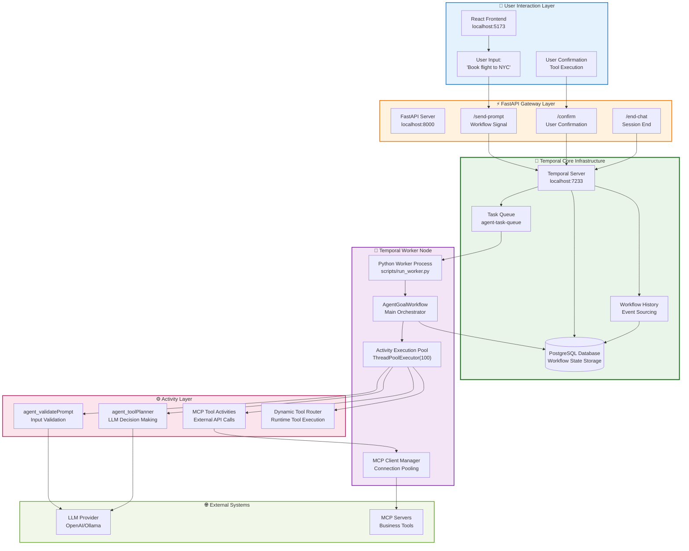

# Temporal Architecture Documentation

## 🎯 **Executive Summary**

This document provides a comprehensive technical analysis of YODA's Temporal-based architecture. Temporal provides the core orchestration engine that enables durable, stateful AI agent workflows with automatic persistence, error recovery, and signal-based user interactions.

**🔑 Temporal Architecture Benefits:**
- **Durable State Management**: Conversation history, tool results, and workflow state persist across restarts
- **Automatic Error Recovery**: Failed activities retry with exponential backoff
- **Signal-Based Interaction**: Real-time user input handling without polling
- **Horizontal Scaling**: Multiple workers can process tasks from shared queues
- **Continue-as-New**: Long conversations maintain state while avoiding memory limits

---

## 🏗️ **System Architecture Overview**

### **Complete Temporal Flow Diagram**



---

## 🔄 **Temporal Server Infrastructure**

### **Database Persistence Layer**

**PostgreSQL Configuration** (`docker-compose.yml`):
```yaml
postgresql:
  image: postgres:14
  environment:
    POSTGRES_USER: temporal
    POSTGRES_PASSWORD: temporal  
    POSTGRES_DB: temporal
  # Stores: workflow history, activity results, timer states
```

**Temporal Server** (`docker-compose.yml`):
```yaml
temporal:
  image: temporalio/auto-setup:1.27.2
  ports: ["7233:7233"]
  environment:
    DB: postgres12
    POSTGRES_SEEDS: postgresql
  # Provides: workflow orchestration, state management, event sourcing
```

### **Key Persistence Mechanisms**

1. **Event Sourcing**: Every workflow action stored as immutable events
2. **State Reconstruction**: Workflow state rebuilt from event history on restart
3. **Automatic Checkpointing**: Workflow state saved at decision points
4. **Durable Timers**: Scheduled activities survive system restarts

---

## 🧠 **Temporal Worker Analysis**

### **Worker Initialization** (`scripts/run_worker.py`)

```python
# Core Worker Setup
async def main():
    client = await get_temporal_client()  # Connect to localhost:7233
    mcp_client_manager = MCPClientManager()  # Connection pooling
    activities = ToolActivities(mcp_client_manager)  # LLM integration
    
    with ThreadPoolExecutor(max_workers=100) as activity_executor:
        worker = Worker(
            client,
            task_queue="agent-task-queue",  # Dedicated queue
            workflows=[AgentGoalWorkflow],  # Register workflow
            activities=[
                activities.agent_validatePrompt,  # Input validation
                activities.agent_toolPlanner,    # LLM planning 
                activities.mcp_tool_activity,    # MCP execution
                dynamic_tool_activity,           # Runtime tools
                mcp_list_tools,                  # Tool discovery
            ],
            activity_executor=activity_executor  # Thread pool
        )
        await worker.run()  # Start polling task queue
```

### **Worker Responsibilities**

1. **Task Queue Polling**: Continuously polls `agent-task-queue` for work
2. **Workflow Execution**: Runs `AgentGoalWorkflow` instances with state management
3. **Activity Scheduling**: Executes activities in thread pool with timeout handling
4. **Connection Management**: Maintains MCP client pools for external tool calls
5. **Error Handling**: Automatic retries with exponential backoff

---

## 🎯 **AgentGoalWorkflow Deep Dive**

### **Workflow State Management**

```python
@workflow.defn
class AgentGoalWorkflow:
    def __init__(self):
        # Persistent State (survives restarts)
        self.conversation_history: ConversationHistory = {"messages": []}
        self.tool_results: List[Dict[str, Any]] = []
        self.goal: AgentGoal = {"tools": []}
        self.conversation_summary: Optional[str] = None
        
        # Runtime State (reconstructed on restart)
        self.prompt_queue: Deque[str] = deque()
        self.confirmed: bool = False
        self.chat_ended: bool = False
        self.tool_data: Optional[ToolData] = None
```

### **Main Workflow Loop** (`workflows/agent_goal_workflow.py:90-224`)

```python
async def run(self, combined_input: CombinedInput) -> str:
    # 1. Initialization Phase
    self.goal = combined_input.agent_goal
    await self.lookup_wf_env_settings(combined_input)
    if self.goal.mcp_server_definition:
        await self.load_mcp_tools()  # Dynamic MCP tool discovery
    
    # 2. Main Interactive Loop  
    while True:
        # Wait for signals: user_prompt, end_chat, or confirm
        await workflow.wait_condition(
            lambda: bool(self.prompt_queue) or self.chat_ended or self.confirmed
        )
        
        # 3. Chat End Handling
        if self.chat_should_end():
            return f"{self.conversation_history}"
        
        # 4. Tool Execution
        if self.ready_for_tool_execution(waiting_for_confirm, current_tool):
            waiting_for_confirm = await self.execute_tool(current_tool)
            continue
        
        # 5. Prompt Processing
        if self.prompt_queue:
            prompt = self.prompt_queue.popleft()
            self.add_message("user", prompt)
            
            # Validate prompt via LLM activity
            validation_result = await workflow.execute_activity_method(
                ToolActivities.agent_validatePrompt,
                args=[validation_input],
                retry_policy=RetryPolicy(initial_interval=timedelta(seconds=5))
            )
            
            # Generate response via LLM activity
            tool_data = await workflow.execute_activity_method(
                ToolActivities.agent_toolPlanner,
                args=[prompt_input],
                retry_policy=RetryPolicy(initial_interval=timedelta(seconds=5))
            )
            
            # Handle next step: confirm, pick-new-goal, or done
            if next_step == "confirm" and current_tool:
                waiting_for_confirm = True
            elif next_step == "pick-new-goal":
                self.change_goal("goal_choose_agent_type")
            
            self.add_message("agent", tool_data)
            
            # Continue-as-new for long conversations
            await helpers.continue_as_new_if_needed(
                self.conversation_history, self.prompt_queue, 
                self.goal, MAX_TURNS_BEFORE_CONTINUE
            )
```

### **Signal-Based User Interaction**

```python
@workflow.signal
async def user_prompt(self, prompt: str) -> None:
    """Real-time user input handling"""
    if self.chat_ended:
        workflow.logger.info(f"Message dropped due to chat closed: {prompt}")
        return
    self.prompt_queue.append(prompt)  # State persisted automatically

@workflow.signal  
async def confirm(self) -> None:
    """User tool execution confirmation"""
    self.confirmed = True  # Triggers tool execution

@workflow.signal
async def end_chat(self) -> None:
    """Graceful session termination"""
    self.chat_ended = True
```

### **Workflow Queries for State Access**

```python
@workflow.query
def get_conversation_history(self) -> ConversationHistory:
    """External access to conversation state"""
    return self.conversation_history

@workflow.query
def get_agent_goal(self) -> AgentGoal:
    """Current goal configuration"""
    return self.goal
```

---

## 🤖 **LLM Activities Analysis**

### **agent_validatePrompt Activity** (`activities/tool_activities.py:51-109`)

**Purpose**: Validates user input against current agent goal and conversation context

```python
@activity.defn
async def agent_validatePrompt(self, validation_input: ValidationInput) -> ValidationResult:
    # 1. Context Assembly
    tools_description = [f"Tool: {tool.name}\nDescription: {tool.description}" 
                        for tool in validation_input.agent_goal.tools]
    context_instructions = f"""Agent goal: {validation_input.agent_goal.description}
        Available Tools: {tools_description}
        Conversation History: {validation_input.conversation_history}"""
    
    # 2. Validation Prompt Construction
    validation_prompt = f"""User prompt: "{validation_input.prompt}"
        Validate if this makes sense given the goal and history.
        Return JSON: {{"validationResult": true/false, "validationFailedReason": "..."}}"""
    
    # 3. LLM Call via agent_toolPlanner
    result = await self.agent_toolPlanner(ToolPromptInput(
        prompt=validation_prompt, 
        context_instructions=context_instructions
    ))
    
    return ValidationResult(
        validationResult=result.get("validationResult", False),
        validationFailedReason=result.get("validationFailedReason", {})
    )
```

### **agent_toolPlanner Activity** (`activities/tool_activities.py:112-180`)

**Purpose**: Core LLM interaction for decision making and response generation

```python
@activity.defn
async def agent_toolPlanner(self, input: ToolPromptInput) -> dict:
    # 1. Message Assembly
    messages = [
        {"role": "system", "content": input.context_instructions + 
         f". Current date: {datetime.now().strftime('%B %d, %Y')}"},
        {"role": "user", "content": input.prompt}
    ]
    
    # 2. LLM Configuration
    completion_kwargs = {
        "model": self.llm_model,  # from env: LLM_MODEL
        "messages": messages,
        "api_key": self.llm_key   # from env: LLM_KEY
    }
    if self.llm_base_url:
        completion_kwargs["base_url"] = self.llm_base_url
    
    # 3. LLM Call via LiteLLM
    response = completion(**completion_kwargs)
    response_content = response.choices[0].message.content
    
    # 4. JSON Response Parsing
    response_content = self.sanitize_json_response(response_content)
    return json.loads(response_content)
```

### **Activity Execution Patterns**

**Timeout Configuration**:
```python
# LLM activities: 60 second timeout
LLM_ACTIVITY_SCHEDULE_TO_CLOSE_TIMEOUT = timedelta(minutes=1)
LLM_ACTIVITY_START_TO_CLOSE_TIMEOUT = timedelta(minutes=1)

# Tool activities: 5 minute timeout  
TOOL_ACTIVITY_SCHEDULE_TO_CLOSE_TIMEOUT = timedelta(minutes=5)
TOOL_ACTIVITY_START_TO_CLOSE_TIMEOUT = timedelta(minutes=5)
```

**Retry Policy**:
```python
retry_policy=RetryPolicy(
    initial_interval=timedelta(seconds=5),
    backoff_coefficient=1,  # Linear backoff
    maximum_attempts=3
)
```

---

## 💾 **Temporal State Persistence**

### **Automatic State Management**

**Event Sourcing Pattern**:
- Every workflow decision stored as immutable event
- State reconstruction from event history on worker restart
- No manual state saving required

**State Types**:
```python
# 1. Workflow Instance Variables (auto-persisted)
self.conversation_history: ConversationHistory  # Full chat history
self.tool_results: List[Dict[str, Any]]        # Tool execution results
self.goal: AgentGoal                           # Current agent configuration

# 2. Activity Results (auto-persisted)  
validation_result = await workflow.execute_activity_method(...)  # Persisted
tool_response = await workflow.execute_activity_method(...)      # Persisted

# 3. Signal State (auto-persisted)
self.prompt_queue.append(prompt)  # Via @workflow.signal
self.confirmed = True             # Via @workflow.signal
```

### **Continue-as-New Mechanism** (`workflows/workflow_helpers.py:182-214`)

**Purpose**: Maintain state while avoiding memory limits in long conversations

```python
async def continue_as_new_if_needed(
    conversation_history: ConversationHistory,
    prompt_queue: Deque[str], 
    agent_goal: Any,
    max_turns: int,
    add_message_callback: callable
):
    if len(conversation_history["messages"]) >= max_turns:
        # 1. Generate Conversation Summary
        summary_result = await workflow.start_activity_method(
            "ToolActivities.agent_toolPlanner",
            summary_input,  # "Summarize this conversation in 2 sentences"
        )
        
        # 2. Continue with Fresh Workflow
        workflow.continue_as_new(args=[{
            "tool_params": {
                "conversation_summary": summary_result,  # Compressed history
                "prompt_queue": prompt_queue            # Pending user inputs
            },
            "agent_goal": agent_goal  # Current goal state
        }])
```

**Benefits**:
- **Memory Efficiency**: Old workflow instance garbage collected
- **State Continuity**: Summary + goal + queue preserve context  
- **Unlimited Conversations**: No practical conversation length limit
- **Performance**: Fresh workflow instance with clean memory

---

## 🔧 **MCP Integration Architecture**

### **Dynamic Tool Loading** (`workflows/agent_goal_workflow.py:75-77`)

```python
# If goal has MCP server definition, dynamically load tools
if self.goal.mcp_server_definition:
    await self.load_mcp_tools()  # Runtime tool discovery
```

### **Tool Execution Flow** (`workflows/workflow_helpers.py:83-131`)

```python
async def handle_tool_execution(current_tool, tool_data, goal):
    if goal and is_mcp_tool(current_tool, goal):
        # 1. Add MCP Server Context
        mcp_args = tool_data["args"].copy()
        mcp_args["server_definition"] = goal.mcp_server_definition
        
        # 2. Execute as Dynamic Activity
        dynamic_result = await workflow.execute_activity(
            current_tool,  # Tool name becomes activity name
            mcp_args,
            retry_policy=RetryPolicy(initial_interval=timedelta(seconds=5)),
            summary=f"{goal.mcp_server_definition.name} (MCP Tool)"
        )
    else:
        # Handle static tools
        dynamic_result = await workflow.execute_activity(
            current_tool, tool_data["args"]
        )
```

### **MCP Client Management** (`shared/mcp_client_manager.py`)

**Connection Pooling**:
```python
class MCPClientManager:
    def __init__(self):
        self._clients: Dict[str, Any] = {}      # Active connections
        self._connections: Dict[str, Tuple] = {} # stdio connections  
        self._lock = asyncio.Lock()             # Thread safety
    
    async def get_client(self, server_def: MCPServerDefinition):
        """Return existing client or create new one"""
        key = self._get_server_key(server_def)  # Hash of server config
        if key not in self._clients:
            await self._create_client(server_def, key)  # New connection
        return self._clients[key]  # Reuse existing
```

**Connection Lifecycle**:
1. **Initialization**: MCP server spawned via stdio
2. **Session Setup**: MCP protocol handshake  
3. **Tool Discovery**: `list_tools()` for available operations
4. **Connection Pooling**: Reuse across multiple tool calls
5. **Cleanup**: Graceful shutdown on worker termination

---

## 🚀 **Performance & Scaling Characteristics**

### **Horizontal Scaling**

**Multiple Workers**:
```bash
# Scale workers independently
docker-compose up --scale worker=3  # 3 worker instances
```

**Task Distribution**:
- Single task queue: `agent-task-queue`
- Round-robin task assignment across workers
- Automatic load balancing via Temporal server
- No worker coordination required

### **Activity Thread Pool**

```python
ThreadPoolExecutor(max_workers=100)  # Per worker instance
```

**Concurrency Model**:
- 100 concurrent activities per worker
- Activities can be CPU or I/O bound (LLM, MCP, DB calls)
- Thread isolation prevents activity interference
- Automatic timeout and retry handling

### **Connection Efficiency**

**MCP Client Pooling**:
- Persistent connections to MCP servers
- Connection reuse across tool calls
- Reduced startup latency for tool execution
- Graceful connection cleanup

**Database Efficiency**:
- PostgreSQL connection pooling via Temporal
- Event sourcing minimizes write operations
- Query-based state access for external systems

---

## 🔍 **Observability & Debugging**

### **Temporal UI Integration**

**Web Interface**: `http://localhost:8080`
- Workflow execution history
- Activity success/failure rates  
- Signal and query interactions
- Performance metrics and timing

### **Workflow Debugging**

**Signal-Based Debugging**:
```python
@workflow.signal
async def enable_debugging_confirm(self) -> None:
    """Override .env setting for debugging"""
    self.show_tool_args_confirmation = True

@workflow.signal  
async def disable_debugging_confirm(self) -> None:
    """Disable debugging confirms"""
    self.show_tool_args_confirmation = False
```

### **Logging & Monitoring**

**Activity Logging**:
```python
activity.logger.info(f"Executing MCP tool: {tool_name}")
activity.logger.error(f"Tool {tool_name} failed: {str(e)}")
workflow.logger.info(f"Signal received: user_prompt, prompt is {prompt}")
```

**Error Tracking**:
- Automatic retry with exponential backoff
- Error propagation to workflow level
- Failed activity details in Temporal UI
- Exception stack traces preserved

---

## ✅ **Temporal Architecture Benefits Summary**

### **Reliability**
- **Durable Execution**: Workflows survive system restarts and failures
- **Automatic Recovery**: Failed activities retry with configurable policies  
- **State Consistency**: Event sourcing ensures state integrity
- **Timeout Handling**: Prevents hung operations with configurable timeouts

### **Scalability**  
- **Horizontal Workers**: Add workers without coordination
- **Thread Pool Activities**: 100 concurrent operations per worker
- **Connection Pooling**: Efficient MCP server connections
- **Continue-as-New**: Unlimited conversation length

### **Developer Experience**
- **Signal-Based UX**: Real-time user interactions without polling
- **Workflow Queries**: External state access for frontend/API
- **Rich Debugging**: Temporal UI with execution history
- **Type Safety**: Strongly typed workflow and activity definitions

### **Operational Excellence**
- **Zero Downtime Deployment**: Workers can be updated without losing state
- **Observability**: Built-in metrics, logging, and tracing
- **Testability**: Deterministic workflow execution for testing  
- **Configuration**: Environment-based settings with runtime flexibility

This architecture enables YODA to provide a robust, scalable, and maintainable AI agent platform with enterprise-grade reliability and developer productivity.