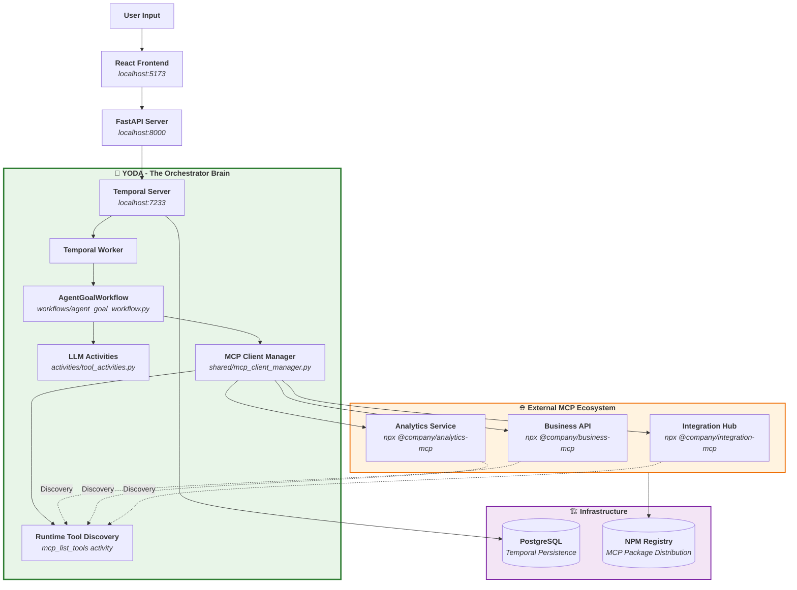
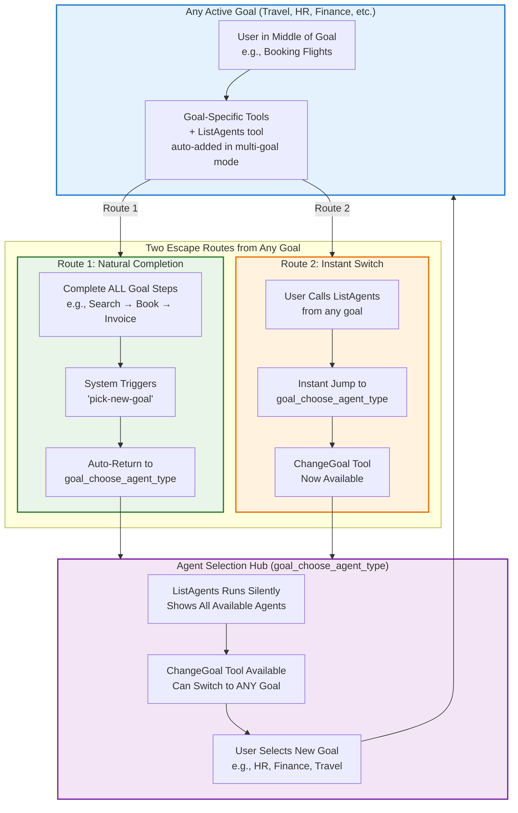
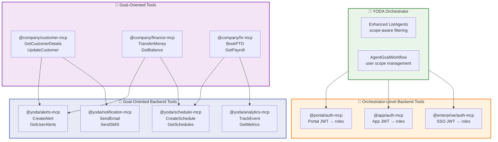
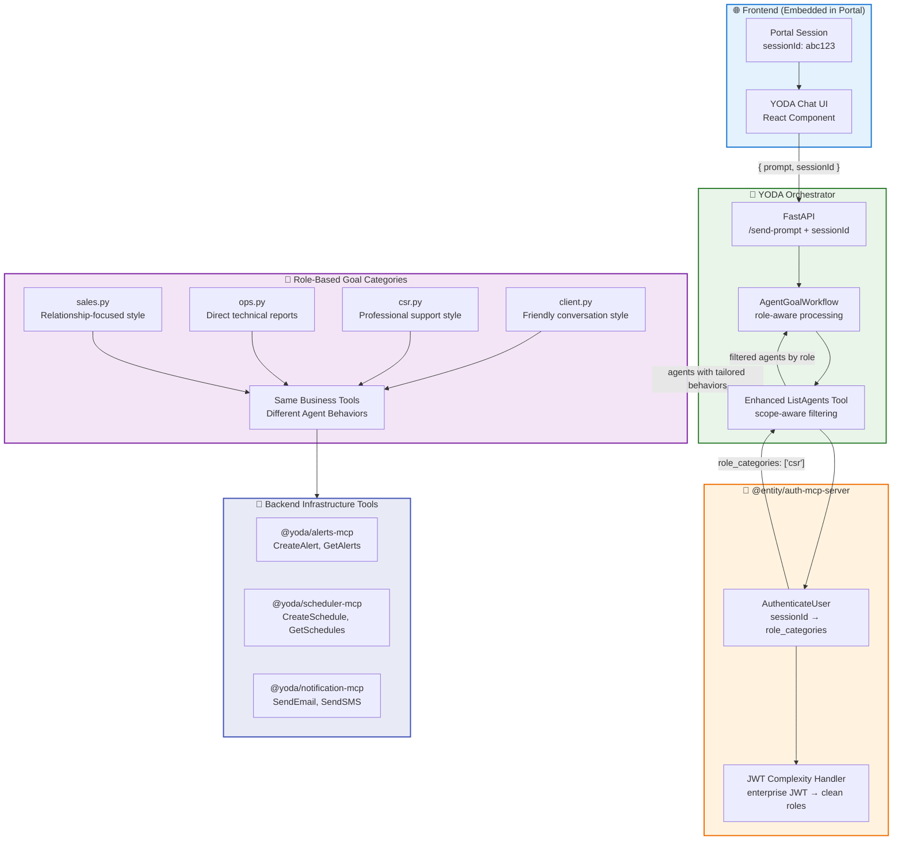

# YODA Documentation

                                ⠀⢀⣠⣄⣀⣀⣀⠀⠀⠀⠀⠀⠀⠀⠀⠀⠀⠀⠀⠀⠀⠀⣀⣤⣴⣶⡾⠿⠿⠿⠿⢷⣶⣦⣤⣀⡀⠀⠀⠀⠀⠀⠀⠀⠀⠀⠀⠀⠀⠀⠀⠀⠀⠀⠀⠀⠀⠀
                                ⢰⣿⡟⠛⠛⠛⠻⠿⠿⢿⣶⣶⣦⣤⣤⣀⣀⡀⣀⣴⣾⡿⠟⠋⠉⠀⠀⠀⠀⠀⠀⠀⠀⠉⠙⠻⢿⣷⣦⣀⠀⠀⠀⠀⠀⠀⠀⠀⠀⢀⣀⣀⣀⣀⣀⣀⣀⡀
                                ⠀⠻⣿⣦⡀⠀⠉⠓⠶⢦⣄⣀⠉⠉⠛⠛⠻⠿⠟⠋⠁⠀⠀⠀⣤⡀⠀⠀⢠⠀⠀⠀⣠⠀⠀⠀⠀⠈⠙⠻⠿⠿⠿⠿⠿⠿⠿⠿⠿⠿⠿⠿⠿⠟⠛⠛⢻⣿
                                ⠀⠀⠈⠻⣿⣦⠀⠀⠀⠀⠈⠙⠻⢷⣶⣤⡀⠀⠀⠀⠀⢀⣀⡀⠀⠙⢷⡀⠸⡇⠀⣰⠇⠀⢀⣀⣀⠀⠀⠀⠀⠀⠀⣀⣠⣤⣤⣶⡶⠶⠶⠒⠂⠀⠀⣠⣾⠟
                                ⠀⠀⠀⠀⠈⢿⣷⡀⠀⠀⠀⠀⠀⠀⠈⢻⣿⡄⣠⣴⣿⣯⣭⣽⣷⣆⠀⠁⠀⠀⠀⠀⢠⣾⣿⣿⣿⣿⣦⡀⠀⣠⣾⠟⠋⠁⠀⠀⠀⠀⠀⠀⠀⣠⣾⡟⠁⠀
                                ⠀⠀⠀⠀⠀⠈⢻⣷⣄⠀⠀⠀⠀⠀⠀⠀⣿⡗⢻⣿⣧⣽⣿⣿⣿⣧⠀⠀⣀⣀⠀⢠⣿⣧⣼⣿⣿⣿⣿⠗⠰⣿⠃⠀⠀⠀⠀⠀⠀⠀⠀⣠⣾⡿⠋⠀⠀⠀
                                ⠀⠀⠀⠀⠀⠀⠀⠙⢿⣶⣄⡀⠀⠀⠀⠀⠸⠃⠈⠻⣿⣿⣿⣿⣿⡿⠃⠾⣥⡬⠗⠸⣿⣿⣿⣿⣿⡿⠛⠀⢀⡟⠀⠀⠀⠀⠀⠀⣀⣠⣾⡿⠋⠀⠀⠀⠀⠀
                                ⠀⠀⠀⠀⠀⠀⠀⠀⠀⠉⠛⠿⣷⣶⣤⣤⣄⣰⣄⠀⠀⠉⠉⠉⠁⠀⢀⣀⣠⣄⣀⡀⠀⠉⠉⠉⠀⠀⢀⣠⣾⣥⣤⣤⣤⣶⣶⡿⠿⠛⠉⠀⠀⠀⠀⠀⠀⠀
                                ⠀⠀⠀⠀⠀⠀⠀⠀⠀⠀⠀⠀⠀⠈⠉⢻⣿⠛⢿⣷⣦⣤⣴⣶⣶⣦⣤⣤⣤⣤⣬⣥⡴⠶⠾⠿⠿⠿⠿⠛⢛⣿⣿⣿⣯⡉⠁⠀⠀⠀⠀⠀⠀⠀⠀⠀⠀⠀
                                ⠀⠀⠀⠀⠀⠀⠀⠀⠀⠀⠀⠀⠀⠀⠀⠈⣿⣧⡀⠈⠉⠀⠈⠁⣾⠛⠉⠉⠀⠀⠀⠀⠀⠀⠀⠀⠀⠀⣀⣴⣿⠟⠉⣹⣿⣇⠀⠀⠀⠀⠀⠀⠀⠀⠀⠀⠀⠀
                                ⠀⠀⠀⠀⠀⠀⠀⠀⠀⠀⠀⠀⠀⠀⠀⢀⣸⣿⣿⣦⣀⠀⠀⠀⢻⡀⠀⠀⠀⠀⠀⠀⠀⢀⣠⣤⣶⣿⠋⣿⠛⠃⠀⣈⣿⣿⠀⠀⠀⠀⠀⠀⠀⠀⠀⠀⠀⠀
                                ⠀⠀⠀⠀⠀⠀⠀⠀⠀⠀⠀⠀⠀⠀⠀⣿⡿⢿⡀⠈⢹⡿⠶⣶⣼⡇⠀⢀⣀⣀⣤⣴⣾⠟⠋⣡⣿⡟⠀⢻⣶⠶⣿⣿⠛⠋⠀⠀⠀⠀⠀⠀⠀⠀⠀⠀⠀⠀
                                ⠀⠀⠀⠀⠀⠀⠀⠀⠀⠀⠀⠀⠀⠀⠘⣿⣷⡈⢿⣦⣸⠇⢀⡿⠿⠿⡿⠿⠿⣿⠛⠋⠁⠀⣴⠟⣿⣧⡀⠈⢁⣰⣿⠏⠀⠀⠀⠀⠀⠀⠀⠀⠀⠀⠀⠀⠀⠀
                                ⠀⠀⠀⠀⠀⠀⠀⠀⠀⠀⠀⠀⠀⠀⠀⢸⣿⢻⣦⣈⣽⣀⣾⠃⠀⢸⡇⠀⢸⡇⠀⢀⣠⡾⠋⢰⣿⣿⣿⣿⡿⠟⠋⠀⠀⠀⠀⠀⠀⠀⠀⠀⠀⠀⠀⠀⠀⠀
                                ⠀⠀⠀⠀⠀⠀⠀⠀⠀⠀⠀⠀⠀⠀⠀⠘⠿⢿⣿⣿⡟⠛⠃⠀⠀⣾⠀⠀⢸⡇⠐⠿⠋⠀⠀⣿⢻⣿⣿⠀⠀⠀⠀⠀⠀⠀⠀⠀⠀⠀⠀⠀⠀⠀⠀⠀⠀⠀
                                ⠀⠀⠀⠀⠀⠀⠀⠀⠀⠀⠀⠀⠀⠀⠀⠀⠀⠀⢸⣿⠁⢀⡴⠋⠀⣿⠀⠀⢸⠇⠀⠀⠀⠀⠀⠁⢸⣿⣿⠀⠀⠀⠀⠀⠀⠀⠀⠀⠀⠀⠀⠀⠀⠀⠀⠀⠀⠀
                                ⠀⠀⠀⠀⠀⠀⠀⠀⠀⠀⠀⠀⠀⠀⠀⠀⠀⢀⣿⡿⠟⠋⠀⠀⠀⣿⠀⠀⣸⠀⠀⠀⠀⠀⠀⠀⢸⣿⣿⠀⠀⠀⠀⠀⠀⠀⠀⠀⠀⠀⠀⠀⠀⠀⠀⠀⠀⠀
                                ⠀⠀⠀⠀⠀⠀⠀⠀⠀⠀⠀⠀⠀⠀⠀⠀⠀⢸⣿⣁⣀⠀⠀⠀⠀⣿⡀⠀⣿⠀⠀⠀⠀⠀⠀⢀⣈⣿⣿⠀⠀⠀⠀⠀⠀⠀⠀⠀⠀⠀⠀⠀⠀⠀⠀⠀⠀⠀
                                ⠀⠀⠀⠀⠀⠀⠀⠀⠀⠀⠀⠀⠀⠀⠀⠀⠀⠘⠛⠿⠿⠿⠿⠿⠿⠿⠿⠿⠿⠿⠿⠿⠿⠿⠿⠿⠟⠛⠋⠀⠀⠀⠀⠀⠀⠀⠀⠀⠀⠀⠀⠀⠀⠀⠀⠀⠀⠀

## Overview

YODA is a Temporal-powered AI agent system for integrating external business tools via Model Context Protocol (MCP) servers. This document covers LLM-driven agent orchestration, team workflows, JWT authentication, MCP integration, and persistent alert/schedule systems.

### Architectural Traits

- **[MCP Servers for Tools](#mcp-servers-for-tools):** Modular tools, auto-discovered via NPM
- **[Parallel Team Workflow](#parallel-team-workflow):** Tool and goal teams work in parallel with minimal coordination
- **[Goal Switching Architecture](#goal-switching-architecture):** Users can seamlessly switch between agent personas and goals
- **[MCP Tool Documentation Standards](#mcp-tool-documentation-standards):** Standardized documentation for tool response schemas and examples alongside standard MCP protocol
- **[JWT-Based Authorization Flow](#jwt-based-authorization-flow):** User access is securely managed with JWT tokens across all tools
- **[Persistent Alerts & Schedules](#persistent-alerts--schedules):** User-specific alerts and schedules are managed as stateful JSON feeds within the orchestrator

**Note:** All file paths and package names mentioned in this document are exact locations used in the codebase. Tool and goal teams only need to update these specific files and packages to register new tools, define agent goals, or integrate new business logic as described below. Note that "goal" and "agent" are used interchangeably throughout this document.

---

## MCP Servers for Tools

YODA's architecture is modular by design: YODA itself acts as the orchestrator ("the brain"), while all business logic and integrations are provided by independently developed MCP servers ("the hands"). MCP servers expose tools without needing to know anything about the orchestrator's internals, enabling infinite scalability and rapid, parallel development.

### Tool Registration & Deployment

1. Publish MCP server to NPM
2. Register server endpoint in the orchestrator
3. Reference server in goal files
4. Tools are auto-discovered at runtime

**Note:** For the exact file paths, code references, and detailed step-by-step process, see the [Parallel Team Workflow](#parallel-team-workflow) section.



## **MCP Tool Documentation Standards**

YODA's scalable tool ecosystem is built on close collaboration between two teams: **tool teams**, who develop and maintain MCP servers, and **goal teams**, who design agent experiences that leverage those tools. The standard MCP protocol exposes only a tool's name, description, and input schema—leaving goal teams to infer or reverse-engineer response formats.

To solve this, YODA establishes a shared documentation standard: both teams collaborate on a living document that clearly defines response schemas and example payloads. This document acts first as a requirements spec from the goal team, then as the authoritative reference from the tool team, ensuring agent design is accurate and tool integration is seamless.

**Example: Documentation Standard in Practice**

```markdown
# @company/customer-mcp-server Documentation

## GetCustomerDetails Tool

**Summary:**
Retrieves detailed customer information from the CRM system. Returns customer profile data including contact information, account status, and registration details.

**Input Schema:**
{
    "type": "object",
    "properties": {
    "customer_id": {"type": "string", "description": "Unique customer identifier"}
    },
    "required": ["customer_id"]
  }

**Response Schema:**
{
  "type": "object", 
  "properties": {
    "customer_id": {"type": "string"},
    "name": {"type": "string"},
    "email": {"type": "string"},
    "status": {"type": "string"},
    "created_date": {"type": "string", "format": "date"}
  },
  "required": ["customer_id", "name", "email", "status"]
}

**Examples:**
- Success: {"customer_id": "CUST_123", "name": "John Smith", "email": "john@example.com", "status": "active", "created_date": "2024-01-15"}
- Not Found: {"error": "Customer not found", "customer_id": "CUST_999"}
```

---

## Streamlined Team Workflow

1. **Goal Team: Define & Send Requirement**  
   Prepare a structured MCP server/tool requirement document (as shown in the documentation standards above).

2. **Tool Team: Develop & Document**  
   Implement the MCP server and tools based on the requirement, update shared documentation with finalized response schemas and examples, then publish to NPM.

3. **Goal Team: Integrate & Design**  
   Add the server definition to the orchestrator, reference it in goal files, and use the documentation to write accurate `example_conversation_history` for agent behavior.

```python
# Goal team uses finalized documentation to write accurate tool responses:
example_conversation_history="\n ".join([
    "user_confirmed_tool_run: <user clicks confirm on GetCustomerDetails tool>",
    "tool_result: { 'customer_id': 'CUST_123', 'name': 'John Smith', 'email': 'john@example.com', 'status': 'active' }",  # From tool docs
    "agent: Found customer John Smith (john@example.com) - account is active."
])
```

---

## **Goal Switching Architecture**

Original Temporal supports both single-agent and multi-agent modes, but YODA defaults to multi-goal mode—enabling agent orchestration and fully realizing the MCP framework.




---

## **Backend Infrastructure Tools**

YODA's architecture separates **goal-oriented tools** (business logic for user interactions) from **backend infrastructure tools**. Backend infrastructure tools are divided into two distinct types: **orchestrator-level tools** that handle platform-specific authentication and user scoping across different deployment contexts (portal, app, enterprise), and **goal-oriented backend tools** that provide universal functionality like alerts, scheduling, and notifications that any business tool can consume regardless of platform.

### **Architecture Pattern: Two-Tier Backend Infrastructure**




### **Orchestrator-Level Backend Tools**

Platform-specific authentication servers that YODA Orchestrator uses to handle JWT complexity and map to standardized role categories:

```python
# Different auth servers for different deployment platforms
class YODAOrchestrator:
    async def authenticate_user(self, session_id, platform):
        if platform == "portal":
            auth_result = await portal_auth_mcp.authenticate_user(session_id)
        elif platform == "mobile_app":
            auth_result = await app_auth_mcp.authenticate_user(session_id) 
        elif platform == "enterprise":
            auth_result = await enterprise_auth_mcp.authenticate_user(session_id)
        
        # All return standardized format: {"user_id": "...", "role_categories": ["csr"]}
        return auth_result

# @portal/auth-mcp handles portal-specific JWT
async def authenticate_user(session_id):
    portal_jwt = await portal_system.validate_session(session_id)
    # Complex portal JWT → clean roles
    role_categories = map_portal_roles(portal_jwt["user_type"], portal_jwt["permissions"])
    return {"user_id": portal_jwt["user_id"], "role_categories": role_categories}

# @enterprise/auth-mcp handles enterprise SSO  
async def authenticate_user(session_id):
    sso_jwt = await enterprise_sso.validate_session(session_id)
    # Complex enterprise JWT → clean roles
    role_categories = map_enterprise_roles(sso_jwt["roles"], sso_jwt["department"])
    return {"user_id": sso_jwt["employee_id"], "role_categories": role_categories}
```

### **Goal-Oriented Backend Tools**

Universal infrastructure tools that any business MCP server can use for common functionality:

```python
# @company/finance-mcp-server using goal-oriented backend tools
class FinanceMCP:
    def __init__(self):
        # Goal-oriented backend tools - available to any business tool
        self.alerts = MCPClient("@yoda/alerts-mcp")
        self.scheduler = MCPClient("@yoda/scheduler-mcp") 
        self.notifications = MCPClient("@yoda/notification-mcp")
        self.analytics = MCPClient("@yoda/analytics-mcp")
    
    async def transfer_money(self, from_account, to_account, amount, user_id):
        # Business logic
        transfer = await self.execute_transfer(from_account, to_account, amount)
        
        # Use goal-oriented backend infrastructure
        if amount > 10000:
            await self.alerts.create_user_alert(
                user_id=user_id,
                condition=f"Large transfer of ${amount:,.2f} completed",
                alert_type="high_value_transaction"
            )
        
        await self.notifications.send_email(
            user_id=user_id,
            template="transfer_confirmation", 
            data={"amount": amount, "to_account": to_account}
        )
        
        await self.analytics.track_event(
            user_id=user_id,
            event="money_transfer",
            metadata={"amount": amount, "type": "internal"}
        )
        
        return {"transfer_id": transfer.id, "status": "completed"}
```

---

## **User Management & Authentication Flow**

YODA implements scope-based agent categories where each user role (client, csr, ops, sales) has dedicated agent goals with tailored behaviors and conversation styles. The system uses a single authentication MCP server to handle JWT complexity and map enterprise authentication to clean role categories, with the `listAgents` tool providing scope-aware agent discovery.



**Benefits of Role-Based Category Approach:**

- **🎭 Role-Specific Agent Behaviors:** Same tools with tailored conversation styles for different user types
- **🏢 Enterprise JWT Abstraction:** @entity/auth-mcp handles complex enterprise authentication mapping
- **🔍 Scope-Aware Discovery:** Users only see agents appropriate for their role
- **🧩 Backend Tool Freedom:** Tool teams can freely use all infrastructure MCP tools
- **⚡ Enhanced ListAgents:** Single tool modification provides complete role-based filtering

**Example Flow:**

**1. Enterprise JWT → Role Categories:**
```json
// @entity/auth-mcp receives complex enterprise JWT
{
  "session_id": "sess_abc123"
}

// Complex enterprise JWT from company auth system
{
  "user_id": "emp_456",
  "roles": ["customer_service", "support_tier_2"], 
  "department": "customer_success",
  "permissions": ["view_customer_data", "modify_orders"],
  "groups": ["west_coast_team", "senior_agents"]
}

// @entity/auth-mcp maps to clean role categories
{
  "user_id": "emp_456",
  "role_categories": ["csr"],  // Clean, simple role mapping
  "session_expires": "2024-01-15T10:30:00Z"
}
```

**2. Scope-Aware Agent Discovery:**
```json
// Enhanced listAgents with role filtering
{
  "session_id": "sess_abc123",
  "user_role_categories": ["csr"]
}

// Response: Only agents appropriate for CSR role
{
  "agents": [
    {
      "agent_name": "Customer Support Assistant",
      "goal_id": "goal_csr_order_status", 
      "agent_description": "Professional order status checking with technical details",
      "conversation_style": "direct_professional"
    },
    {
      "agent_name": "Account Management Helper", 
      "goal_id": "goal_csr_account_mgmt",
      "agent_description": "Manage customer accounts with administrative tools",
      "conversation_style": "business_focused"
    }
  ]
}
```

**3. Role-Specific Agent Behavior:**
```python
# csr.py - Professional, direct style
goal_csr_order_status = AgentGoal(
    category_tag="csr",
    example_conversation_history="\n ".join([
        "user: Order status for 102",
        "agent: Order ID: 102. Status: Shipped. Tracking: 039813852990618. ETA: April 30, 2025.",
        "user: Any delivery issues?", 
        "agent: No delivery exceptions. Package in transit. Last scan: Phoenix, AZ."
    ])
)

# client.py - Friendly, conversational style  
goal_client_order_status = AgentGoal(
    category_tag="client",
    example_conversation_history="\n ".join([
        "user: Hi, how's my order doing?",
        "agent: Hi there! I'd be happy to check on your order. What's your order number?",
        "user: 102",
        "agent: Great news! Your order shipped and is on its way! 😊 It should arrive by April 30th."
    ])
)
```


---

## **Goal-Oriented Backend Tools in Action**

Goal-oriented backend tools provide universal infrastructure capabilities that any business MCP server can use. These tools manage persistent, stateful operations while remaining platform-agnostic and composable across all business domains.

### **@yoda/alerts-mcp-server**

Universal alerting infrastructure that any business tool can use for user notifications:

```python
# Any business tool can create sophisticated alerts
await alerts_mcp.create_user_alert(
    user_id="user_456",
    condition="BTC price drops below $50,000 AND portfolio loss > 5%",
    alert_type="financial_risk",
    priority="high"
)

# Universal alert format across all business domains
{
  "alert_id": "alert_123",
  "user_id": "user_456", 
  "condition": "BTC < $50000 AND portfolio_loss > 0.05",
  "status": "active",
  "created_at": "2024-01-10T09:00:00Z",
  "triggered_at": null
}
```

### **@yoda/scheduler-mcp-server**

Universal scheduling infrastructure for time-based and conditional automation:

```python
# Any business tool can schedule actions
await scheduler_mcp.create_schedule(
    user_id="user_456",
    action="transfer_to_savings",
    condition="monthly",
    action_params={"amount": 500, "target_account": "savings_001"}
)

# Universal schedule format across all business domains
{
  "schedule_id": "schedule_789",
  "user_id": "user_456",
  "action": "transfer_to_savings", 
  "condition": "monthly",
  "status": "pending",
  "next_execution": "2024-02-01T00:00:00Z",
  "action_params": {"amount": 500, "target_account": "savings_001"}
}
```

### **@yoda/notification-mcp-server**

Universal notification infrastructure for multi-channel communications:

```python
# Any business tool can send notifications
await notification_mcp.send_email(
    user_id="user_456",
    template="payment_confirmation",
    data={"amount": "$1,500", "account": "checking"}
)

await notification_mcp.send_sms(
    user_id="user_456", 
    message="Your payment of $1,500 has been processed successfully."
)

await notification_mcp.send_push_notification(
    user_id="user_456",
    title="Payment Complete",
    body="Your transfer is complete. Check your account for details."
)
```

### **@yoda/analytics-mcp-server**

Universal analytics infrastructure for business intelligence and monitoring:

```python
# Any business tool can track events and metrics
await analytics_mcp.track_event(
    user_id="user_456",
    event="money_transfer",
    metadata={
        "amount": 1500,
        "type": "internal",
        "from_account": "checking",
        "to_account": "savings"
    }
)

await analytics_mcp.track_metric(
    metric_name="daily_transaction_volume",
    value=1500,
    tags={"user_type": "premium", "region": "west_coast"}
)
```

### **Cross-Domain Integration Example**

Business tools from different domains using the same goal-oriented backend infrastructure:

```python
# HR tool using multiple goal-oriented backend tools
class HRMCP:
    def __init__(self):
        self.scheduler = MCPClient("@yoda/scheduler-mcp")
        self.alerts = MCPClient("@yoda/alerts-mcp")
        self.notifications = MCPClient("@yoda/notification-mcp")
        self.analytics = MCPClient("@yoda/analytics-mcp")
    
    async def setup_payroll_automation(self, employee_id, salary_amount):
        # Schedule recurring payroll using universal scheduler
        await self.scheduler.create_schedule(
            user_id=employee_id,
            action="process_payroll",
            condition="bi_weekly",
            action_params={"amount": salary_amount, "employee_id": employee_id}
        )
        
        # Create alert for payroll failures using universal alerts
        await self.alerts.create_user_alert(
            user_id=employee_id,
            condition="payroll_failed OR insufficient_funds",
            alert_type="payroll_issue",
            priority="critical"
        )
        
        # Send confirmation using universal notifications
        await self.notifications.send_email(
            user_id=employee_id,
            template="payroll_setup_confirmation",
            data={"amount": salary_amount, "frequency": "bi_weekly"}
        )
        
        # Track setup event using universal analytics
        await self.analytics.track_event(
            user_id=employee_id,
            event="payroll_automation_setup",
            metadata={"salary_amount": salary_amount}
        )
```


