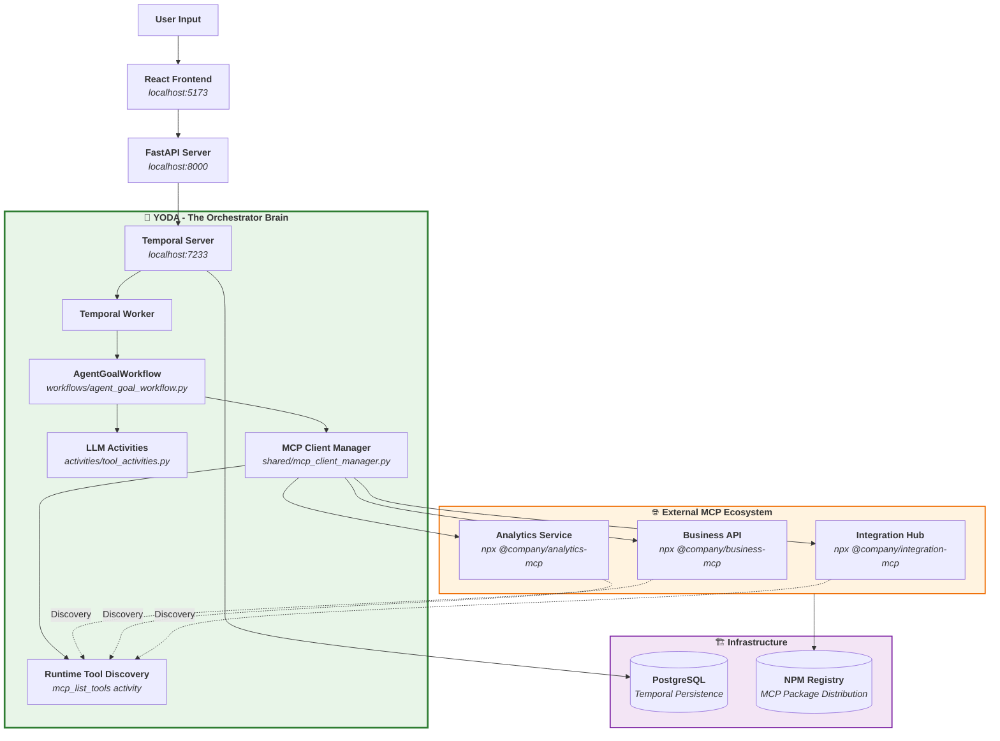
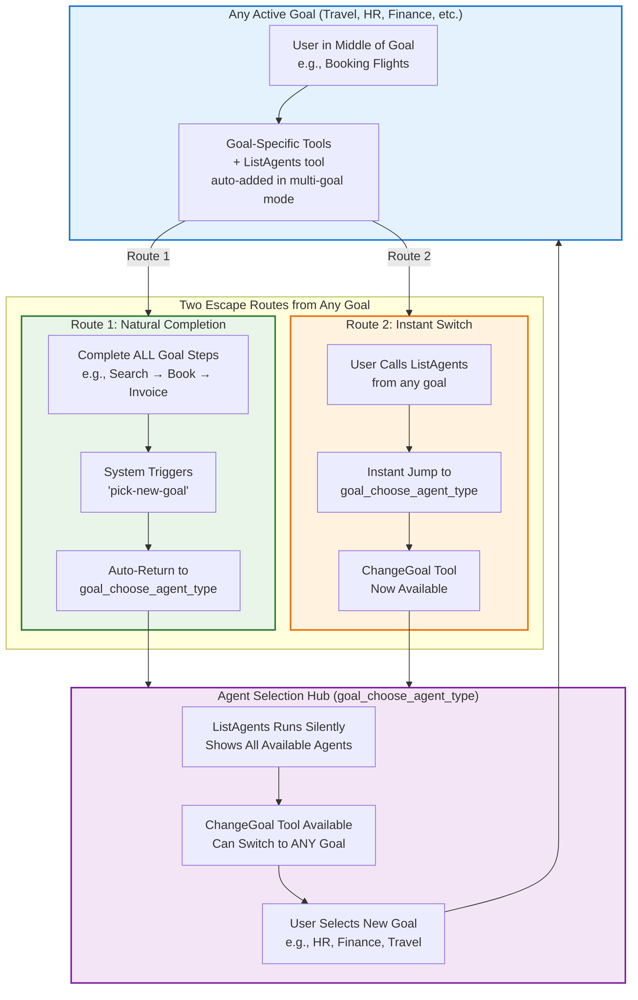
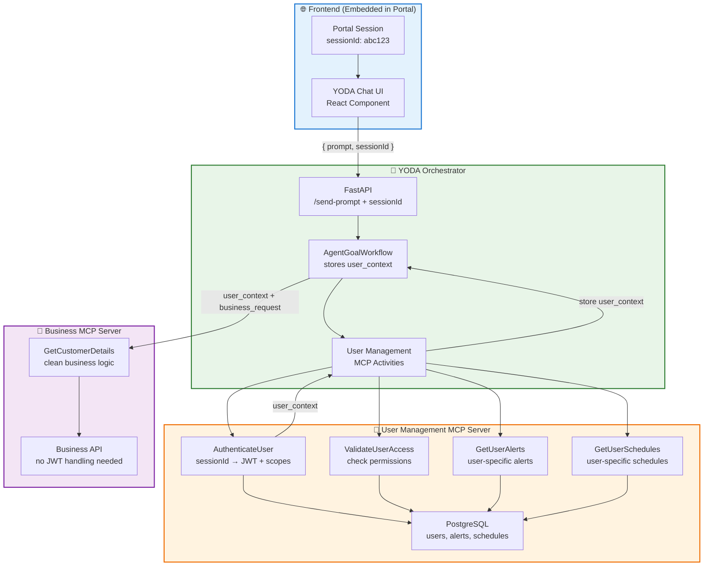

# YODA Documentation

                                ⠀⢀⣠⣄⣀⣀⣀⠀⠀⠀⠀⠀⠀⠀⠀⠀⠀⠀⠀⠀⠀⠀⣀⣤⣴⣶⡾⠿⠿⠿⠿⢷⣶⣦⣤⣀⡀⠀⠀⠀⠀⠀⠀⠀⠀⠀⠀⠀⠀⠀⠀⠀⠀⠀⠀⠀⠀⠀
                                ⢰⣿⡟⠛⠛⠛⠻⠿⠿⢿⣶⣶⣦⣤⣤⣀⣀⡀⣀⣴⣾⡿⠟⠋⠉⠀⠀⠀⠀⠀⠀⠀⠀⠉⠙⠻⢿⣷⣦⣀⠀⠀⠀⠀⠀⠀⠀⠀⠀⢀⣀⣀⣀⣀⣀⣀⣀⡀
                                ⠀⠻⣿⣦⡀⠀⠉⠓⠶⢦⣄⣀⠉⠉⠛⠛⠻⠿⠟⠋⠁⠀⠀⠀⣤⡀⠀⠀⢠⠀⠀⠀⣠⠀⠀⠀⠀⠈⠙⠻⠿⠿⠿⠿⠿⠿⠿⠿⠿⠿⠿⠿⠿⠟⠛⠛⢻⣿
                                ⠀⠀⠈⠻⣿⣦⠀⠀⠀⠀⠈⠙⠻⢷⣶⣤⡀⠀⠀⠀⠀⢀⣀⡀⠀⠙⢷⡀⠸⡇⠀⣰⠇⠀⢀⣀⣀⠀⠀⠀⠀⠀⠀⣀⣠⣤⣤⣶⡶⠶⠶⠒⠂⠀⠀⣠⣾⠟
                                ⠀⠀⠀⠀⠈⢿⣷⡀⠀⠀⠀⠀⠀⠀⠈⢻⣿⡄⣠⣴⣿⣯⣭⣽⣷⣆⠀⠁⠀⠀⠀⠀⢠⣾⣿⣿⣿⣿⣦⡀⠀⣠⣾⠟⠋⠁⠀⠀⠀⠀⠀⠀⠀⣠⣾⡟⠁⠀
                                ⠀⠀⠀⠀⠀⠈⢻⣷⣄⠀⠀⠀⠀⠀⠀⠀⣿⡗⢻⣿⣧⣽⣿⣿⣿⣧⠀⠀⣀⣀⠀⢠⣿⣧⣼⣿⣿⣿⣿⠗⠰⣿⠃⠀⠀⠀⠀⠀⠀⠀⠀⣠⣾⡿⠋⠀⠀⠀
                                ⠀⠀⠀⠀⠀⠀⠀⠙⢿⣶⣄⡀⠀⠀⠀⠀⠸⠃⠈⠻⣿⣿⣿⣿⣿⡿⠃⠾⣥⡬⠗⠸⣿⣿⣿⣿⣿⡿⠛⠀⢀⡟⠀⠀⠀⠀⠀⠀⣀⣠⣾⡿⠋⠀⠀⠀⠀⠀
                                ⠀⠀⠀⠀⠀⠀⠀⠀⠀⠉⠛⠿⣷⣶⣤⣤⣄⣰⣄⠀⠀⠉⠉⠉⠁⠀⢀⣀⣠⣄⣀⡀⠀⠉⠉⠉⠀⠀⢀⣠⣾⣥⣤⣤⣤⣶⣶⡿⠿⠛⠉⠀⠀⠀⠀⠀⠀⠀
                                ⠀⠀⠀⠀⠀⠀⠀⠀⠀⠀⠀⠀⠀⠈⠉⢻⣿⠛⢿⣷⣦⣤⣴⣶⣶⣦⣤⣤⣤⣤⣬⣥⡴⠶⠾⠿⠿⠿⠿⠛⢛⣿⣿⣿⣯⡉⠁⠀⠀⠀⠀⠀⠀⠀⠀⠀⠀⠀
                                ⠀⠀⠀⠀⠀⠀⠀⠀⠀⠀⠀⠀⠀⠀⠀⠈⣿⣧⡀⠈⠉⠀⠈⠁⣾⠛⠉⠉⠀⠀⠀⠀⠀⠀⠀⠀⠀⠀⣀⣴⣿⠟⠉⣹⣿⣇⠀⠀⠀⠀⠀⠀⠀⠀⠀⠀⠀⠀
                                ⠀⠀⠀⠀⠀⠀⠀⠀⠀⠀⠀⠀⠀⠀⠀⢀⣸⣿⣿⣦⣀⠀⠀⠀⢻⡀⠀⠀⠀⠀⠀⠀⠀⢀⣠⣤⣶⣿⠋⣿⠛⠃⠀⣈⣿⣿⠀⠀⠀⠀⠀⠀⠀⠀⠀⠀⠀⠀
                                ⠀⠀⠀⠀⠀⠀⠀⠀⠀⠀⠀⠀⠀⠀⠀⣿⡿⢿⡀⠈⢹⡿⠶⣶⣼⡇⠀⢀⣀⣀⣤⣴⣾⠟⠋⣡⣿⡟⠀⢻⣶⠶⣿⣿⠛⠋⠀⠀⠀⠀⠀⠀⠀⠀⠀⠀⠀⠀
                                ⠀⠀⠀⠀⠀⠀⠀⠀⠀⠀⠀⠀⠀⠀⠘⣿⣷⡈⢿⣦⣸⠇⢀⡿⠿⠿⡿⠿⠿⣿⠛⠋⠁⠀⣴⠟⣿⣧⡀⠈⢁⣰⣿⠏⠀⠀⠀⠀⠀⠀⠀⠀⠀⠀⠀⠀⠀⠀
                                ⠀⠀⠀⠀⠀⠀⠀⠀⠀⠀⠀⠀⠀⠀⠀⢸⣿⢻⣦⣈⣽⣀⣾⠃⠀⢸⡇⠀⢸⡇⠀⢀⣠⡾⠋⢰⣿⣿⣿⣿⡿⠟⠋⠀⠀⠀⠀⠀⠀⠀⠀⠀⠀⠀⠀⠀⠀⠀
                                ⠀⠀⠀⠀⠀⠀⠀⠀⠀⠀⠀⠀⠀⠀⠀⠘⠿⢿⣿⣿⡟⠛⠃⠀⠀⣾⠀⠀⢸⡇⠐⠿⠋⠀⠀⣿⢻⣿⣿⠀⠀⠀⠀⠀⠀⠀⠀⠀⠀⠀⠀⠀⠀⠀⠀⠀⠀⠀
                                ⠀⠀⠀⠀⠀⠀⠀⠀⠀⠀⠀⠀⠀⠀⠀⠀⠀⠀⢸⣿⠁⢀⡴⠋⠀⣿⠀⠀⢸⠇⠀⠀⠀⠀⠀⠁⢸⣿⣿⠀⠀⠀⠀⠀⠀⠀⠀⠀⠀⠀⠀⠀⠀⠀⠀⠀⠀⠀
                                ⠀⠀⠀⠀⠀⠀⠀⠀⠀⠀⠀⠀⠀⠀⠀⠀⠀⢀⣿⡿⠟⠋⠀⠀⠀⣿⠀⠀⣸⠀⠀⠀⠀⠀⠀⠀⢸⣿⣿⠀⠀⠀⠀⠀⠀⠀⠀⠀⠀⠀⠀⠀⠀⠀⠀⠀⠀⠀
                                ⠀⠀⠀⠀⠀⠀⠀⠀⠀⠀⠀⠀⠀⠀⠀⠀⠀⢸⣿⣁⣀⠀⠀⠀⠀⣿⡀⠀⣿⠀⠀⠀⠀⠀⠀⢀⣈⣿⣿⠀⠀⠀⠀⠀⠀⠀⠀⠀⠀⠀⠀⠀⠀⠀⠀⠀⠀⠀
                                ⠀⠀⠀⠀⠀⠀⠀⠀⠀⠀⠀⠀⠀⠀⠀⠀⠀⠘⠛⠿⠿⠿⠿⠿⠿⠿⠿⠿⠿⠿⠿⠿⠿⠿⠿⠿⠟⠛⠋⠀⠀⠀⠀⠀⠀⠀⠀⠀⠀⠀⠀⠀⠀⠀⠀⠀⠀⠀

## Overview

YODA is a Temporal-powered AI agent system for integrating external business tools via Model Context Protocol (MCP) servers. This document covers LLM-driven agent orchestration, team workflows, JWT authentication, MCP integration, and persistent alert/schedule systems.

### Architectural Traits

- **[MCP Servers for Tools](#mcp-servers-for-tools):** Modular tools, auto-discovered via NPM
- **[Parallel Team Workflow](#parallel-team-workflow):** Tool and goal teams work in parallel with minimal coordination
- **[Goal Switching Architecture](#goal-switching-architecture):** Users can seamlessly switch between agent personas and goals
- **[MCP Tool Documentation Standards](#mcp-tool-documentation-standards):** Standardized documentation for tool response schemas and examples alongside standard MCP protocol
- **[JWT-Based Authorization Flow](#jwt-based-authorization-flow):** User access is securely managed with JWT tokens across all tools
- **[Persistent Alerts & Schedules](#persistent-alerts--schedules):** User-specific alerts and schedules are managed as stateful JSON feeds within the orchestrator

**Note:** All file paths and package names mentioned in this document are exact locations used in the codebase. Tool and goal teams only need to update these specific files and packages to register new tools, define agent goals, or integrate new business logic as described below. Note that "goal" and "agent" are used interchangeably throughout this document.

---

## MCP Servers for Tools

YODA's architecture is modular by design: YODA itself acts as the orchestrator ("the brain"), while all business logic and integrations are provided by independently developed MCP servers ("the hands"). MCP servers expose tools without needing to know anything about the orchestrator's internals, enabling infinite scalability and rapid, parallel development.

### Tool Registration & Deployment

1. Publish MCP server to NPM
2. Register server endpoint in the orchestrator
3. Reference server in goal files
4. Tools are auto-discovered at runtime

**Note:** For the exact file paths, code references, and detailed step-by-step process, see the [Parallel Team Workflow](#parallel-team-workflow) section.



## **MCP Tool Documentation Standards**

YODA's scalable tool ecosystem is built on close collaboration between two teams: **tool teams**, who develop and maintain MCP servers, and **goal teams**, who design agent experiences that leverage those tools. The standard MCP protocol exposes only a tool's name, description, and input schema—leaving goal teams to infer or reverse-engineer response formats.

To solve this, YODA establishes a shared documentation standard: both teams collaborate on a living document that clearly defines response schemas and example payloads. This document acts first as a requirements spec from the goal team, then as the authoritative reference from the tool team, ensuring agent design is accurate and tool integration is seamless.

**Example: Documentation Standard in Practice**

```markdown
# @company/customer-mcp-server Documentation

## GetCustomerDetails Tool

**Summary:**
Retrieves detailed customer information from the CRM system. Returns customer profile data including contact information, account status, and registration details.

**Input Schema:**
{
  "type": "object",
  "properties": {
    "customer_id": {"type": "string", "description": "Unique customer identifier"}
  },
  "required": ["customer_id"]
}

**Response Schema:**
{
  "type": "object", 
  "properties": {
    "customer_id": {"type": "string"},
    "name": {"type": "string"},
    "email": {"type": "string"},
    "status": {"type": "string"},
    "created_date": {"type": "string", "format": "date"}
  },
  "required": ["customer_id", "name", "email", "status"]
}

**Examples:**
- Success: {"customer_id": "CUST_123", "name": "John Smith", "email": "john@example.com", "status": "active", "created_date": "2024-01-15"}
- Not Found: {"error": "Customer not found", "customer_id": "CUST_999"}
```

---

## Streamlined Team Workflow

1. **Goal Team: Define & Send Requirement**  
   Prepare a structured MCP server/tool requirement document (as shown in the documentation standards above).

2. **Tool Team: Develop & Document**  
   Implement the MCP server and tools based on the requirement, update shared documentation with finalized response schemas and examples, then publish to NPM.

3. **Goal Team: Integrate & Design**  
   Add the server definition to the orchestrator, reference it in goal files, and use the documentation to write accurate `example_conversation_history` for agent behavior.

```python
# Goal team uses finalized documentation to write accurate tool responses:
example_conversation_history="\n ".join([
    "user_confirmed_tool_run: <user clicks confirm on GetCustomerDetails tool>",
    "tool_result: { 'customer_id': 'CUST_123', 'name': 'John Smith', 'email': 'john@example.com', 'status': 'active' }",  # From tool docs
    "agent: Found customer John Smith (john@example.com) - account is active."
])
```

---

## **Goal Switching Architecture**

Original Temporal supports both single-agent and multi-agent modes, but YODA defaults to multi-goal mode—enabling agent orchestration and fully realizing the MCP framework.



---

## **Realistic MCP Server Requirement: User Management & Persistence**

### **Goal Team Requirement Document**

**Use Case:** Enable user-scoped operations, persistent alerts, and scheduled actions across all YODA agent interactions.

**Business Context:** YODA needs to distinguish between users, maintain user-specific alerts/schedules, and ensure secure access to business tools based on user permissions.

#### **Required MCP Server: User Management Server**

**MCP Server Package:** `@company/user-management-mcp-server`

**Tools Required:**

##### **1. AuthenticateUser Tool**
```yaml
name: "AuthenticateUser"
description: "Validate user session and retrieve JWT token with scopes"
inputSchema:
  type: object
  properties:
    session_id:
      type: string
      description: "User session identifier from frontend"
  required: ["session_id"]
responseSchema:
  type: object
  properties:
    jwt_token:
      type: string
      description: "Valid JWT token for API calls"
    user_id:
      type: string
      description: "Unique user identifier"
    scopes:
      type: array
      items:
        type: string
      description: "User permission scopes (e.g., finance:read, hr:write)"
    expires_at:
      type: string
      format: date-time
      description: "Token expiration timestamp"
  required: ["jwt_token", "user_id", "scopes"]
examples:
  success:
    jwt_token: "eyJhbGciOiJIUzI1NiIsInR5cCI6IkpXVCJ9..."
    user_id: "user_456"
    scopes: ["finance:read", "hr:write", "ecommerce:admin"]
    expires_at: "2024-01-15T10:30:00Z"
  error:
    error: "Invalid or expired session"
    session_id: "sess_invalid"
```

##### **2. GetUserAlerts Tool**
```yaml
name: "GetUserAlerts"
description: "Retrieve all active alerts for authenticated user"
inputSchema:
  type: object
  properties:
    user_id:
      type: string
      description: "User identifier from authentication"
  required: ["user_id"]
responseSchema:
  type: object
  properties:
    alerts:
      type: array
      items:
        type: object
        properties:
          alert_id:
            type: string
          condition:
            type: string
          status:
            type: string
            enum: ["active", "triggered", "dismissed"]
          created_at:
            type: string
            format: date-time
          triggered_at:
            type: string
            format: date-time
            nullable: true
  required: ["alerts"]
examples:
  success:
    alerts:
      - alert_id: "alert_123"
        condition: "BTC drops below $50,000"
        status: "active"
        created_at: "2024-01-10T09:00:00Z"
        triggered_at: null
      - alert_id: "alert_124"
        condition: "New order over $1000"
        status: "triggered"
        created_at: "2024-01-09T14:30:00Z"
        triggered_at: "2024-01-12T11:15:00Z"
```

##### **3. CreateUserAlert Tool**
```yaml
name: "CreateUserAlert"
description: "Create a new alert for the authenticated user"
inputSchema:
  type: object
  properties:
    user_id:
      type: string
      description: "User identifier"
    condition:
      type: string
      description: "Alert condition in natural language"
    alert_type:
      type: string
      enum: ["price_change", "order_status", "account_balance", "custom"]
      description: "Type of alert"
  required: ["user_id", "condition", "alert_type"]
responseSchema:
  type: object
  properties:
    alert_id:
      type: string
      description: "Unique identifier for created alert"
    status:
      type: string
      enum: ["created", "error"]
    message:
      type: string
      description: "Success or error message"
  required: ["alert_id", "status", "message"]
examples:
  success:
    alert_id: "alert_125"
    status: "created"
    message: "Alert created successfully"
```

##### **4. GetUserSchedules Tool**
```yaml
name: "GetUserSchedules"
description: "Retrieve all scheduled actions for authenticated user"
inputSchema:
  type: object
  properties:
    user_id:
      type: string
      description: "User identifier"
    status_filter:
      type: string
      enum: ["pending", "executed", "failed", "all"]
      description: "Filter schedules by status"
  required: ["user_id"]
responseSchema:
  type: object
  properties:
    schedules:
      type: array
      items:
        type: object
        properties:
          schedule_id:
            type: string
          action:
            type: string
          condition:
            type: string
          status:
            type: string
            enum: ["pending", "executed", "failed"]
          created_at:
            type: string
            format: date-time
          scheduled_for:
            type: string
            format: date-time
            nullable: true
          executed_at:
            type: string
            format: date-time
            nullable: true
  required: ["schedules"]
```

##### **5. CreateUserSchedule Tool**
```yaml
name: "CreateUserSchedule"
description: "Schedule an action to be performed for the user"
inputSchema:
  type: object
  properties:
    user_id:
      type: string
      description: "User identifier"
    action:
      type: string
      description: "Action to perform (e.g., 'Send monthly report', 'Process payment')"
    condition:
      type: string
      description: "When to trigger (e.g., 'Every 1st of month', 'In 3 days')"
    action_type:
      type: string
      enum: ["recurring", "one_time", "conditional"]
      description: "Type of scheduled action"
  required: ["user_id", "action", "condition", "action_type"]
responseSchema:
  type: object
  properties:
    schedule_id:
      type: string
      description: "Unique identifier for created schedule"
    status:
      type: string
      enum: ["scheduled", "error"]
    next_execution:
      type: string
      format: date-time
      nullable: true
      description: "When the action is next scheduled to run"
    message:
      type: string
  required: ["schedule_id", "status", "message"]
```

##### **6. ValidateUserAccess Tool**
```yaml
name: "ValidateUserAccess"
description: "Check if user has permission for specific business operation"
inputSchema:
  type: object
  properties:
    user_id:
      type: string
      description: "User identifier"
    jwt_token:
      type: string
      description: "User JWT token"
    operation:
      type: string
      description: "Business operation to validate (e.g., 'finance:transfer', 'hr:schedule_pto')"
  required: ["user_id", "jwt_token", "operation"]
responseSchema:
  type: object
  properties:
    authorized:
      type: boolean
      description: "Whether user is authorized for this operation"
    scopes:
      type: array
      items:
        type: string
      description: "User's current permission scopes"
    reason:
      type: string
      nullable: true
      description: "Reason if authorization failed"
  required: ["authorized", "scopes"]
examples:
  authorized:
    authorized: true
    scopes: ["finance:read", "finance:transfer", "hr:read"]
    reason: null
  unauthorized:
    authorized: false
    scopes: ["finance:read"]
    reason: "Insufficient permissions for finance:transfer"
```

#### **Infrastructure Requirements**

##### **Database Schema (PostgreSQL)**
```sql
-- User sessions and authentication
CREATE TABLE user_sessions (
    session_id VARCHAR(255) PRIMARY KEY,
    user_id VARCHAR(255) NOT NULL,
    jwt_token TEXT NOT NULL,
    scopes TEXT[], -- Array of permission scopes
    expires_at TIMESTAMP NOT NULL,
    created_at TIMESTAMP DEFAULT NOW()
);

-- User alerts
CREATE TABLE user_alerts (
    alert_id VARCHAR(255) PRIMARY KEY,
    user_id VARCHAR(255) NOT NULL,
    condition TEXT NOT NULL,
    alert_type VARCHAR(50) NOT NULL,
    status VARCHAR(20) DEFAULT 'active',
    created_at TIMESTAMP DEFAULT NOW(),
    triggered_at TIMESTAMP NULL
);

-- User schedules
CREATE TABLE user_schedules (
    schedule_id VARCHAR(255) PRIMARY KEY,
    user_id VARCHAR(255) NOT NULL,
    action TEXT NOT NULL,
    condition TEXT NOT NULL,
    action_type VARCHAR(20) NOT NULL,
    status VARCHAR(20) DEFAULT 'pending',
    created_at TIMESTAMP DEFAULT NOW(),
    scheduled_for TIMESTAMP NULL,
    executed_at TIMESTAMP NULL
);
```

##### **Integration Points**

**YODA Orchestrator Changes:**
1. **API Enhancement:** Add `session_id` parameter to `/send-prompt` endpoint
2. **Workflow State:** Store `user_context` (user_id, jwt_token, scopes) in workflow state
3. **Tool Execution:** Pass user context to business MCP tools for validation
4. **Frontend:** Add notification area for alerts/schedules display

**Business MCP Tool Enhancement:**
- Each business tool receives `user_context` and validates permissions before execution
- Example: `GetCustomerDetails` checks if user has `customer:read` scope

#### **Example Integration**

```python
# YODA workflow passes user context to business tools
user_context = {
    "user_id": "user_456",
    "jwt_token": "eyJhbGciOiJIUzI1NiIsInR5cCI6IkpXVCJ9...",
    "scopes": ["finance:read", "customer:read"]
}

# Business MCP tool request
business_tool_request = {
    "customer_id": "CUST_123",
    "user_context": user_context  # Added by YODA orchestrator
}
```

---

## **Centralized User Management Flow**

YODA uses a centralized User Management MCP Server to handle authentication, user sessions, and permission validation. This approach keeps business MCP tools focused on business logic while ensuring secure, user-scoped operations through a single security layer.



**Benefits of Centralized Approach:**

- **🔒 Single Security Layer:** All authentication and authorization logic centralized
- **🧹 Clean Business Tools:** Business MCP servers focus purely on business logic
- **📊 User Context Management:** Alerts, schedules, and permissions managed in one place
- **🔄 Scalable Architecture:** Easy to add new business tools without security complexity

**Example Flow:**

**1. User Authentication:**
```json
// YODA calls AuthenticateUser with session
{
  "session_id": "sess_abc123"
}

// Response: Complete user context
{
  "user_id": "user_456",
  "jwt_token": "eyJhbGciOiJIUzI1NiIsInR5cCI6IkpXVCJ9...",
  "scopes": ["finance:read", "customer:read", "hr:write"],
  "expires_at": "2024-01-15T10:30:00Z"
}
```

**2. Permission Validation:**
```json
// YODA validates access before calling business tools
{
  "user_id": "user_456",
  "jwt_token": "eyJhbGciOiJIUzI1NiIsInR5cCI6IkpXVCJ9...",
  "operation": "customer:read"
}

// Response: Authorization check
{
  "authorized": true,
  "scopes": ["finance:read", "customer:read", "hr:write"],
  "reason": null
}
```

**3. Clean Business Tool Call:**
```json
// Business MCP tool receives clean request (no JWT complexity)
{
  "customer_id": "CUST_123"
}

// Response: Pure business data
{
  "customer_id": "CUST_123",
  "name": "John Smith",
  "email": "john@example.com",
  "status": "active"
}
```


---

## **Persistent Alerts & Schedules**

YODA manages persistent alerts and schedules as stateful JSON feeds, linked to user JWT tokens and stored within the orchestration engine. This design ensures user-specific automation and notifications are reliably maintained across all integrated business tools.

**Database Extension:**
Add alerts and schedules tables to existing PostgreSQL (Temporal persistence database):

```sql
-- User alerts/schedules identified by JWT token
alerts_table: user_id, condition, status (active/triggered/dismissed), created_at
schedules_table: user_id, action, condition, status (pending/executed/failed), created_at
```

**Frontend Enhancement:**
Add notification area above the chat interface.

**JSON Feed Structure:**

```json
// Alerts table feed
{
  "alerts": [
    {"condition": "BTC drops 5%", "status": "active", "created_at": "2024-01-15"},
    {"condition": "Unpaid fee $50", "status": "triggered", "created_at": "2024-01-10"}
  ]
}

// Schedules table feed  
{
  "schedules": [
    {"action": "Sell BTC", "condition": "BTC rises 5%", "status": "pending", "created_at": "2024-01-15"},
    {"action": "Monthly report", "condition": "1st of month", "status": "executed", "created_at": "2024-01-01"}
  ]
}
```


