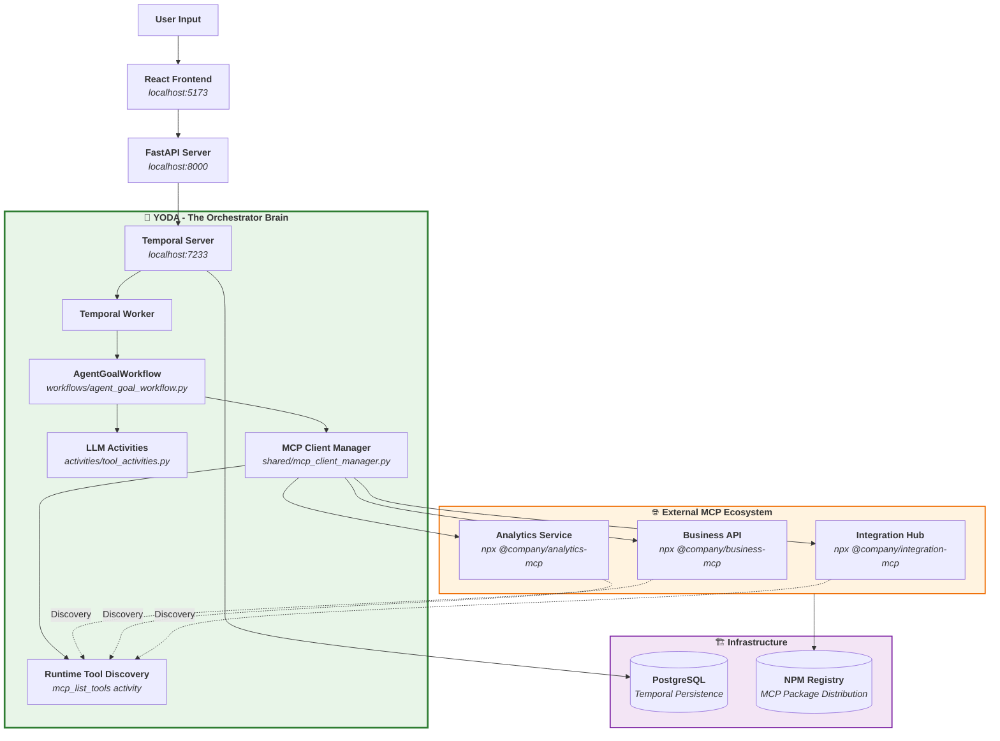
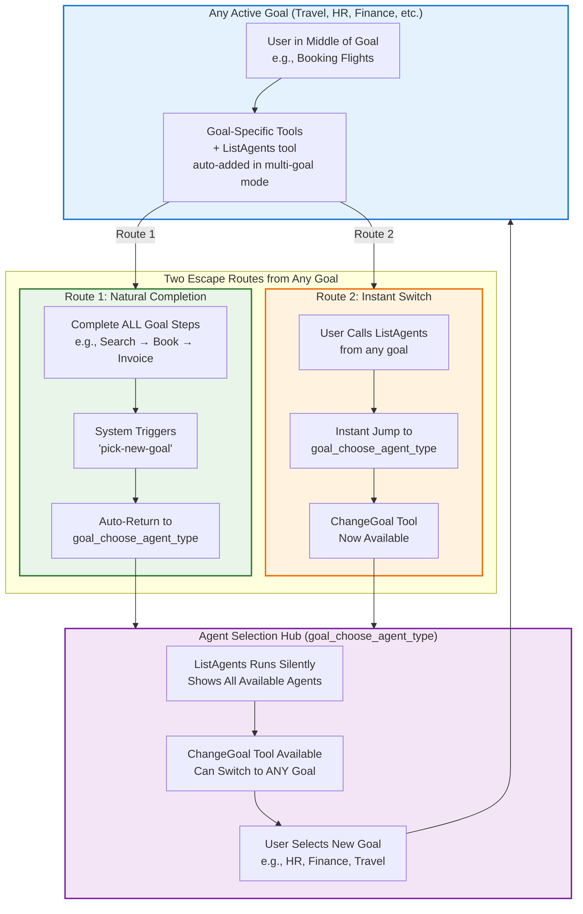
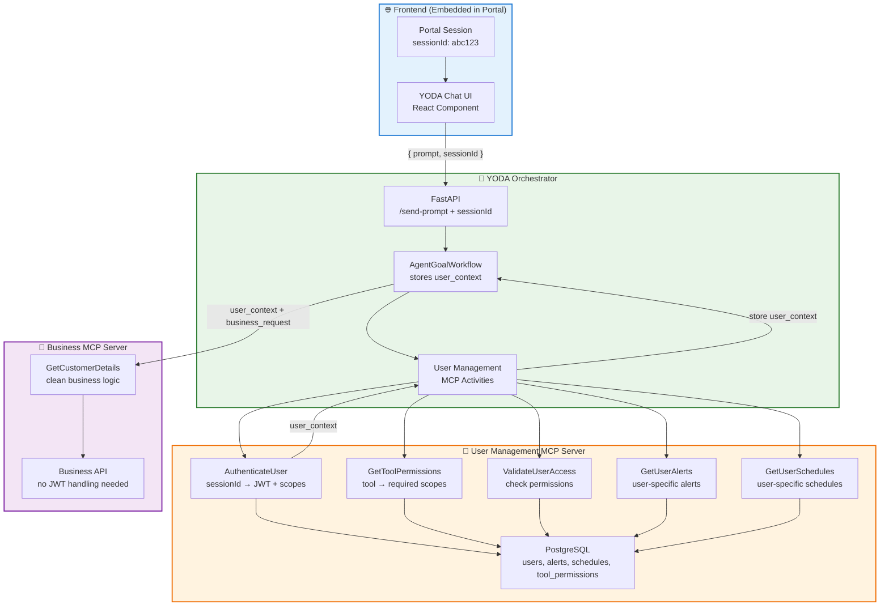

# YODA Documentation

                                ⠀⢀⣠⣄⣀⣀⣀⠀⠀⠀⠀⠀⠀⠀⠀⠀⠀⠀⠀⠀⠀⠀⣀⣤⣴⣶⡾⠿⠿⠿⠿⢷⣶⣦⣤⣀⡀⠀⠀⠀⠀⠀⠀⠀⠀⠀⠀⠀⠀⠀⠀⠀⠀⠀⠀⠀⠀⠀
                                ⢰⣿⡟⠛⠛⠛⠻⠿⠿⢿⣶⣶⣦⣤⣤⣀⣀⡀⣀⣴⣾⡿⠟⠋⠉⠀⠀⠀⠀⠀⠀⠀⠀⠉⠙⠻⢿⣷⣦⣀⠀⠀⠀⠀⠀⠀⠀⠀⠀⢀⣀⣀⣀⣀⣀⣀⣀⡀
                                ⠀⠻⣿⣦⡀⠀⠉⠓⠶⢦⣄⣀⠉⠉⠛⠛⠻⠿⠟⠋⠁⠀⠀⠀⣤⡀⠀⠀⢠⠀⠀⠀⣠⠀⠀⠀⠀⠈⠙⠻⠿⠿⠿⠿⠿⠿⠿⠿⠿⠿⠿⠿⠿⠟⠛⠛⢻⣿
                                ⠀⠀⠈⠻⣿⣦⠀⠀⠀⠀⠈⠙⠻⢷⣶⣤⡀⠀⠀⠀⠀⢀⣀⡀⠀⠙⢷⡀⠸⡇⠀⣰⠇⠀⢀⣀⣀⠀⠀⠀⠀⠀⠀⣀⣠⣤⣤⣶⡶⠶⠶⠒⠂⠀⠀⣠⣾⠟
                                ⠀⠀⠀⠀⠈⢿⣷⡀⠀⠀⠀⠀⠀⠀⠈⢻⣿⡄⣠⣴⣿⣯⣭⣽⣷⣆⠀⠁⠀⠀⠀⠀⢠⣾⣿⣿⣿⣿⣦⡀⠀⣠⣾⠟⠋⠁⠀⠀⠀⠀⠀⠀⠀⣠⣾⡟⠁⠀
                                ⠀⠀⠀⠀⠀⠈⢻⣷⣄⠀⠀⠀⠀⠀⠀⠀⣿⡗⢻⣿⣧⣽⣿⣿⣿⣧⠀⠀⣀⣀⠀⢠⣿⣧⣼⣿⣿⣿⣿⠗⠰⣿⠃⠀⠀⠀⠀⠀⠀⠀⠀⣠⣾⡿⠋⠀⠀⠀
                                ⠀⠀⠀⠀⠀⠀⠀⠙⢿⣶⣄⡀⠀⠀⠀⠀⠸⠃⠈⠻⣿⣿⣿⣿⣿⡿⠃⠾⣥⡬⠗⠸⣿⣿⣿⣿⣿⡿⠛⠀⢀⡟⠀⠀⠀⠀⠀⠀⣀⣠⣾⡿⠋⠀⠀⠀⠀⠀
                                ⠀⠀⠀⠀⠀⠀⠀⠀⠀⠉⠛⠿⣷⣶⣤⣤⣄⣰⣄⠀⠀⠉⠉⠉⠁⠀⢀⣀⣠⣄⣀⡀⠀⠉⠉⠉⠀⠀⢀⣠⣾⣥⣤⣤⣤⣶⣶⡿⠿⠛⠉⠀⠀⠀⠀⠀⠀⠀
                                ⠀⠀⠀⠀⠀⠀⠀⠀⠀⠀⠀⠀⠀⠈⠉⢻⣿⠛⢿⣷⣦⣤⣴⣶⣶⣦⣤⣤⣤⣤⣬⣥⡴⠶⠾⠿⠿⠿⠿⠛⢛⣿⣿⣿⣯⡉⠁⠀⠀⠀⠀⠀⠀⠀⠀⠀⠀⠀
                                ⠀⠀⠀⠀⠀⠀⠀⠀⠀⠀⠀⠀⠀⠀⠀⠈⣿⣧⡀⠈⠉⠀⠈⠁⣾⠛⠉⠉⠀⠀⠀⠀⠀⠀⠀⠀⠀⠀⣀⣴⣿⠟⠉⣹⣿⣇⠀⠀⠀⠀⠀⠀⠀⠀⠀⠀⠀⠀
                                ⠀⠀⠀⠀⠀⠀⠀⠀⠀⠀⠀⠀⠀⠀⠀⢀⣸⣿⣿⣦⣀⠀⠀⠀⢻⡀⠀⠀⠀⠀⠀⠀⠀⢀⣠⣤⣶⣿⠋⣿⠛⠃⠀⣈⣿⣿⠀⠀⠀⠀⠀⠀⠀⠀⠀⠀⠀⠀
                                ⠀⠀⠀⠀⠀⠀⠀⠀⠀⠀⠀⠀⠀⠀⠀⣿⡿⢿⡀⠈⢹⡿⠶⣶⣼⡇⠀⢀⣀⣀⣤⣴⣾⠟⠋⣡⣿⡟⠀⢻⣶⠶⣿⣿⠛⠋⠀⠀⠀⠀⠀⠀⠀⠀⠀⠀⠀⠀
                                ⠀⠀⠀⠀⠀⠀⠀⠀⠀⠀⠀⠀⠀⠀⠘⣿⣷⡈⢿⣦⣸⠇⢀⡿⠿⠿⡿⠿⠿⣿⠛⠋⠁⠀⣴⠟⣿⣧⡀⠈⢁⣰⣿⠏⠀⠀⠀⠀⠀⠀⠀⠀⠀⠀⠀⠀⠀⠀
                                ⠀⠀⠀⠀⠀⠀⠀⠀⠀⠀⠀⠀⠀⠀⠀⢸⣿⢻⣦⣈⣽⣀⣾⠃⠀⢸⡇⠀⢸⡇⠀⢀⣠⡾⠋⢰⣿⣿⣿⣿⡿⠟⠋⠀⠀⠀⠀⠀⠀⠀⠀⠀⠀⠀⠀⠀⠀⠀
                                ⠀⠀⠀⠀⠀⠀⠀⠀⠀⠀⠀⠀⠀⠀⠀⠘⠿⢿⣿⣿⡟⠛⠃⠀⠀⣾⠀⠀⢸⡇⠐⠿⠋⠀⠀⣿⢻⣿⣿⠀⠀⠀⠀⠀⠀⠀⠀⠀⠀⠀⠀⠀⠀⠀⠀⠀⠀⠀
                                ⠀⠀⠀⠀⠀⠀⠀⠀⠀⠀⠀⠀⠀⠀⠀⠀⠀⠀⢸⣿⠁⢀⡴⠋⠀⣿⠀⠀⢸⠇⠀⠀⠀⠀⠀⠁⢸⣿⣿⠀⠀⠀⠀⠀⠀⠀⠀⠀⠀⠀⠀⠀⠀⠀⠀⠀⠀⠀
                                ⠀⠀⠀⠀⠀⠀⠀⠀⠀⠀⠀⠀⠀⠀⠀⠀⠀⢀⣿⡿⠟⠋⠀⠀⠀⣿⠀⠀⣸⠀⠀⠀⠀⠀⠀⠀⢸⣿⣿⠀⠀⠀⠀⠀⠀⠀⠀⠀⠀⠀⠀⠀⠀⠀⠀⠀⠀⠀
                                ⠀⠀⠀⠀⠀⠀⠀⠀⠀⠀⠀⠀⠀⠀⠀⠀⠀⢸⣿⣁⣀⠀⠀⠀⠀⣿⡀⠀⣿⠀⠀⠀⠀⠀⠀⢀⣈⣿⣿⠀⠀⠀⠀⠀⠀⠀⠀⠀⠀⠀⠀⠀⠀⠀⠀⠀⠀⠀
                                ⠀⠀⠀⠀⠀⠀⠀⠀⠀⠀⠀⠀⠀⠀⠀⠀⠀⠘⠛⠿⠿⠿⠿⠿⠿⠿⠿⠿⠿⠿⠿⠿⠿⠿⠿⠿⠟⠛⠋⠀⠀⠀⠀⠀⠀⠀⠀⠀⠀⠀⠀⠀⠀⠀⠀⠀⠀⠀

## Overview

YODA is a Temporal-powered AI agent system for integrating external business tools via Model Context Protocol (MCP) servers. This document covers LLM-driven agent orchestration, team workflows, JWT authentication, MCP integration, and persistent alert/schedule systems.

### Architectural Traits

- **[MCP Servers for Tools](#mcp-servers-for-tools):** Modular tools, auto-discovered via NPM
- **[Parallel Team Workflow](#parallel-team-workflow):** Tool and goal teams work in parallel with minimal coordination
- **[Goal Switching Architecture](#goal-switching-architecture):** Users can seamlessly switch between agent personas and goals
- **[MCP Tool Documentation Standards](#mcp-tool-documentation-standards):** Standardized documentation for tool response schemas and examples alongside standard MCP protocol
- **[JWT-Based Authorization Flow](#jwt-based-authorization-flow):** User access is securely managed with JWT tokens across all tools
- **[Persistent Alerts & Schedules](#persistent-alerts--schedules):** User-specific alerts and schedules are managed as stateful JSON feeds within the orchestrator

**Note:** All file paths and package names mentioned in this document are exact locations used in the codebase. Tool and goal teams only need to update these specific files and packages to register new tools, define agent goals, or integrate new business logic as described below. Note that "goal" and "agent" are used interchangeably throughout this document.

---

## MCP Servers for Tools

YODA's architecture is modular by design: YODA itself acts as the orchestrator ("the brain"), while all business logic and integrations are provided by independently developed MCP servers ("the hands"). MCP servers expose tools without needing to know anything about the orchestrator's internals, enabling infinite scalability and rapid, parallel development.

### Tool Registration & Deployment

1. Publish MCP server to NPM
2. Register server endpoint in the orchestrator
3. Reference server in goal files
4. Tools are auto-discovered at runtime

**Note:** For the exact file paths, code references, and detailed step-by-step process, see the [Parallel Team Workflow](#parallel-team-workflow) section.


```mermaid
graph TB
    User["<b>User Input</b>"] --> Frontend["<b>React Frontend</b><br/><i>localhost:5173</i>"]
    Frontend --> API["<b>FastAPI Server</b><br/><i>localhost:8000</i>"]
    API --> Temporal["<b>Temporal Server</b><br/><i>localhost:7233</i>"]
    
    subgraph YodaBrain ["🧠 <b>YODA - The Orchestrator Brain</b>"]
        Temporal --> Worker["<b>Temporal Worker</b>"]
        Worker --> AgentWorkflow["<b>AgentGoalWorkflow</b><br/><i>workflows/agent_goal_workflow.py</i>"]
        AgentWorkflow --> LLMActivity["<b>LLM Activities</b><br/><i>activities/tool_activities.py</i>"]
        AgentWorkflow --> MCPClientManager["<b>MCP Client Manager</b><br/><i>shared/mcp_client_manager.py</i>"]
        MCPClientManager --> RuntimeDiscovery["<b>Runtime Tool Discovery</b><br/><i>mcp_list_tools activity</i>"]
    end
    
    subgraph ExternalMCP ["🌐 <b>External MCP Ecosystem</b>"]
        BusinessAPI["<b>Business API</b><br/><i>npx @company/business-mcp</i>"]
        AnalyticsService["<b>Analytics Service</b><br/><i>npx @company/analytics-mcp</i>"]
        IntegrationHub["<b>Integration Hub</b><br/><i>npx @company/integration-mcp</i>"]
    end
    
    subgraph Infrastructure ["🏗️ <b>Infrastructure</b>"]
        Postgres[("<b>PostgreSQL</b><br/><i>Temporal Persistence</i>")]
        NPMRegistry[("<b>NPM Registry</b><br/><i>MCP Package Distribution</i>")]
    end
    
    %% Connections
    MCPClientManager --> BusinessAPI
    MCPClientManager --> AnalyticsService  
    MCPClientManager --> IntegrationHub
    BusinessAPI -.->|Discovery| RuntimeDiscovery
    AnalyticsService -.->|Discovery| RuntimeDiscovery
    IntegrationHub -.->|Discovery| RuntimeDiscovery
    Temporal --> Postgres
    ExternalMCP --> NPMRegistry
    
    classDef brain fill:#e8f5e8,stroke:#2e7d32,stroke-width:3px
    classDef external fill:#fff3e0,stroke:#ef6c00,stroke-width:2px
    classDef infra fill:#f3e5f5,stroke:#7b1fa2,stroke-width:2px
    
    class YodaBrain brain
    class ExternalMCP external
    class Infrastructure infra
```

## **MCP Tool Documentation Standards**

YODA's scalable tool ecosystem is built on close collaboration between two teams: **tool teams**, who develop and maintain MCP servers, and **goal teams**, who design agent experiences that leverage those tools. The standard MCP protocol exposes only a tool's name, description, and input schema—leaving goal teams to infer or reverse-engineer response formats.

To solve this, YODA establishes a shared documentation standard: both teams collaborate on a living document that clearly defines response schemas and example payloads. This document acts first as a requirements spec from the goal team, then as the authoritative reference from the tool team, ensuring agent design is accurate and tool integration is seamless.

**Example: Documentation Standard in Practice**

```markdown
# @company/customer-mcp-server Documentation

## GetCustomerDetails Tool

**Summary:**
Retrieves detailed customer information from the CRM system. Returns customer profile data including contact information, account status, and registration details.

**Input Schema:**
{
    "type": "object",
    "properties": {
    "customer_id": {"type": "string", "description": "Unique customer identifier"}
    },
    "required": ["customer_id"]
  }

**Response Schema:**
{
  "type": "object", 
  "properties": {
    "customer_id": {"type": "string"},
    "name": {"type": "string"},
    "email": {"type": "string"},
    "status": {"type": "string"},
    "created_date": {"type": "string", "format": "date"}
  },
  "required": ["customer_id", "name", "email", "status"]
}

**Examples:**
- Success: {"customer_id": "CUST_123", "name": "John Smith", "email": "john@example.com", "status": "active", "created_date": "2024-01-15"}
- Not Found: {"error": "Customer not found", "customer_id": "CUST_999"}
```

---

## Streamlined Team Workflow

1. **Goal Team: Define & Send Requirement**  
   Prepare a structured MCP server/tool requirement document (as shown in the documentation standards above).

2. **Tool Team: Develop & Document**  
   Implement the MCP server and tools based on the requirement, update shared documentation with finalized response schemas and examples, then publish to NPM.

3. **Goal Team: Integrate & Design**  
   Add the server definition to the orchestrator, reference it in goal files, and use the documentation to write accurate `example_conversation_history` for agent behavior.

```python
# Goal team uses finalized documentation to write accurate tool responses:
example_conversation_history="\n ".join([
    "user_confirmed_tool_run: <user clicks confirm on GetCustomerDetails tool>",
    "tool_result: { 'customer_id': 'CUST_123', 'name': 'John Smith', 'email': 'john@example.com', 'status': 'active' }",  # From tool docs
    "agent: Found customer John Smith (john@example.com) - account is active."
])
```

---

## **Goal Switching Architecture**

Original Temporal supports both single-agent and multi-agent modes, but YODA defaults to multi-goal mode—enabling agent orchestration and fully realizing the MCP framework.


```mermaid
graph TD
    subgraph AnyGoal ["Any Active Goal (Travel, HR, Finance, etc.)"]
        direction TB
        UserInGoal[User in Middle of Goal<br/>e.g., Booking Flights]
        GoalTools[Goal-Specific Tools<br/>+ ListAgents tool<br/>auto-added in multi-goal mode]
        
        UserInGoal --> GoalTools
    end
    
    subgraph TwoEscapeRoutes ["Two Escape Routes from Any Goal"]
        direction TB
        
        subgraph Route1 ["Route 1: Natural Completion"]
            direction TB
            CompleteAllSteps[Complete ALL Goal Steps<br/>e.g., Search → Book → Invoice]
            SystemTrigger[System Triggers<br/>'pick-new-goal']
            AutoReturn[Auto-Return to<br/>goal_choose_agent_type]
            
            CompleteAllSteps --> SystemTrigger
            SystemTrigger --> AutoReturn
        end
        
        subgraph Route2 ["Route 2: Instant Switch"]
            direction TB
            UserCallsListAgents[User Calls ListAgents<br/>from any goal]
            InstantJump[Instant Jump to<br/>goal_choose_agent_type]
            ChangeGoalAvailable[ChangeGoal Tool<br/>Now Available]
            
            UserCallsListAgents --> InstantJump
            InstantJump --> ChangeGoalAvailable
        end
    end
    
    subgraph AgentSelection ["Agent Selection Hub (goal_choose_agent_type)"]
        direction TB
        ListAgentsSilent[ListAgents Runs Silently<br/>Shows All Available Agents]
        ChangeGoalTool[ChangeGoal Tool Available<br/>Can Switch to ANY Goal]
        NewGoalSelected[User Selects New Goal<br/>e.g., HR, Finance, Travel]
        
        ListAgentsSilent --> ChangeGoalTool
        ChangeGoalTool --> NewGoalSelected
    end
    
    %% Connections
    GoalTools -->|Route 1| Route1
    GoalTools -->|Route 2| Route2
    AutoReturn --> AgentSelection
    ChangeGoalAvailable --> AgentSelection
    NewGoalSelected --> AnyGoal
    
    classDef anyGoal fill:#e3f2fd,stroke:#1976d2,stroke-width:2px
    classDef route1 fill:#e8f5e8,stroke:#2e7d32,stroke-width:2px
    classDef route2 fill:#fff3e0,stroke:#ef6c00,stroke-width:2px
    classDef agentHub fill:#f3e5f5,stroke:#7b1fa2,stroke-width:2px
    
    class AnyGoal anyGoal
    class Route1 route1
    class Route2 route2
    class AgentSelection agentHub
```


---

## **Centralized User Management Flow**

YODA uses a centralized User Management MCP Server to handle authentication, user sessions, permission validation, and tool permission registry. This approach keeps business MCP tools focused on business logic while ensuring secure, user-scoped operations through a single security layer. Goal teams simply specify which tools to include—permissions are automatically discovered and validated.


```mermaid
graph TD
    subgraph Frontend ["🌐 Frontend (Embedded in Portal)"]
        PortalSession["Portal Session<br/>sessionId: abc123"]
        YodaUI["YODA Chat UI<br/>React Component"]
        PortalSession --> YodaUI
    end
    
    subgraph YODA ["🧠 YODA Orchestrator"]
        API["FastAPI<br/>/send-prompt + sessionId"]
        Workflow["AgentGoalWorkflow<br/>stores user_context"]
        UserMgmtActivity["User Management<br/>MCP Activities"]
        
        API --> Workflow
        Workflow --> UserMgmtActivity
    end
    
    subgraph UserMgmtMCP ["🔐 User Management MCP Server"]
        AuthTool["AuthenticateUser<br/>sessionId → JWT + scopes"]
        PermissionTool["GetToolPermissions<br/>tool → required scopes"]
        AccessTool["ValidateUserAccess<br/>check permissions"]
        AlertsTool["GetUserAlerts<br/>user-specific alerts"]
        ScheduleTool["GetUserSchedules<br/>user-specific schedules"]
        Database["PostgreSQL<br/>users, alerts, schedules, tool_permissions"]
        
        AuthTool --> Database
        PermissionTool --> Database
        AccessTool --> Database
        AlertsTool --> Database
        ScheduleTool --> Database
    end
    
    subgraph BusinessMCP ["🏢 Business MCP Server"]
        CustomerTool["GetCustomerDetails<br/>clean business logic"]
        BusinessAPI["Business API<br/>no JWT handling needed"]
        
        CustomerTool --> BusinessAPI
    end
    
    %% Flow connections
    YodaUI -->|"{ prompt, sessionId }"| API
    UserMgmtActivity --> AuthTool
    AuthTool -->|"user_context"| UserMgmtActivity
    UserMgmtActivity -->|"store user_context"| Workflow
    Workflow -->|"user_context + business_request"| CustomerTool
    UserMgmtActivity --> PermissionTool
    UserMgmtActivity --> AccessTool
    UserMgmtActivity --> AlertsTool
    UserMgmtActivity --> ScheduleTool
    
    classDef frontend fill:#e3f2fd,stroke:#1976d2,stroke-width:2px
    classDef yoda fill:#e8f5e8,stroke:#2e7d32,stroke-width:2px
    classDef userMgmt fill:#fff3e0,stroke:#ef6c00,stroke-width:2px
    classDef business fill:#f3e5f5,stroke:#7b1fa2,stroke-width:2px
    
    class Frontend frontend
    class YODA yoda
    class UserMgmtMCP userMgmt
    class BusinessMCP business
```

**Benefits of Centralized Approach:**

- **🔒 Single Security Layer:** All authentication, authorization, and tool permission registry centralized
- **🧹 Clean Business Tools:** Business MCP servers focus purely on business logic  
- **📊 User Context Management:** Alerts, schedules, and permissions managed in one place
- **🔄 Scalable Architecture:** Easy to add new business tools without security complexity
- **⚡ Automatic Permission Discovery:** Goal teams just specify tools—permissions handled automatically
- **🎯 Tool Team Ownership:** Tool teams define their own permission requirements

**Example Flow:**

**1. User Authentication:**
```json
// YODA calls AuthenticateUser with session
{
  "session_id": "sess_abc123"
}

// Response: Complete user context
{
  "user_id": "user_456",
  "jwt_token": "eyJhbGciOiJIUzI1NiIsInR5cCI6IkpXVCJ9...",
  "scopes": ["finance:read", "customer:read", "hr:write"],
  "expires_at": "2024-01-15T10:30:00Z"
}
```

**2. Tool Permission Discovery:**
```json
// YODA asks User Management MCP Server what permissions a tool needs
{
  "tool_name": "GetCustomerDetails",
  "mcp_server": "customer-mcp"
}

// Response: Required scopes for this tool
{
  "required_scopes": ["customer:read"],
  "tool_name": "GetCustomerDetails",
  "mcp_server": "customer-mcp"
}
```

**3. Permission Validation:**
```json
// YODA validates if user has required scopes
{
  "user_id": "user_456",
  "user_scopes": ["finance:read", "customer:read", "hr:write"],
  "required_scopes": ["customer:read"]
}

// Response: Authorization check
{
  "authorized": true,
  "missing_scopes": []
}
```

**4. Clean Business Tool Call:**
```json
// Business MCP tool receives clean request (no JWT complexity)
{
  "customer_id": "CUST_123"
}

// Response: Pure business data
{
  "customer_id": "CUST_123",
  "name": "John Smith",
  "email": "john@example.com",
  "status": "active"
}
```


---

## **Persistent Alerts & Schedules**

YODA manages persistent alerts and schedules as stateful JSON feeds, linked to user JWT tokens and stored within the orchestration engine. This design ensures user-specific automation and notifications are reliably maintained across all integrated business tools.

**Database Extension:**
Add alerts and schedules tables to existing PostgreSQL (Temporal persistence database):

```sql
-- User alerts/schedules identified by JWT token
alerts_table: user_id, condition, status (active/triggered/dismissed), created_at
schedules_table: user_id, action, condition, status (pending/executed/failed), created_at
```

**Frontend Enhancement:**
Add notification area above the chat interface.

**JSON Feed Structure:**

```json
// Alerts table feed
{
  "alerts": [
    {"condition": "BTC drops 5%", "status": "active", "created_at": "2024-01-15"},
    {"condition": "Unpaid fee $50", "status": "triggered", "created_at": "2024-01-10"}
  ]
}

// Schedules table feed  
{
  "schedules": [
    {"action": "Sell BTC", "condition": "BTC rises 5%", "status": "pending", "created_at": "2024-01-15"},
    {"action": "Monthly report", "condition": "1st of month", "status": "executed", "created_at": "2024-01-01"}
  ]
}
```


